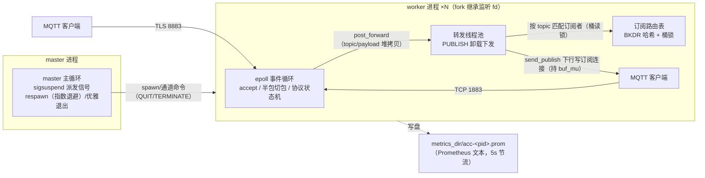

# acc

acc 是一个用 C11 编写的 mini MQTT 3.1.1 broker：master/worker 多进程模型
（fork + respawn）、单 worker epoll 事件驱动、BKDR 订阅路由（`+`/`#` 通配）、
线程池卸载 PUBLISH 转发、可选 TLS 监听（TLS 1.2+）。零运行时依赖
（glibc + OpenSSL），全部源码可由本仓库独立构建。

## 架构



- **读路径**（recv/切包/协议分支）仅事件循环线程执行，不加锁；写路径统一持
  连接级 `buf_mu` 与池线程互斥
- **转发任务自包含**（topic/payload 堆拷贝）：发布者 qos1 回 PUBACK 即受理，
  其断开/复用不丢消息；队列满等失败计数丢弃（`acc_forward_drop_total`）
- **证书缺失自动降级**：跳过 TLS 监听、保持明文服务（不退出进程）

## 快速开始

```bash
task build       # 配置并编译（cmake + gcc，需 C11/OpenSSL）
task test        # 单元测试（15 组，ctest 驱动）
task e2e         # 端到端验收：spawn acc 实例跑协议用例（需在仓库根运行）
task run         # 前台运行（./build/acc -c conf/acc.conf）
task gen-certs   # 生成自签 TLS 证书（conf/cert.pem + conf/key.pem）
task clean       # 清理构建产物
```

### mosquitto 互通验证

```bash
task run &                                          # 启动 broker
mosquitto_sub -h 127.0.0.1 -p 1883 -t 'a/+' -v     # 终端 1：订阅
mosquitto_pub -h 127.0.0.1 -p 1883 -t a/b -m hello # 终端 2：发布
mosquitto_pub -h 127.0.0.1 -p 1883 -t a/b -q 1 -m qos1msg
# TLS（先生成证书）：端口换 8883，客户端加 --cafile conf/cert.pem
```

### 指标导出

配置 `metrics_dir` 非空即启用：每个 worker 周期性（5s 节流）快照写
`metrics_dir/acc-<pid>.prom`（Prometheus 文本格式，临时文件 + rename
原子替换）。指标一览：

| 指标 | 类型 | 含义 |
| --- | --- | --- |
| `acc_connections` | gauge | 本 worker 活跃连接数 |
| `acc_free_connections` | gauge | 本 worker 空闲连接数 |
| `acc_packets_rx_total` | counter | 成功接收并处理的 MQTT 包数 |
| `acc_packets_tx_total` | counter | 转发入写缓冲的下行 PUBLISH 数 |
| `acc_forward_drop_total` | counter | 转发丢弃数（队列满/组包失败等） |
| `acc_tp_queue_used` | gauge | 转发线程池即时排队任务数 |

## 配置项

`conf/acc.conf`（支持 `include` 递归展开，相对路径相对主文件目录）：

| 配置项 | 默认值 | 说明 |
| --- | --- | --- |
| `log_level` | `0` | 日志级别：0 DEBUG / 1 INFO / 2 WARN / 3 ERROR |
| `log_path` | `./logs/` | 日志目录（按小时滚动，守护化前绝对化） |
| `enable_daemon` | `no` | 是否守护进程化（yes/no） |
| `worker_process` | `2` | worker 进程数 |
| `connections_per_worker` | `1024` | 单 worker 连接池容量 |
| `server` | `127.0.0.1` | 监听地址 |
| `tcp_port` | `1883` | MQTT over TCP 端口 |
| `tls_port` | `8883` | MQTT over TLS 端口（证书缺失自动降级跳过） |
| `cert_file` | `conf/cert.pem` | TLS 证书（PEM） |
| `key_file` | `conf/key.pem` | TLS 私钥（PEM） |
| `accept_mutex` | `no` | worker 间 accept 互斥锁（文件记录锁） |
| `accept_mutex_delay_ms` | `500` | 抢锁失败重试延迟（毫秒） |
| `client_timeout` | `300` | 客户端空闲超时（秒，支持 s/m/h 后缀） |
| `max_read_buffer_size` | `1048576` | 单连接最大读缓冲（支持 k/m/g 后缀） |
| `max_open_fd` | `65536` | 进程 fd 上限（setrlimit 软限收紧） |
| `thread_pool_thread_num` | `4` | 转发线程池线程数 |
| `thread_pool_queue_size` | `1000` | 转发线程池任务队列长度 |
| `metrics_dir` | `./metrics/` | 指标输出目录；空值（行尾留空格）禁用 |

## 测试

- **单元测试**：`task test`（15 组，覆盖 util/event/net/mqtt 各模块）
- **e2e**：`task e2e`——自研 MQTT 客户端（链接 vendored MQTTPacket）spawn
  真实 acc 实例：connect/connack、订阅通配 `a/+` 与 `#`、双连接 pubsub、
  qos1 PUBACK、TLS 全流程（证书缺失自动 SKIP）、SIGTERM 优雅退出码校验
- **冒烟**：`./tests/smoke.sh`（端口连通/worker respawn/优雅退出）、
  `./tests/tls_smoke.sh`（TLS 握手 + MQTT over TLS）

## 设计文档

见 [docs/superpowers/specs/2026-09-14-acc-rebuild-design.md](docs/superpowers/specs/2026-09-14-acc-rebuild-design.md)。

## 许可证

- 本项目：MIT，见 [LICENSE](LICENSE)
- vendored [third_party/mqttpacket](third_party/mqttpacket)：Eclipse Paho
  MQTT C 客户端的 MQTTPacket 组件，Eclipse Public License v1.0 /
  Eclipse Distribution License v1.0 双许可（原文见各文件头）。相对上游的
  修改仅为增加 `need_len`/`walk_len` 出参以支持流式半包解析
