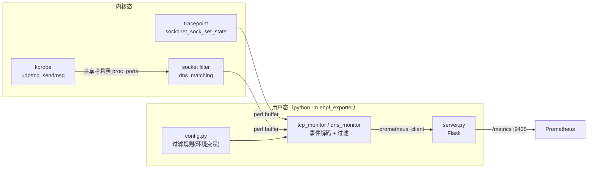

# ebpf_exporter

基于 [BCC](https://github.com/iovisor/bcc) 的 eBPF 网络监控导出器，提供两类监控器：

| 监控器 | 采集手段 | 输出 |
|--------|----------|------|
| `tcp` | tracepoint `sock:inet_sock_set_state`（Linux 4.16+） | Prometheus 指标：TCP 连接存活时长直方图 |
| `dns` | kprobe（`udp_sendmsg`/`tcp_sendmsg`）+ socket filter | 结构化日志：DNS 查询/应答及发起进程 |

## 架构



## 环境要求

- Linux 内核 4.16+（`sock:inet_sock_set_state` tracepoint）
- Python 3.8+
- BCC 工具链（**必须系统包安装，不能用 pip**）：

```bash
# Ubuntu / Debian
sudo apt install bpfcc-tools python3-bpfcc
# CentOS / RHEL
sudo yum install bcc-tools python3-bcc
```

- 运行时需要内核头文件（裸机通常已具备；容器运行见下文挂载说明）

## 快速开始

项目使用 [Taskfile](https://taskfile.dev) 管理任务，安装 task CLI 后：

```bash
task              # 查看全部任务
task install      # 安装 Python 依赖
task check        # 语法检查（无需 root）

sudo task run-tcp # 本地运行 TCP 监控（需 root），访问 http://localhost:9435/metrics
sudo task run-dns # 本地运行 DNS 捕获（需 root），前台输出日志
```

不使用 task 的等价命令：

```bash
python3 -m pip install -r requirements.txt
sudo env PYTHONPATH=src python3 -m ebpf_exporter tcp
sudo env PYTHONPATH=src python3 -m ebpf_exporter dns
```

## 容器运行

```bash
task docker-build             # 构建镜像（ubuntu:22.04 + apt 版 BCC）
task docker-run               # 特权容器运行 TCP 监控
task docker-debug             # 进入带 BCC 工具链的调试容器
task docker-stop              # 停止并清理容器
```

> eBPF 容器必须满足：`--privileged`、挂载宿主机 `/lib/modules` 与内核源码目录。
> 内核源码挂载路径因发行版而异（CentOS 为 `/usr/src/kernels`，Ubuntu 为 `/usr/src`），
> `task docker-run` 默认按 CentOS 路径挂载，Ubuntu 节点请自行调整。

## Kubernetes 部署

```bash
# 先修改 deploy/exporter.yaml 中的 image 为实际仓库地址
kubectl create namespace monitoring
task deploy
```

以 DaemonSet 方式在每个节点运行一个实例，Service 自带标准 Prometheus 抓取注解。

## 指标

| 指标 | 类型 | 标签 | 说明 |
|------|------|------|------|
| `ebpf_tcp_duration_millisecond_bucket` | Histogram | `type`, `source_addr`, `dest_addr` | TCP 连接存活时长（毫秒）分布 |
| `ebpf_tcp_duration_millisecond_sum` | Histogram | 同上 | 时长累计值 |
| `ebpf_tcp_duration_millisecond_count` | Histogram | 同上 | 连接计数 |

- `type=C`：主动发起的连接（客户端）；`type=A`：被动接受的连接（服务端）；`type=U`：未观察到建立过程的连接
- `type=A` 的连接已交换源/目的地址，统一为「客户端 → 服务端」方向
- 桶边界：`0.005, 0.01, 0.1, 0.5, 1, 10, 100, 1000, 10000, 100000, +Inf`（毫秒）

常用查询见 [prometheus.pql](prometheus.pql)。

## 配置

全部通过环境变量（默认值见 [config.py](src/ebpf_exporter/config.py)）：

| 环境变量 | 默认值 | 说明 |
|----------|--------|------|
| `FILTER_COMMANDS` | 空 | 进程名黑名单（精确匹配，逗号分隔） |
| `FILTER_COMMAND_PREFIXES` | 空 | 进程名前缀黑名单（如 `kube,containerd`） |
| `IGNORE_LOOPBACK` | `1` | 忽略 127.0.0.1 环回连接 |
| `MAX_EVENTS_PER_ADDR` | `500` | 每个地址最大记录事件数（标签基数保护） |
| `LISTEN_HOST` / `LISTEN_PORT` | `0.0.0.0` / `9435` | HTTP 服务监听地址 |

## 项目结构

```
├── Taskfile.yml            # 任务管理（构建/运行/部署/清理）
├── Dockerfile              # ubuntu:22.04 + apt 版 BCC
├── requirements.txt        # 纯 pip 依赖（bcc 由系统包提供）
├── deploy/exporter.yaml    # K8s DaemonSet + Service
└── src/ebpf_exporter/
    ├── __main__.py         # CLI 入口：ebpf_exporter tcp|dns
    ├── config.py           # 环境变量配置与过滤规则
    ├── server.py           # Flask /metrics 服务
    ├── tcp_monitor.py      # TCP 连接时长监控（tracepoint）
    └── dns_monitor.py      # DNS 查询捕获（kprobe + socket filter）
```
