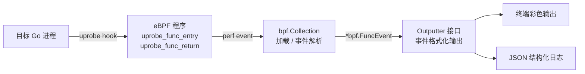

# gprobe

Go 进程动态追踪探针，基于 eBPF uprobe 技术，用于在生产环境中**无侵入**捕获 Go 进程的函数入参和返回值。

## 功能特性

- **无侵入** — 不修改源码、不重启目标进程
- **Go 原生支持** — 适配 Go 1.21+ 寄存器 ABI，正确解析参数/返回值
- **实时追踪** — 微秒级延迟，实时捕获函数调用流
- **低开销** — 基于 eBPF uprobe，单次 hook 约 1-3μs
- **多种输出** — 终端彩色输出 / JSON 结构化日志

## 快速开始

### 构建

```bash
# 安装 Task (如未安装)
sh -c "$(curl -L https://taskfile.dev/install.sh)" -- -d -b ~/.local/bin

# 完整构建 (eBPF 编译 + 探针 + 示例)
task
```

### 使用

```bash
# 追踪单个函数
sudo gprobe -p <PID> -f "main.Add"

# 追踪多个函数，JSON 输出
sudo gprobe -p <PID> -f "main.Add" -f "main.Multiply" -o json

# 通过二进制路径指定 (无需 PID)
sudo gprobe -b ./myapp -f "main.HandleRequest"
```

### 完整示例

**目标程序** ([examples/target/main.go](examples/target/main.go))：

```go
package main

import "fmt"

func Add(a, b int) int {
    return a + b
}

func main() {
    result := Add(1, 2)
    fmt.Println(result)
}
```

**运行探针：**

```bash
# 编译
task

# 终端 1：启动目标程序
./bin/target

# 终端 2：运行探针
sudo ./bin/gprobe -p $(pgrep -f "/bin/target") -f "main.Add"
```

**终端输出：**

```
gprobe: 目标 /proc/114112/exe, 函数 [main.Add]
gprobe: 已挂载 main.Add
gprobe: 开始监听... (Ctrl+C 退出)
00:23:54.438125 RET  main.Add => 15 (0.00ms)
00:23:54.438132 CALL main.Add([2 1 0 15 0 0])
00:23:55.438941 RET  main.Add => 16 (1000.81ms)
00:23:55.438947 CALL main.Add([2 1 0 16 0 0])
```

**JSON 输出：**

```json
{
  "timestamp": "2026-06-13T12:34:56.789012+08:00",
  "pid": 12345,
  "tid": 12345,
  "goroutine_id": 0,
  "func_name": "main.Add",
  "is_return": false,
  "args": [1, 2]
}
```

## 命令行参考

```
gprobe [flags]

Flags:
  -p, --pid int         目标进程 PID
  -b, --binary string   目标二进制文件路径
  -f, --func strings    要 hook 的函数名，支持完整路径
                        如 main.Add, net/http.HandleFunc
  -o, --output string   输出格式：terminal（默认）| json
  -h, --help            帮助信息
```

## Task 脚本

| 命令 | 说明 |
|------|------|
| `task` | 完整构建（generate + build + examples） |
| `task generate` | 编译 eBPF 程序并生成 Go 绑定 |
| `task build` | 构建探针 → `bin/gprobe` |
| `task examples` | 构建示例 → `bin/target` |
| `task test` | 运行所有测试 |
| `task clean` | 清理构建产物 |
| `task fmt` | 格式化 Go 代码 |
| `task lint` | golangci-lint 静态检查 |
| `task build-linux` | 交叉编译 (Linux amd64) |
| `task install` | 安装到 `$GOPATH/bin` |

## 技术架构



- **eBPF uprobe** — 内核层 hook 函数入口/出口，读取寄存器获取参数和返回值
- **寄存器 ABI** — 解析 RAX, RBX, RCX, RDI, RSI, R8 等寄存器
- **perf event** — 零拷贝内核→用户态数据传输
- **Outputter 接口** — 可扩展的输出架构，实现接口即可添加新格式

## 目录结构

```
gprobe/
├── cmd/gprobe/main.go       # 主程序入口
├── internal/
│   ├── bpf/                 # eBPF 程序 (C) + Go 加载器
│   │   ├── uprobe.c         # eBPF 探针源码 (入口/返回)
│   │   ├── events.h         # 事件数据结构和 map 定义
│   │   ├── vmlinux.h        # 内核类型定义
│   │   ├── generate.go      # go generate 指令 (bpf2go)
│   │   └── loader.go        # eBPF 加载/卸载/事件解析
│   └── output/              # 输出格式化
│       ├── interface.go     # Outputter 接口定义
│       ├── terminal.go      # 终端彩色输出
│       ├── json.go          # JSON 结构化输出
│       └── decode.go        # 参数类型解码
├── examples/target/         # 示例目标程序
├── docs/                    # 项目文档
├── Taskfile.yml             # 构建任务
├── go.mod / go.sum          # Go 依赖
└── README.md
```

## 依赖

| 组件 | 版本 | 说明 |
|------|------|------|
| Go | 1.24+ | 探针运行时 |
| Linux 内核 | 5.4+ | 需要 BTF 支持 |
| clang | 12+ | 编译 eBPF 程序 |
| 权限 | root | eBPF uprobe 要求 |

### 环境检查

```bash
go version                  # >= 1.24
uname -r                   # >= 5.4
ls /sys/kernel/btf/vmlinux # BTF 支持
clang --version            # >= 12
```

### 安装依赖 (Ubuntu/Debian)

```bash
sudo apt install -y clang llvm libbpf-dev \
    linux-headers-$(uname -r) gcc-multilib \
    linux-tools-common linux-tools-$(uname -r)
```

## 限制

- 仅支持 x86_64 架构
- 目标程序需编译时包含调试信息（`-gcflags="all=-N -l"`）
- 最多读取 6 个参数
- string/slice/map/struct 等复杂类型当前仅显示长度占位，待实现完整解析
- goroutine ID 获取尚未实现（字段已预留，当前返回 0）

## 路线图

- [ ] string 参数解析（bpf_probe_read_user 读取 Go string 结构）
- [ ] slice 参数解析（读取底层数组数据）
- [ ] struct 字段解析（DWARF 调试信息）
- [ ] map/channel 内容解析
- [ ] goroutine ID 获取（解析 Go runtime TLS）
- [ ] 采样模式（降低高频函数开销）
- [ ] ARM64 架构支持

## 文档

| 文档 | 说明 |
|------|------|
| [架构设计](docs/architecture.md) | 系统架构与核心组件 |
| [开发指南](docs/development.md) | 环境搭建、构建流程、扩展开发 |
| [BPF 内部实现](docs/bpf-internal.md) | eBPF 程序数据结构与探针逻辑 |
| [需求文档](docs/requirements.md) | 功能需求与实现阶段 |
| [贡献指南](docs/CONTRIB.md) | PR 流程、代码规范、调试技巧 |
| [运维手册](docs/RUNBOOK.md) | 部署、监控、故障排查、回滚 |

## License

[MIT](LICENSE)
