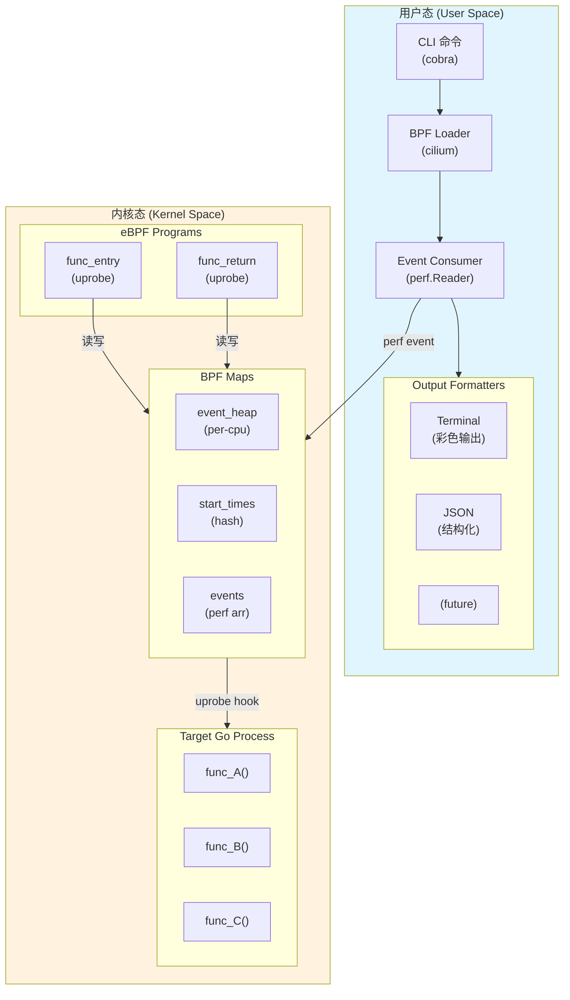
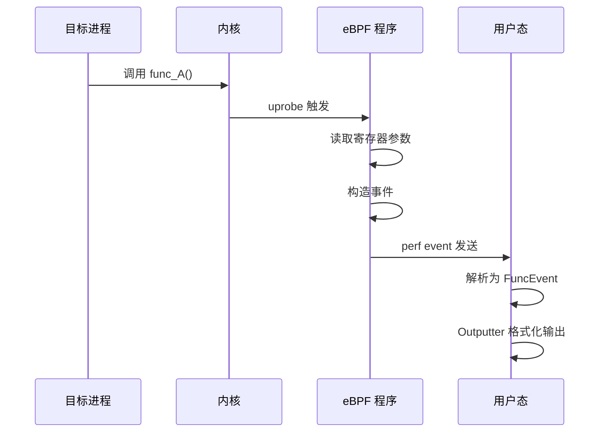
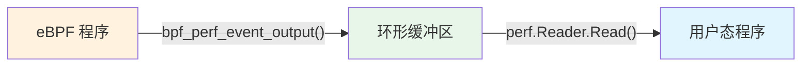

# gprobe 系统架构

## 概述

gprobe 是一个基于 eBPF uprobe 的 Go 进程动态追踪探针，采用内核-用户态协作架构实现低开销的函数追踪。

## 架构图



## 核心组件

### 1. CLI 命令层 (`cmd/gprobe/`)

基于 cobra 库实现命令行解析，负责：

- 参数验证（PID/二进制路径、函数名）
- 组件初始化和生命周期管理
- 信号处理（优雅退出）

**主要参数：**

| 参数 | 短参数 | 说明 |
|------|--------|------|
| `--pid` | `-p` | 目标进程 PID |
| `--binary` | `-b` | 目标二进制文件路径 |
| `--func` | `-f` | 要 hook 的函数名（可多次指定）|
| `--output` | `-o` | 输出格式（terminal/json）|

### 2. eBPF 层 (`internal/bpf/`)

#### 2.1 eBPF 程序 (`uprobe.c`)

两个核心探针：

- **`func_entry`** - 函数入口探针
  - 读取寄存器参数（Go 1.17+ 寄存器 ABI）
  - 记录入口时间戳
  - 发送调用事件

- **`func_return`** - 函数返回探针
  - 计算函数执行耗时
  - 读取返回值（RAX 寄存器）
  - 发送返回事件

#### 2.2 BPF Maps

| Map 名称 | 类型 | 用途 |
|----------|------|------|
| `events` | PERF_EVENT_ARRAY | 向用户态发送事件 |
| `event_heap` | PERCPU_ARRAY | 临时事件数据缓冲 |
| `start_times` | HASH | 存储函数入口时间戳 |

#### 2.3 Go Loader (`loader.go`)

封装 cilium/ebpf 库，提供：

- eBPF 程序加载
- uprobe 挂载/卸载
- perf event 读取
- 事件解析和转换

### 3. 输出层 (`internal/output/`)

#### 3.1 接口定义

```go
type Outputter interface {
    RegisterFunc(id uint32, name string)
    Output(event *bpf.FuncEvent) error
}
```

#### 3.2 实现

- **TerminalOutputter** - 彩色终端输出
- **JSONOutputter** - JSON 结构化输出

### 4. 事件数据流



## 关键技术

### Go 寄存器 ABI (Go 1.17+)

```
参数传递：
  整数: RAX, RBX, RCX, RDI, RSI, R8-R9
  浮点: X0-X15

返回值：
  整数: RAX
  浮点: X0
```

### uprobe 工作原理

```
1. 在目标函数入口处插入断点指令 (int3)
2. CPU 执行到断点时触发陷阱
3. 内核调度执行关联的 eBPF 程序
4. eBPF 程序读取寄存器状态
5. 恢复原始指令继续执行
```

### perf event 数据传输



## 性能特性

- **单次 hook 开销**: 1-3μs（uprobe 标准开销）
- **数据传输**: 零拷贝（perf event 共享内存）
- **内存占用**: 固定（per-cpu 缓冲区）

## 限制

1. **架构限制**: 目前仅支持 x86_64
2. **参数限制**: 最多读取 6 个参数
3. **类型限制**: 暂不支持复杂类型（string/slice/map）
4. **调试信息**: 目标程序需要包含调试符号

## 扩展点

1. **新增输出格式**: 实现 `Outputter` 接口
2. **参数类型扩展**: 在 `events.h` 中添加新类型
3. **eBPF 程序扩展**: 添加新的探针类型（如 tracepoint）
