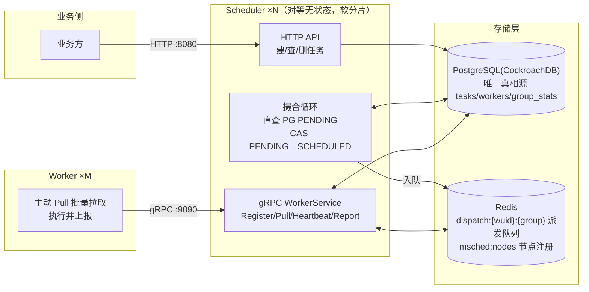
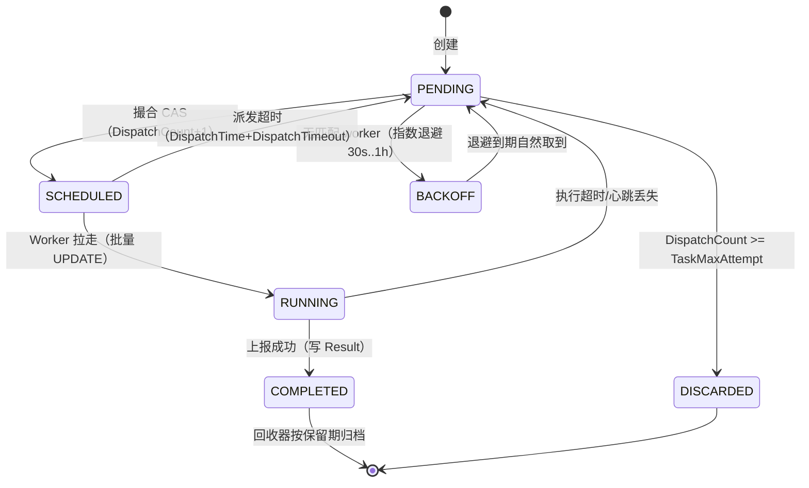

# msched

无中心、Pull 模式、面向 10 亿级任务的分布式调度系统。

- **无中心**：一组对等无状态 Scheduler（无主）撮合并下发，一致性哈希软分片消除 CAS 竞争
- **Pull 模式**：Worker 主动拉取，Scheduler 不 push；热路径零撮合零 CAS
- **10 亿级**：PostgreSQL(CockroachDB) 是唯一真相源，撮合器直查 PENDING，无就绪池；进程内不持有海量索引
- **多租户**：按 `GroupUID` 隔离级防饿死（撮合端 group 游标轮询 + 派发端分桶 worker 轮询，双重 group 轮询）
- **不支持定时**：任务创建即可派发，无调度时间

技术栈：Go + GORM + PostgreSQL(CockroachDB) + Redis + gRPC。

## 架构



### 任务状态机



关键语义（详见 [docs/DESIGN.md](docs/DESIGN.md) §8）：

- **未下发 ≠ RUNNING**：派发队列里的任务是 SCHEDULED，Worker 拉走才 RUNNING
- **防双发**：CAS `UPDATE ... WHERE unit_id=? AND state='PENDING'`，影响行数 =1 才算抢到；软分片仅减竞争，正确性始终靠 CAS 兜底
- **UnitID** = hash(group+Args)，全系统上层唯一标识，天然支持创建去重与幂等
- **匹配语义**：单向强约束 `Task.WorkerSelector ⊆ Worker.Labels`，selector 维度开放

## 快速开始

依赖：Go 1.26+、[Task](https://taskfile.dev)、CockroachDB、Redis、[buf](https://buf.build)（改 proto 时）。

```bash
# 构建
task build          # 产出 bin/msched-scheduler、bin/msched-worker

# 启动 Scheduler（依赖 CockroachDB + Redis，连接见下方配置）
./bin/msched-scheduler

# 测试
task test                          # 单元测试（miniredis，无需外部依赖）
task test-integration              # 集成测试（需 CockroachDB，MSCHED_PG_DSN 覆盖默认连接）
```

## 配置

全部通过环境变量覆盖，未设项保留默认值（`internal/storage/config.go`）。

### 连接

| 环境变量 | 默认值 | 说明 |
|---|---|---|
| `MSCHED_PG_HOST` | `192.168.124.3` | CockroachDB 地址 |
| `MSCHED_PG_PORT` | `26257` | CockroachDB 端口 |
| `MSCHED_PG_USER` | `root` | 用户名 |
| `MSCHED_PG_PASSWORD` | 空（insecure root） | 密码 |
| `MSCHED_PG_DATABASE` | `defaultdb` | 数据库 |
| `MSCHED_PG_SSL_MODE` | `disable` | SSL 模式 |
| `MSCHED_REDIS_ADDR` | `127.0.0.1:6379` | Redis 地址 |
| `MSCHED_REDIS_PASSWORD` | 空 | Redis 密码 |
| `MSCHED_REDIS_DB` | `0` | Redis DB |
| `MSCHED_HTTP_ADDR` | `:8080` | HTTP API 监听地址 |
| `MSCHED_GRPC_ADDR` | `:9090` | gRPC 监听地址 |

### 运行参数

| 环境变量 | 默认值 | 说明 |
|---|---|---|
| `MSCHED_NODE_ID` | hostname | 节点 ID（软分片成员标识） |
| `MSCHED_NODE_REFRESH` | `1s` | 节点成员刷新周期 |
| `MSCHED_NODE_LEASE_TTL` | `5s` | 节点 lease 有效期 |
| `MSCHED_WORKER_REFRESH` | `1s` | Worker 视图缓存刷新周期 |
| `MSCHED_WORKER_LEASE_TTL` | `10s` | Worker 在线 lease 有效期 |
| `MSCHED_TASK_HEARTBEAT_TTL` | `5s` | Task 心跳续期有效期 |
| `MSCHED_WORKER_SCAN_INTERVAL` | `1s` | Worker 心跳过期扫描周期 |
| `MSCHED_TASK_SCAN_INTERVAL` | `1s` | Task 心跳过期扫描周期 |
| `MSCHED_TASK_MAX_ATTEMPT` | `5` | 派发次数上限，超限转 DISCARDED |
| `MSCHED_WORKER_REGISTER_SECRET` | 空 | Register 共享密钥（生产必配） |
| `MSCHED_MATCH_INTERVAL` | `100ms` | 撮合循环周期 |
| `MSCHED_MATCH_BATCH` | `100` | 单轮单 group 候选批大小 N |

## API

### HTTP（业务侧，OpenAPI 定义见 [api/openapi/msched.yaml](api/openapi/msched.yaml)）

| 方法 | 路径 | 说明 |
|---|---|---|
| `POST` | `/groups/{group_uid}/tasks` | 创建任务（相同 group+Args 幂等） |
| `GET` | `/groups/{group_uid}/tasks` | 查询任务列表 |
| `DELETE` | `/groups/{group_uid}/tasks` | 批量丢弃任务 |
| `GET` | `/groups/{group_uid}/progress` | 查询 group 进度 |

### gRPC（Worker 侧，proto 见 [proto/msched/worker/v1/worker.proto](proto/msched/worker/v1/worker.proto)）

`Register` / `Pull` / `Heartbeat` / `Report`。Worker 直连任一 Scheduler，`Pull(batch=N)` 非阻塞——有则返回、空则立即返回空批，Worker 端退避轮询。

## 开发

```bash
task build             # 构建全部二进制
task scheduler         # 仅构建 msched-scheduler
task worker            # 仅构建 msched-worker
task test              # 单元测试
task test-integration  # 集成测试（需 CockroachDB）
task vet               # go vet
task proto             # buf lint + generate（改 proto 后）
task proto-deps        # 同步 buf 依赖
task fmt               # gofmt -s -w
task tidy              # go mod tidy
task clean             # 清理构建产物
```

### 目录结构

```
msched/
├── api/openapi/        # HTTP API OpenAPI 定义
├── cmd/
│   ├── scheduler/      # Scheduler 入口
│   └── worker/         # Worker 入口
├── docs/               # 设计文档（见下）
├── internal/
│   ├── api/            # HTTP API（gin）
│   ├── model/          # 数据模型与匹配语义
│   ├── rpc/            # gRPC WorkerService
│   ├── scheduler/      # 撮合循环 / 派发 / 退避 / 一致性哈希环
│   ├── storage/        # PG + Redis 存储层实现
│   └── version/
├── proto/msched/worker/v1/  # gRPC proto 定义
└── specs/              # 功能规格（spec 驱动开发）
```

### 文档

| 文档 | 内容 |
|---|---|
| [docs/DESIGN.md](docs/DESIGN.md) | 架构设计（状态机、撮合、软分片、多租户公平、Redis 布局） |
| [docs/REDIS.md](docs/REDIS.md) | Redis 用法参考（key 设计、指令速查） |
| [docs/SQL.md](docs/SQL.md) | 表结构与索引规范 |
| [docs/CODING.md](docs/CODING.md) | 代码风格（Uber Go 规范 + 项目布局） |
| [docs/CONTRIB.md](docs/CONTRIB.md) | 贡献指南与开发工作流 |
| [docs/RUNBOOK.md](docs/RUNBOOK.md) | 运维手册 |

## License

[MIT](LICENSE)
