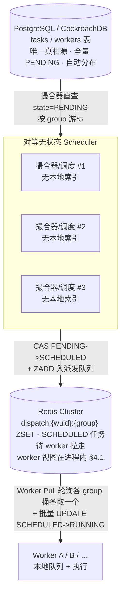

# msched 分布式调度系统 — 架构设计文档

## Context（背景与目标）

`msched` 是一个**无中心、Pull 模式、10 亿级任务**的分布式调度系统，用 Go 编写、
GORM 访问 PostgreSQL。需要在以下硬约束下工作：

- **规模**：处于 `PENDING` 的任务总量约 **10 亿**。**不支持定时**——task 创建即可派，无调度时间。PostgreSQL 是全量真相源（CockroachDB 自动 range 分布，无需应用层分区，见 §3.1），撮合器直查 PostgreSQL PENDING（无就绪池镜像），保证新任务（含新 group）立即可撮合，不被历史积压阻塞。
- **无中心**：一组**对等无状态 Scheduler**（无主，地位相同）负责撮合、下发；
  一组 **Worker** 只负责拉取并执行。
- **Pull**：Worker 主动拉，Scheduler 不主动 push。
- **状态**：Scheduler 进程**无状态**，Redis 只存派发队列（已派待拉）与 worker 注册表；撮合器直查 PostgreSQL。进程内不持有海量索引，规避 Go GC 灾难。
- **多租户**：按 `GroupUID` 隔离级防饿死（双重 group 轮询，非严格等量，见 §9）。

---

## 1. 关键决策一览

| # | 议题 | 决策 |
|---|------|------|
| 1 | 状态机 | **PENDING（待撮合）/ BACKOFF（无匹配 worker 退避）→ SCHEDULED（已调度待拉取）→ RUNNING（worker 拉走下发执行中）→ COMPLETED / DISCARDED**。未下发的任务不是 RUNNING（见 §8） |
| 2 | 撮合发生层 | **撮合器直查 PostgreSQL PENDING**（无就绪池）→ 匹配 worker → CAS PENDING→SCHEDULED → 入派发队列；Worker Pull 时直接拉现成队列，热路径零撮合零 CAS |
| 3 | 撮合数据结构 | Redis 只存**派发队列** `dispatch:{wuid}:{group}` ZSET（SCHEDULED 任务）；**无就绪池**（见 §6） |
| 4 | 多租户公平 | **隔离级防饿死**：撮合端 SQL group 游标轮询取候选 + 派发端 `dispatch:{wuid}:{group}` 分桶 worker 轮询各取一个，双重 group 轮询；**非长期严格等量**（见 §9） |
| 5 | 节点对等 | **软分片对等**：撮合器/调度器无状态对等，一致性哈希环按 `group_uid` 归属节点，各节点只撮合自己认领的 group，消除多实例对同一活跃 group 的 CAS 竞争（§12.8）；加删节点只影响相邻段。CAS 兜底保留：N 变更瞬间 group 可能被多节点认领，靠 §8.2 CAS 天然防双发。扩缩容即开即用 |
| 6 | Worker 路由 | **直连任一 Scheduler，轮询 `dispatch:{wuid}:{group}` 各取一个** |
| 7 | 撮合候选源 | **PostgreSQL 直查**：撮合器 `SELECT ... WHERE group_uid=? AND (state='PENDING' OR (state='BACKOFF' AND next_retry_time<=now)) ORDER BY priority, unit_id LIMIT N`（按 group 游标轮询）；无扫描器、无就绪池同步 |
| 8 | 防双发与下发 | 撮合器 CAS `PENDING→SCHEDULED`（入派发队列前）；worker 拉走时 `SCHEDULED→RUNNING`（批量 UPDATE，per-worker 无竞争） |
| 9 | RPC | **gRPC + protobuf** |
| 10 | 拉取粒度 | **批量预取 + Worker 本地队列** |
| 11 | 匹配语义 | **单向强约束** `Task.WorkerSelector ⊆ Worker.Labels`。**selector 维度开放**（业务可自定义任意 k/v），撮合器进程内遍历在线 worker 求 `SelectorSubset`，无需 Redis 倒排预建 |
| 12 | 拉取语义 | **Pull（定稿）**：Worker 主动 `Pull(batch=N)`，**非阻塞**——有则返回、空则立即返回空批，Worker 端退避轮询；Scheduler 不主动 push |

---

## 2. 总体架构与数据流



**全链路**：
1. **创建**：task 写入 PostgreSQL，state=PENDING。新任务（含新 group）立即可被撮合器查到，不被历史积压阻塞。
2. **撮合**：撮合器（无状态多实例，软分片）先按一致性哈希环过滤出本节点认领的 group（§5），再按 group 游标 `SELECT ... WHERE group_uid=? AND (state='PENDING' OR (state='BACKOFF' AND next_retry_time<=now)) ORDER BY priority, unit_id LIMIT N` 取候选 -> 按 `S_t ⊆ L_w` 遍历进程内 worker 视图匹配在线 worker（§4.1）-> 选 worker -> **PostgreSQL CAS `PENDING/BACKOFF->SCHEDULED`** -> 抢到的 `ZADD` 入 `dispatch:{wuid}:{group}` -> 推进 group 游标。CAS 失败即丢弃；**无匹配 worker 的 task 转 BACKOFF 退避**（见 §8.6），不空耗撮合器。
3. **拉取**：Worker 向任一 Scheduler 发 `Pull(batch=N)` → Scheduler 扫 `dispatch:{wuid}:*` 列出各 group 桶，**轮询各 group 桶各取一个** `ZPOPMIN 1`，凑满 batch → **批量 `UPDATE SCHEDULED→RUNNING`**（设 `pull_time` + `timeout`）→ 返回（**非阻塞**，空批立即返回）。**热路径零撮合零 CAS。**
4. **执行**：Worker 入本地队列逐个执行，完成回传 `Result`，PostgreSQL `RUNNING->COMPLETED`（终态，见 §8.7）。
5. **超时回收**：派发超时（SCHEDULED 阶段 worker 没拉走）或执行超时（RUNNING 阶段硬截止）→ reschedule 回 PENDING（见 §8）。
6. **心跳**：Worker 周期 `Heartbeat` 刷新 `workers.LeaseExpireTime`，并携带 `running_unit_ids` 作任务级活性心跳；lease 过期 → worker 离线，其派发队列残留 SCHEDULED + 名下 RUNNING 任务靠 §8 超时 reschedule。

---

## 3. 数据模型（相对给定结构的改动）

**`tasks` 表**：沿用给定结构。注意：
- 标准字段：`id SERIAL8 PRIMARY KEY`（DB 物理主键，CRDB `unique_rowid` 生成）、`created_at`（创建时间）、`updated_at`（修改时间，每次 UPDATE 同事务内 `now()` 维护）。`id` 为 DB 内部主键（range 分布/外键用），上层逻辑一律用 `UnitID` 定位，不直接读 `id`。
- `State`：枚举 `PENDING / BACKOFF / SCHEDULED / RUNNING / COMPLETED / DISCARDED`（见 §8 状态机）。**未下发的任务是 SCHEDULED 而非 RUNNING**。COMPLETED 为执行成功终态（Report SUCCEEDED，见 §8.7）。
- `DispatchTime time.Time`：撮合 CAS `PENDING→SCHEDULED` 时设；派发超时判定依据 `DispatchTime + DispatchTimeout`。
- `PullTime time.Time`：worker 拉走 `SCHEDULED->RUNNING` 时设；执行硬截止起算点。
- `MaxExecDuration time.Duration`：业务给定执行时长上限，创建时设定。
- `Timeout time.Time`：worker 拉走时设为 `PullTime + MaxExecDuration`，仅 RUNNING 阶段生效。
- `UnitID`：= hash(group+Args)，**全系统上层唯一标识**（`UNIQUE` 约束 + CAS 定位 + Redis 派发队列 member + RPC 字段）。DB 物理主键为自增 `id`，`unit_id` 带 UNIQUE 索引供上层定位；相同 group+Args 产生相同 UnitID，支持创建去重与幂等。
- `Priority`：撮合 `ORDER BY priority, unit_id` 决定 FIFO 派发序；默认 = created_at（Unix 微秒），业务可调升优先级。
- `NextRetryTime`：BACKOFF 退避的下次可撮合时间（PENDING 时 NULL，见 §8.6）。
- `FailCount`：连续无匹配次数，决定退避时长（见 §8.6）。
- 无调度时间字段：task 创建即 PENDING 即可派，不支持定时。
- `Labels`：**删除反向匹配后不再参与撮合**。如别处无消费方，可后续删除；当前保留作观测/过滤用途（待定，见 §11）。
- `SelectorHash`：= `ComputeSelectorHash(WorkerSelector)`（key 排序后长度前缀 + SHA-256 hex），group_stats 按 (group_uid, selector_hash) 聚合计数的维度键。创建时算好存入，避免状态转换时重算。

**`workers` 表**：
- 标准字段同 tasks：`id SERIAL8 PRIMARY KEY`、`created_at`、`updated_at`；`unit_id` 带 UNIQUE 约束作上层唯一标识（业务逻辑用，DESIGN §3）。
- 保留 `Labels`（被 `Task.WorkerSelector` 子集匹配）、`LeaseExpireTime`（worker 在线心跳）、`State`、`Token`（身份校验凭证，RPC 入口比对，见 §10）。

**`group_stats` 表**：按 (group_uid, selector_hash, state) 聚合的任务计数，行式存储。
- **主键**：`id SERIAL8`（标准化，同 tasks/workers）；`(group_uid, selector_hash, state)` 为业务唯一键（UNIQUE），UPSERT/UPDATE 定位走此，每态一行，`count BIGINT`。`created_at`/`updated_at` 审计时间，count 增减时维护 `updated_at=now()`。
- **实时维护**：任务状态转换（§8 状态机）同事务内增减对应行 count--`UPDATE count = count ± 1`。CAS 成功者才改，多撮合器并发无重复计数。
- **用途**：观测/撮合决策查询（如某 group 某 selector 下积压水位），不进 Redis（PostgreSQL 派生数据）。
- **规模小**：group<100 × selector 种类有限 × state 5 ≈ 千级行，同 workers 表，普通表即可。
- **selector_hash 维度**：`= ComputeSelectorHash(WorkerSelector)`（见 tasks.SelectorHash）。空 selector 也是一个独立维度（通配）。
- **selectors 可读伴随**：每行冗余 `selectors TEXT[]`（= `ComputeSelectorPairs(WorkerSelector)`，"k=v" 按 key 字典序），selector_hash 的可读投影。观测查询时直接看懂聚合维度，无需反查 hash 对应的 selector。规模小（千级行）冗余可忽略。

```sql
CREATE TABLE group_stats (
  id            SERIAL8 PRIMARY KEY,   -- DB 物理主键（标准化，同 tasks/workers）
  group_uid     TEXT NOT NULL,
  selector_hash TEXT NOT NULL,
  selectors     TEXT[] NOT NULL DEFAULT '{}',  -- selector_hash 的可读伴随（"k=v" 按 key 排序，DESIGN §3）
  state         TEXT NOT NULL,   -- PENDING/BACKOFF/SCHEDULED/RUNNING/COMPLETED/DISCARDED
  count         BIGINT NOT NULL DEFAULT 0,
  created_at    TIMESTAMPTZ NOT NULL DEFAULT now(),
  updated_at    TIMESTAMPTZ NOT NULL DEFAULT now(),
  UNIQUE (group_uid, selector_hash, state)  -- 业务唯一键，UPSERT/UPDATE 定位走此
);
```

### 3.1 分布与索引策略（CockroachDB 自动 range 分布）

CockroachDB 自动按 range（默认 64MB）分片 `tasks` 表数据并跨节点均衡 leaseholder，**无需应用层 hash 分区**。新 group 随写入自动落入对应 range，无需 DDL 新建分区：

- **复合索引定向扫描**：撮合查询 `WHERE group_uid=?` 依赖 `(group_uid, state, next_retry_time, priority)` 复合索引定向扫描，10 亿全量不压单 range 索引。
- **主键 id 的 hotspot 权衡**：`id SERIAL8`（CRDB `unique_rowid`，基于时间戳有序）作主键时新写入集中末尾 range，高并发写入可能成 hotspot；`unit_id`（SHA-256 hash 随机分布）带 UNIQUE 索引，查询均匀打散。若压测写入成瓶颈，可改随机 UUID 主键或回退 `unit_id` 作主键（其随机分布更利于 CRDB range 均衡）。
- **group 动态无需 DDL**：新 group 随写入自动分布到各 range，无需建分区，避免运维负担（list 分区则需为每个新 group 建分区）。
- **ListActiveGroups 扫描**：`SELECT DISTINCT group_uid WHERE state='PENDING' OR (state='BACKOFF' AND next_retry_time<=now)` 扫 PENDING + 到期 BACKOFF；靠周期刷新缓存活跃 group 缓解（§9.5），非热路径。漏到期 BACKOFF 会让纯退避 group 永不被轮询（饿死）。
- **workers 表**：在线 worker 规模小（千级），普通表即可，无需分区。

---

## 4. 匹配语义（单向强约束，selector 维度开放）

唯一约束：**`Task.WorkerSelector ⊆ Worker.Labels`**
即任务声明的每个 `k=v` 都必须在 worker 的 `Labels` 中存在且相等，worker 才有资格执行。空 selector 通配，匹配任意 worker。

### 4.1 撮合匹配实现（进程内遍历）
撮合器取一个 task 后，要找「labels 包含该 selector」的在线 worker。本设计采用**进程内遍历 worker 视图**：对每个在线 worker 调 `SelectorSubset(selector, labels)` 判断子集包含，返回全部匹配的 worker UnitID。

- **selector 维度开放**：业务可自定义任意 `k=v`（无需固定维度集合 `D`）。`SelectorSubset` 是通用子集判断，对任意 key 皆成立，**不再依赖 Redis 倒排预建**。
- **规模前提**：在线 worker 千级内、撮合 QPS 百级。单轮撮合遍历千 worker × 百 QPS = 10⁵ 次/s 子集判断（每次几个 map 查找，微秒级），单核可扛。
- **worker 视图来源**：撮合器本地缓存在线 worker 的 `UnitID + Labels`，从 PostgreSQL `workers` 表全量拉取 + 周期增量刷新（**默认 1s，可配**）。缓存可重建、弱一致：崩溃无损、扩缩容即开即用。
- **一致性窗口** = 刷新周期。worker 上下线延迟 ~1s 可见：上线晚见最多多退避一轮；下线晚见靠 §8.4 派发/执行超时兜底回收。

> 已删除原「维度固定化硬约束」与 Redis 倒排 `SINTER` 方案。开放 k/v selector 不再使设计失效。


## 5. 无状态调度与软分片

- **撮合器 / 调度器无状态**：进程内不持有撮合索引；持有可重建的 worker 视图缓存（§4.1），崩溃重拉即恢复，扩缩容即开即用。任一节点均可服务任一 Worker 的 Pull。
- **软分片（横向扩展）**：一致性哈希环按 `group_uid` 归属节点，各节点只撮合自己认领的 group，消除多实例对同一活跃 group 的 CAS 竞争（§12.8）。加删节点只影响相邻段（虚节点均摊负载）。**CAS 兜底保留**：N 变更瞬间 group 可能被多节点认领，靠 §8.2 CAS 天然防双发，分片仅为减竞争、不依赖正确性。
- **成员发现**：节点注册到 Redis `msched:nodes` ZSET（member=nodeID，score=lease_expire_ts，§6）。各节点周期（1s）心跳续 lease（`ZADD` 覆盖 score=now+5s）+ 拉全量活跃成员（`ZRANGEBYSCORE now +inf`）增量重建环（`ring.Add` 新增 / `ring.Remove` 消失），并幂等清理过期（`ZREMRANGEBYSCORE -inf now`，任节点可做）。成员变更感知延迟 ≈ 1 个刷新周期，靠 CAS 兜底。本节点 nodeID **配置注入**（env `MSCHED_NODE_ID`，空兜底 `hostname`），重启稳定使环不抖动、虚节点不重排。优雅下线 `ZREM` 立即摘除；崩溃靠 lease TTL（5s）自然过期。
- **Redis Cluster**：存派发队列（SCHEDULED 任务，GB 级）+ 节点注册表（`msched:nodes`，§5，规模 N 节点极小）。撮合候选来自 PostgreSQL 直查，worker 视图在进程内，不经 Redis。原 worker 倒排/online/meta 注册表已删除（§6）；`msched:nodes` 是 scheduler 对等**成员发现**注册表（非 worker 视图），二者不可混淆。
- **角色**：撮合器（PostgreSQL PENDING->派发队列，含 CAS）、调度器（派发队列->Worker Pull）均可无状态多实例，逻辑上可同进程或拆分。无扫描器（就绪池已去除）。


## 6. Redis 数据布局

Redis 存**派发队列**（撮合后、已 CAS、待 worker 拉走的 SCHEDULED 任务）+ **节点注册表**（软分片成员发现，§5）。**无就绪池**--撮合候选来自 PostgreSQL 直查，worker 视图在进程内，不镜像 PENDING。Redis 规模 = SCHEDULED 集合 + N 节点注册行，远小于 10 亿，GB 级，无需分片分摊全量。

```
# 撮合后：派发队列（per-worker × per-group，group 公平靠 key 结构）
dispatch:{wuid}:{group}                 ZSET  score=dispatch_time, member=unitID

# 软分片成员注册表（scheduler 节点 lease，§5）
msched:nodes                            ZSET  score=lease_expire_ts, member=nodeID

# worker 视图在撮合器进程内（PostgreSQL 刷新，§4.1），不进 Redis。
```

- 派发队列 `dispatch:{wuid}:{group}`：每个 worker 每个 group 一个 ZSET，task 已是 SCHEDULED（CAS `PENDING→SCHEDULED` 时设 `dispatch_time`）。group 桶按需创建（ZADD 自动建、ZREM 到空自动消），空 group 不留 key。
- 派发时 worker 轮询 `dispatch:{wuid}:*` 下各 group 桶各取一个，实现单轮 group 间公平（见 §9）。
- `Args/Result` 等大字段不进 Redis，留在 PostgreSQL。
- **`dispatch:{wuid}:{group}` 用 `{wuid}` hash tag** 集中同 worker 各 group 桶到同 slot，便于 SCAN/Lua。
- 节点注册表 `msched:nodes`：单 ZSET 全集群共享，member=nodeID、score=lease_expire_ts。各 scheduler 周期（1s）`ZADD` 续自己的 lease（score=now+5s），`ZRANGEBYSCORE now +inf` 拉全量活跃成员增量重建环，`ZREMRANGEBYSCORE -inf now` 幂等清过期。优雅下线 `ZREM`，崩溃靠 5s TTL 自然过期。nodeID 配置注入（env `MSCHED_NODE_ID`，空兜底 hostname）。规模 N 节点（个位~几十），单 key 不分片。

---

## 7. 撮合（直查 PostgreSQL:CockroachDB）

- PostgreSQL 是唯一真相源（全量 task、`Args/Result`、状态机）。撮合器直查 PostgreSQL，不经 Redis 取候选。
- **撮合器**（无状态多实例，软分片）先按一致性哈希环过滤出本节点认领的 group（§5），再按 group 游标 `SELECT ... WHERE group_uid=? AND (state='PENDING' OR (state='BACKOFF' AND next_retry_time<=now)) ORDER BY priority, unit_id LIMIT N` 取候选 -> 对每个 task，遍历进程内 worker 视图调 `SelectorSubset` 得匹配在线 worker（§4.1）-> 选 worker -> **PostgreSQL CAS `PENDING/BACKOFF->SCHEDULED`**（`WHERE unit_id=? AND state IN ('PENDING','BACKOFF')`）-> 抢到的 `ZADD` 入 `dispatch:{wuid}:{group}` -> 推进 group 游标。**无匹配 worker 的 task 转 BACKOFF 退避**（见 §8.6），不空耗撮合器。
- 依赖 PostgreSQL `(group_uid, state, next_retry_time, priority)` 复合索引避免撮合查询全表扫。
- **新任务快可见**：task 创建写 PostgreSQL 即 PENDING，撮合器下次查询即见；新 group 的任务与老 group 平等，**立即可撮合，不被积压阻塞**。
- **无脏缓存/残影/对账**：撮合器 CAS 失败（他节点已抢）即丢弃候选，下次查询因 state 已变 SCHEDULED 不再返回。无就绪池同步链路、无扫描器。
- group 公平：撮合端 SQL group 游标轮询 + 派发端 key 结构轮询双重保证（见 §9）。

---

## 8. 状态机、超时与防双发

### 8.1 状态机
| 状态 | 含义 | 进入条件 |
|---|---|---|
| PENDING | 待撮合，正常参与撮合查询 | 创建 / reschedule 回收 / BACKOFF 到期 |
| BACKOFF | 无匹配 worker，退避中，到 `next_retry_time` 才查（见 §8.6） | 撮合无匹配 |
| SCHEDULED | 已调度，待 worker 拉取（**未下发，没在执行**） | 撮合器 CAS（从 PENDING 或 BACKOFF） |
| RUNNING | worker 已拉走下发，执行中 | worker Pull 批量 UPDATE |
| COMPLETED | 执行成功终态，`Result` 已写（见 §8.7） | worker Report SUCCEEDED |
| DISCARDED | 派发次数超限，放弃（见 §8.5） | dispatch_count 超限 |

> **语义**：未下发的任务是 SCHEDULED 而非 RUNNING。RUNNING 严格表示「worker 已拉走、正在执行」。COMPLETED 是执行成功终态（§8.7，异步归档）。BACKOFF 是 PENDING 的退避变体（暂不参与撮合查询），退避到期被撮合查询自然取到（§8.6，不主动唤醒）。
>
> **group_stats 实时维护**：每次状态转换（§8.2/§8.3/§8.4/§8.5/§8.6）同事务内增减对应 (group_uid, selector_hash, old_state) 与 (group_uid, selector_hash, new_state) 的 count（DESIGN §3）。

### 8.2 撮合 CAS（PENDING → SCHEDULED）
撮合器选中任务 + 匹配到 worker 后，**入派发队列前**抢租约：
```sql
UPDATE tasks
SET state='SCHEDULED', lease_owner=?, dispatch_time=now,
    dispatch_count=dispatch_count+1
WHERE unit_id=? AND state IN ('PENDING','BACKOFF');      -- 影响行数=1 才算抢到
```
抢到才 `ZADD` 入 `dispatch:{wuid}:{group}`（group 从 task 行已知）；CAS 失败（他节点已抢）则丢弃候选。并发多撮合器选中同一任务时，只有一条 UPDATE 命中 `state='PENDING'`，天然防双发。**此时不设 exec timeout**——还没下发执行。

### 8.3 下发（SCHEDULED → RUNNING）
worker Pull 时，scheduler 从 `dispatch:{wuid}:{group}` 弹出任务，批量标记下发：
```sql
UPDATE tasks
SET state='RUNNING', pull_time=now, time_out = now + max_exec_duration
WHERE unit_id IN (...) AND state='SCHEDULED';
```
派发队列 per-worker，只有该 worker 拉自己的，无并发竞争，无需 CAS。`timeout` 在此设为 `pull_time + MaxExecDuration`（执行硬截止）。

### 8.4 超时回收（两阶段）
**派发超时**（SCHEDULED 阶段，worker 没拉走）：
```sql
UPDATE tasks SET state='PENDING', lease_owner='' WHERE unit_id=? AND state='SCHEDULED' AND dispatch_time + dispatch_timeout < now;
-- 必须同步清理 Redis：ZREMRANGEBYSCORE dispatch:{wuid}:{group} -inf <cutoff>
-- （cutoff=now-dispatch_timeout 兜底，或按 member 精确 ZREM），杜绝幽灵 member 被 worker 重复 ZPOPMIN（防双发，§8.4）
```
**执行超时**（RUNNING 阶段，硬截止）：
```sql
UPDATE tasks SET state='PENDING', lease_owner='' WHERE unit_id=? AND state='RUNNING' AND time_out < now;
```
- 两类超时都 reschedule 回 PENDING，撮合器下次查询自然再取（无需就绪池重推）。
- 僵尸 worker 即使仍发心跳，RUNNING 任务超 `Timeout` 照样回收。
- `Worker.LeaseExpireTime` 过期（worker 整体离线）可作为**更快**的辅助回收信号：批量 reschedule 该 worker 名下 SCHEDULED + RUNNING 任务。
- `dispatch_timeout` 短（如 30s），保护「派发了但 worker 没拉走」不长期占用；`exec timeout` 长（= max_exec_duration）。

### 8.5 丢弃（派发重试上限）
`dispatch_count >= TaskMaxAttempt`（**派发次数**：每次 CAS `PENDING→SCHEDULED` 累加，含派发超时 worker 未拉走，§8.2）→ `state='DISCARDED'`，不再调度。dispatch_count 计的是派发次数而非执行失败次数——慢 worker 致派发超时循环也会消耗次数。
> 注意：这是**派发次数超限**的放弃（含执行失败与派发超时），与 §8.6「无匹配 worker」的退避不同——后者**永不放弃**，worker 恢复即恢复下发。

> 阈值用 `>=`（非 `>`）：TaskMaxAttempt=N 即允许至多 N 次派发，第 N 次失败即放弃，与「最大尝试次数」命名一致。实现见 `task_store.ReportFail`。

### 8.6 无匹配 worker 的退避策略
task 撮合时 selector 无在线 worker 匹配（对应 worker 全挂）→ 不能无限反复撮合（空耗撮合器、压 PostgreSQL 查询、拖慢活任务派发）。采用**退避暂存 + worker 上线唤醒**，**永不放弃**。

退避态合并进 `state`（见 §8.1）：`PENDING`（正常参与撮合）/ `BACKOFF`（退避中，到 `next_retry_time` 才查）。task 加两独立列：
- `next_retry_time`：BACKOFF 时的下次可撮合时间（PENDING 时为 NULL）
- `fail_count`：连续无匹配次数（决定退避时长）

> 这两列是高频撮合调度字段（next_retry_time 进撮合查询 WHERE），保持 PostgreSQL task 行**独立列**进复合索引，不塞 JSON meta——JSON 字段无法用 B-tree 索引高效过滤。

**退避触发**：撮合器取到 task，遍历 worker 视图无匹配（`SelectorSubset` 无命中）->
```sql
UPDATE tasks SET state='BACKOFF',
  next_retry_time = now + backoff(fail_count),
  fail_count = fail_count + 1
WHERE unit_id = ? AND state IN ('PENDING','BACKOFF');
```
退避序列指数 + 抖动封顶：`30s, 1m, 2m, 5m, 10m, 30m, 1h, 1h, ...`（封顶 1h，永不放弃）。

**撮合查询只查 PENDING + 到期 BACKOFF**：
```sql
SELECT ... WHERE group_uid=?
  AND (state='PENDING'
       OR (state='BACKOFF' AND next_retry_time <= now))
ORDER BY priority, unit_id LIMIT N;
```
BACKOFF 中的死任务绝大多数时间不参与查询，不空耗撮合器；到期查一次，撮合成功则 `BACKOFF→SCHEDULED`（CAS `WHERE state='BACKOFF'`），仍无匹配则继续退避。

**不主动唤醒（纯退避到期）**：BACKOFF 任务靠 `next_retry_time` 到期后被撮合查询自然取到（查询条件 `state='BACKOFF' AND next_retry_time<=now`），不依赖 worker 上线事件触发唤醒。worker 恢复后，退避到期的任务自然重新撮合；未到期的仍等下次到期。简化了 worker 注册流程（无需批量 UPDATE 唤醒），代价是故障恢复后任务恢复有退避延迟（最多一个退避周期，封顶 1h）。


**reschedule 不入 BACKOFF**：派发超时/执行超时 reschedule 回 PENDING（非 BACKOFF）——这些 task 之前匹配过 worker（能被派发说明匹配过），重派给公平机会直接 PENDING；若再无匹配则撮合器自然转 BACKOFF。

**收益**：死任务不空耗撮合器、不压查询、活任务派发不受干扰；worker 恢复即自动恢复下发；永不放弃。state 单一权威，无独立退避字段。

### 8.7 执行成功终态与归档（RUNNING -> COMPLETED）
worker `Report(SUCCEEDED)` 回传结果时，**带所有权 CAS** 转终态：
```sql
UPDATE tasks
SET state='COMPLETED', result=?, finished_time=now
WHERE unit_id=? AND lease_owner=? AND state='RUNNING';   -- 影响行数=1 才算成功
```
- **所有权校验**：`WHERE lease_owner=?` 必须匹配上报 worker。若行=0，说明任务已被 §8.4 超时回收重派他处（或已被该 worker 重复 Report），**Report 忽略**，不写结果--防止后置 Report 污染正在他处执行的任务。
- **group_stats 实时维护**：成功时 RUNNING count-1、COMPLETED count+1。
- **Report FAILED**：不写 Result，按 `dispatch_count` 决定--未超限则 reschedule 回 PENDING（重派），超限则 DISCARDED（§8.5）。FAILED 的 reschedule 不入 BACKOFF（之前匹配过 worker，§8.6）。
- **异步归档**：COMPLETED 行保留 `Result` 供事后查询，但 10 亿级 tasks 表不可无限增长。独立回收器按保留期（可配，§11）将 COMPLETED 行归档/清理。COMPLETED 不参与撮合查询，归档不影响调度。
- **终态清理**：COMPLETED/DISCARDED 后，Redis 派发队列已无对应 member（worker Pull 时 ZPOPMIN 已移除），无需额外清理。

---

## 9. 多租户公平（隔离级防饿死，非严格等量）

`GroupUID` 是用户隔离 ID。本设计提供**隔离级防饿死**，**不保证 group 间长期严格等量派发**。公平靠**撮合端 group 游标 + 派发端 key 结构轮询**双重保证。

### 9.1 撮合端：SQL group 游标轮询取候选
- 撮合器维护 group 游标（内存或 PostgreSQL），按游标当前指向的 group，`SELECT ... WHERE group_uid=? AND (state='PENDING' OR (state='BACKOFF' AND next_retry_time<=now)) ORDER BY priority, unit_id LIMIT N` 取一批候选。
- 取尽或撮合完一批后，推进游标到下一个 group（环形轮询所有活跃 group）。
- 效果：撮合阶段就按 group 轮询产出候选，大户 group 不会独占撮合产出，小户 group 每轮都得到撮合机会。
- group 游标可多撮合器实例共享（PostgreSQL/Redis 全局，公平性好），或各实例本地近似（吞吐好，公平性略弱）——取舍见 §9.4。

### 9.2 派发端：派发队列 key 结构轮询
- 派发队列按 `dispatch:{wuid}:{group}` 分桶——每个 worker 每个 group 一个 ZSET。
- Worker Pull 时，Scheduler 扫 `dispatch:{wuid}:*` 列出该 worker 的各 group 桶，**轮询各 group 桶各取一个**（`ZPOPMIN 1`），凑满 batch 或扫完为止。
- 效果：单轮拉取内，每个有任务的 group 至少取一个，大户 group 无法独占 worker 的拉取额度。

### 9.3 作用域与局限
- 公平作用域是**撮合单轮 + 派发单轮**。跨轮/长期不严格：
1. **各 group 待派量不等**：group A 桶满、B 桶空时，轮询跳过空 B 桶，A 拿多数。
2. **per-worker 独立**：各 worker 独立轮询自己的派发 group 桶，group 在不同 worker 上推进速率随 worker 速度差而异。
3. **空桶跳过**：轮询是"有就取"，无任务的 group 不占额度，大户自然多吃。
- 撮合端 + 派发端双重轮询比单端更趋均匀，但上述结构性局限仍在。

### 9.4 严格等量与游标取舍（不采纳严格等量）
- 要长期 group 严格等配额，需全局速率/令牌 + 派发决策经单一串行点按配额裁决，与「撮合器无状态多实例 + CAS」分布式模型冲突，成吞吐瓶颈。评估后**不采纳**。
- group 游标全局 vs 本地：全局游标多实例共享公平性好但争用串行点；本地近似吞吐好但各实例轮询不同步。软分片下每 group 单节点认领撮合（§5），无跨节点同 group 竞争，**全局游标退化为本地**（matcher `nextGroup`）；仅非分片或需跨节点严格公平时才共享全局游标，压测若成瓶颈降级本地。

### 9.5 实现注意
- 撮合端 group 列表：`SELECT DISTINCT group_uid FROM tasks WHERE state='PENDING' OR (state='BACKOFF' AND next_retry_time<=now)` 周期刷新活跃 group，按游标环形轮询。漏到期 BACKOFF 会让纯退避 group 饿死（§3.1）。
- 派发端 group 桶：`SCAN dispatch:{wuid}:*` 列出（per-worker 拉取无并发，非原子可接受），逐桶 `ZPOPMIN 1`；或 Lua 原子化。
- group 桶按需维护：派发桶 `ZREM` 到空后下次 SCAN 不再出现；活跃 group 列表周期刷新。

---

## 10. gRPC 接口草图

- **Worker → Scheduler**：
  - `Register(UnitID, Labels, capacity) -> ok`：上线注册，写 PostgreSQL `workers` 表（Labels/LeaseExpireTime/State）；各撮合器下次刷新 worker 视图时可见（§4.1，默认 1s）。不主动唤醒 BACKOFF 任务（纯退避到期，§8.6）。
  - `Pull(UnitID, batch) → []Task`：扫 `dispatch:{wuid}:*` 轮询各 group 桶各取一个，热路径零撮合零 CAS（SCHEDULED→RUNNING 批量 UPDATE，per-worker 无竞争）。**非阻塞**，空批立即返回。
  - `Heartbeat(UnitID, running_unit_ids) → (lease_expire_time, recovered_unit_ids)`：刷新 `workers.LeaseExpireTime`；携带 `running_unit_ids` 作任务级活性心跳，scheduler 据此把 `lease_owner=UnitID` 但持续未上报的 RUNNING 任务提前 reschedule 回 PENDING（§8.4 补充），并通过 `recovered_unit_ids` 告知 worker 丢弃已回收任务本地状态。
  - `Report(workerUnitID, unitID, result/state)`：回传执行结果。SUCCEEDED → `RUNNING→COMPLETED`（CAS `WHERE unit_id=? AND lease_owner=? AND state='RUNNING'`，写 Result，§8.7）；FAILED → 按 `dispatch_count` reschedule 回 PENDING 或 DISCARDED（§8.5）。**所有权校验**：CAS 必须 `lease_owner==workerUnitID`，否则任务已被回收重派他处，Report 忽略（§8.4/§8.7）。`workerUnitID` 为上报 worker，`unitID` 为被上报任务（proto 中分别 `worker_unit_id`/`unit_id`，DESIGN §3）。
- **Scheduler → Redis/PostgreSQL**：`SCAN dispatch:{wuid}:*` + 逐桶 `ZPOPMIN 1`（Redis）；拉走后批量 `UPDATE SCHEDULED→RUNNING`（PostgreSQL），非 gRPC。

---

## 11. 假设与待定项

1. `Task.Labels` 删除反向匹配后是否仍有消费方？若无 → 后续可移除字段（**待确认**）。
2. OSS payload 阈值默认 64 KB（**假设**，可调）。
3. ~~selector 固定维度集合 `D`~~ → **已废弃**，selector 维度开放（§4，业务可自定义任意 k/v，无需固定维度集合）。
4. 撮合器查询批大小 N、撮合器消费速率、批量预取 N、worker 本地队列水位、派发队列积压阈值 → 调优参数，留默认 + 可配。
5. `dispatch_timeout`（派发超时）默认值 → **待定**，需平衡 worker 拉取延迟与 reschedule 抖动。
6. 退避序列参数（起始/封顶/抖动） → **待定**，见 §8.6（已定 30s..1h 封顶，抖动待补；纯退避到期，不主动唤醒）。
7. worker 容量模型（并发槽位数）与派发队列水位关系 → **待定**，影响背压。
8. COMPLETED 行异步归档保留期 → **待定**，平衡事后查 `Result` 与 10 亿级 tasks 表规模（§8.7）。
9. Pull 空载退避参数（起始/上限/抖动） → **待定**，防空闲高频空轮询打爆 scheduler（§12.9）。
10. 硬件校准：撮合查询 QPS 与 PostgreSQL 负载、派发队列规模、撮合器吞吐 → 需压测后回填参数。

---

## 12. 脆弱点与选型风险

1. **worker 视图一致性窗口**：撮合器进程内 worker 视图周期刷新（默认 1s），worker 上下线延迟 ~1s 可见。上线晚见致任务多退避一轮；下线晚见致向死 worker 派发，靠 §8.4 超时兜底（有延迟）。刷新周期可配，权衡 PG 查询频率与可见延迟。
2. **Redis Cluster 是新单点**：挂了派发断流（PostgreSQL 仍在但 worker 拉不到任务）。需 Cluster 多副本 + Sentinel。
3. **撮合查询压 PostgreSQL**：撮合器直查 PostgreSQL PENDING，高频撮合下查询 QPS 压 PostgreSQL。靠 `(group_uid, state, next_retry_time, priority)` 复合索引定向扫描支撑（§3.1）；若压测成瓶颈，可加有界缓存（非全量镜像）。
4. **无匹配 worker 的 task 退避**：selector 无在线 worker 匹配的 task 转 BACKOFF 退避（§8.6），不空耗撮合器。**纯退避到期，不主动唤醒**（§8.6）——worker 恢复后退避到期的任务被撮合查询自然取到，不依赖上线事件批量 UPDATE。**永不放弃**——退避封顶 1h。风险：故障恢复后任务恢复有退避延迟（最多一个退避周期）；退避任务集中到期时撮合查询潮汐涌入，需监控。
5. **SCHEDULED 派发超时抖动**：worker 拉得慢 → SCHEDULED 任务触发派发超时 reschedule，重新撮合又可能再派给慢 worker，循环抖动。需背压（派发速率 ≤ worker 消费速率）+ 拉取延迟监控。
6. **派发队列积压**：worker 拉得慢致 `dispatch:{wuid}:{group}` 积压，占 Redis 内存；靠 `dispatch_timeout` 兜底回收 + 积压监控。
7. **worker 视图一致性窗口**：撮合器进程内 worker 视图周期刷新（默认 1s），worker 异常离线延迟可见会向死 worker 派发，靠 §8.4 超时兜底回收，但有延迟。
8. **撮合器多实例竞争**：多实例查 PostgreSQL PENDING + CAS 抢同一任务，空转竞争（CAS 失败）消耗吞吐，需限流/分桶。
9. **Pull 空载轮询**：系统空闲时 worker 高频空 Pull（非阻塞立即返回空批）打爆 scheduler。需 worker 端退避轮询（指数退避 + 上限，§11.9 待定）与空载监控，避免空转消耗。
