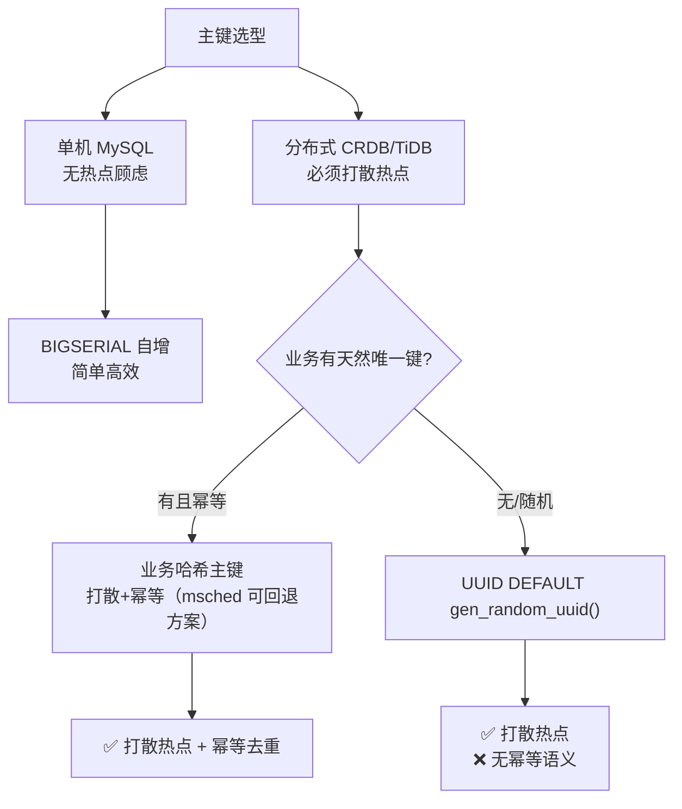

# msched SQL 表结构设计规范

本规范融合通用关系型数据库（PostgreSQL/MySQL）最佳实践与分布式数据库（CockroachDB/TiDB）底层特性，并锚定 msched 的实际工程取舍。改 schema 前必读。

设计依据见 [DESIGN.md](DESIGN.md) §3（数据模型）与 [CODING.md](CODING.md)（Go 代码风格）。DDL 落地在 [internal/storage/pg/schema.sql](../internal/storage/pg/schema.sql)。

---

## 0. 通用规范 vs msched 取舍速览

通用规范主张"四大天王字段 + 逻辑删除 + version 乐观锁"，msched 并非照搬，而是按状态机语义做了定向取舍：

| 通用规范主张 | msched 做法 | 原因 |
|---|---|---|
| 主键用 `BIGSERIAL` 或 `UUID` | `id SERIAL8`（CRDB unique_rowid）物理主键 + `unit_id UNIQUE`（= hash(group+Args)）业务标识 | 标准化主键（id/created_at/updated_at 统一，range 分布/外键用）；unit_id 降 UNIQUE 供上层定位 + 创建去重/幂等。注：SERIAL8 时间戳有序有 hotspot 风险（违反 §5.1 原则），压测后可回退 `unit_id` 作主键（其 SHA-256 随机分布更优，见 §5.1） |
| `version INT` 乐观锁 | `WHERE state='X'` 状态条件 CAS（影响行=1 即成功） | 状态机语义比笼统 version 更精确，且天然防双发 |
| `updated_at` 通用修改时间 | 有 `updated_at`（每次 UPDATE `now()`）+ `dispatch_time`/`pull_time`/`timeout` 精确时间字段并用 | updated_at 作通用修改审计；精确字段表达状态机事件语义（派发了但没拉走靠 dispatch_time 判定），两者各司其职 |
| `is_deleted` 逻辑删除 | tasks 用 `DISCARDED`/`COMPLETED` 终态 + 回收归档；workers 用 lease 过期物理删；group_stats 维护 count | 状态机终态比布尔标志表达力强；worker 是临时注册不逻辑删 |
| 枚举用 `SMALLINT` | `state` 用 `TEXT`（'PENDING'/'SCHEDULED'...） | 可读性优先：直查 CRDB 调试一眼看懂；状态值有限非写入瓶颈 |
| 尽量 `NOT NULL` | 时间字段允许 `NULL` | NULL 表达"未发生"（未派发/未拉走/未完成）是合理语义 |

**核心原则不变**：物理外键禁用、命名小写下划线、索引克制、类型最小化、金额禁浮点。下文逐条展开。

---

## 1. 命名规范

### 1.1 通用规则

- **小写 + 下划线**：所有对象（库/表/列/索引）一律 `lower_case_with_unders`。
  - ✅ `user_profiles`、`order_amount`
  - ❌ `UserProfiles`（CRDB/PG 对带引号标识符大小写敏感，裸写会被折叠成小写，混用极痛苦）
- **表名用复数名词短语**：表是集合，复数见名知集合。✅ `tasks`、`workers`、`group_stats`
- **严禁关键字**：不用 `select`/`table`/`desc`/`order`/`user`/`group` 作表名列名。msched 用 `group_uid` 而非 `group`，`state` 虽是关键字但 PG/CRDB 允许裸用（保留字分级），仍建议长名规避歧义。
- **索引命名后缀**：
  - 主键：`pk_表名`（CRDB 主键多为复合/非显式命名，可省）
  - 唯一索引：`uk_表名_列名`
  - 普通二级索引：`idx_表名_用途或列名`

### 1.2 msched 实践：索引按"用途"命名

msched 的撮合索引命名为 `idx_tasks_match` 而非 `idx_tasks_group_uid_state_next_retry_time_priority`（列名拼接过长）。**按用途命名**优于按列名拼接：一眼看出"这是撮合查询专用索引"，重构列时不易误删。仅当单列普通索引、用途即列名时才用列名后缀。

```sql
-- ✅ 用途命名，撮合专用
CREATE INDEX IF NOT EXISTS idx_tasks_match ON tasks (group_uid, state, next_retry_time, priority);
-- 单列索引，列名即用途
CREATE INDEX IF NOT EXISTS uk_workers_lease ON workers (lease_expire_time);
```

---

## 2. 字段设计规范

### 2.1 通用规则

- **能用数字就不用字符串**：状态/枚举优先 `SMALLINT`（见 §0 msched 对 state 的例外取舍）。
- **精度敏感禁浮点**：金额/费率用 `NUMERIC`/`DECIMAL`，或放大为分/厘存 `BIGINT`。严禁 `FLOAT`/`DOUBLE`。
- **字符串长度克制**：按需 `VARCHAR(32)`，不滥开 `VARCHAR(255)`/`TEXT`。过宽影响临时表与内存排序。
- **时间用带时区类型**：`TIMESTAMPTZ` 优于 Unix 时间戳整数，利于原生函数计算与跨时区。
- **尽量 `NOT NULL` + `DEFAULT`**：NULL 有 Null Bitmap 开销，且在 `COUNT`/`NOT IN` 引发逻辑陷阱。

### 2.2 msched 实践：合理的 NULL 与类型选择

msched 大量使用可空时间字段，**这是有明确语义的 NULL**，非懒散放空：

| 字段 | NULL 语义 | 非空时机 |
|---|---|---|
| `dispatch_time` | 还没派发 | CAS `PENDING→SCHEDULED` 时设 |
| `pull_time` | 还没被拉走 | worker 拉走批量置 `RUNNING` 时设 |
| `timeout` | 非 RUNNING | = `pull_time + max_exec_duration` 派生 |
| `next_retry_time` | 非 BACKOFF | 退避时设下次可撮合时间 |
| `result` | 未成功完成 | `COMPLETED` 时写 |

> NULL 表达"该事件尚未发生"是合法语义；该避免的是"不知道有没有值"的语义模糊 NULL。判断标准：NULL 是否对应一个明确的状态机分支。

**类型落地**：

- `args`/`result` 用 `BYTES`（二进制 protobuf），不进 Redis，留 PG 大字段。
- `worker_selector`/`labels` 用 `JSONB`（非 `JSON`，CRDB 下 JSONB 即 JSON 且支持索引/操作符）。
- `max_exec_duration` 存 `BIGINT`（ns）而非 `INTERVAL`——避开 Go `time.Duration` 与 INTERVAL 的序列化痛点，ns 直接 `int64` 互转。
- `priority` 用 `BIGINT`（默认 = `created_at` 微秒），`fail_count`/`dispatch_count` 用 `BIGINT` 防溢出。

---

## 3. 索引设计规范

### 3.1 通用规则

- **单表二级索引 ≤ 5 个**：索引越多写入越慢（每写一行要同步维护所有索引树/KV）。
- **高选择性列靠左**：复合索引把 Cardinality 高的列放最左。性别/状态这种 2-3 值列单独建索引无意义。
- **最左前缀法则**：复合索引 `(a, b, c)` 等价于同时拥有 `(a)`、`(a,b)`、`(a,b,c)`；查询不含 `a` 则失效。
- **覆盖索引**：高频查询把返回列加入索引（PG 用 `INCLUDE`，CRDB 用 `STORING`），避免回表。

### 3.2 msched 实践：撮合索引为何这么建

```sql
CREATE INDEX IF NOT EXISTS idx_tasks_match ON tasks (group_uid, state, next_retry_time, priority);
```

逐列解释最左前缀与撮合查询的对应（[DESIGN.md](DESIGN.md) §3.1 / §7）：

```sql
-- 撮合候选查询
SELECT ... FROM tasks
WHERE group_uid = ? AND state = 'PENDING'
   OR (state = 'BACKOFF' AND next_retry_time <= now())
ORDER BY priority, unit_id LIMIT N;
```

- `group_uid` 最左：多租户隔离 + 软分片归属，每节点只认领自己的 group，range 在 group 维度天然分片。
- `state` 次左：状态过滤是撮合第一筛条件。
- `next_retry_time`：BACKOFF 退避到期判定，PENDING 行此列 NULL 排序不影响。
- `priority` 末位：`ORDER BY` 排序键。

**关键约束**：10 亿级全量不能压在单个 range 索引上。`(group_uid, ...)` 前缀使索引按 group 分布到不同 range，软分片节点各扫各的 group 段，**消除单点写入/扫描热点**——这是 CRDB 分布式特性决定的索引设计，比单机 MySQL 多一层考量。

> 覆盖索引：msched 撮合查询还要 `unit_id`（UNIQUE 业务标识，非主键；CRDB 二级索引不自动隐含 UNIQUE 列，需回表或显式 STORING）、`worker_selector`/`selector_hash`。若撮合成瓶颈可加 `STORING (worker_selector, selector_hash, unit_id)` 免回表，但目前未加（YAGNI，压测后再回填，见 DESIGN §11）。

---

## 4. 关系与约束规范

### 4.1 通用规则

- **严禁物理外键**：分布式/高并发下外键约束是性能杀手，每次写 A 同步锁 B 校验，易死锁雪崩。外键关系全部在应用层逻辑实现。
- **核心数据禁物理删除**：用户/订单/钱包用逻辑删除（`is_deleted` 布尔或 `deleted_at` 时间戳）。

### 4.2 msched 实践：无外键 + 分场景删除策略

- **无物理外键**：`tasks` 与 `group_stats` 之间靠 `(group_uid, selector_hash, state)` 逻辑关联，不建 FK。`group_stats` 的 count 在状态转换同事务内增减（[DESIGN.md](DESIGN.md) §3），CAS 成功者才改，并发无重复计数。
- **删除策略分场景**（见 §0 速览）：
  - `tasks`：不逻辑删除字段。终态 `COMPLETED`/`DISCARDED` 由状态机表达；`COMPLETED` 行由回收器按保留期**异步归档**（物理删或迁冷表），避免 10 亿级表无限增长（DESIGN §8.7）。
  - `workers`：临时注册表，`lease_expire_time` 过期即失效，可物理删除（worker 重连重建）。
  - `group_stats`：计数行不删，count 增减随状态流转维护。

> 逻辑删除不是银弹。当"删除"本身是状态机的一个终态（DISCARDED），且终态行有归档/回收链路时，布尔 `is_deleted` 反而是冗余噪声。**判断标准：终态能否用状态机枚举表达。能则用状态，不能才上 `is_deleted`。**

---

## 5. 分布式/高级扩展规范

### 5.1 热点规避（CRDB 核心考量）

- **禁自增主键写热点**：`BIGSERIAL`/`AUTO_INCREMENT` 单调递增，所有写入打在同一 range 的尾部 → 单点瓶颈。分布式库主键必须能打散：`UUID` 或业务哈希。
- **msched 选择**：`id SERIAL8`（CRDB unique_rowid，时间戳有序）作物理主键，`unit_id = hash(group+Args)` 带 UNIQUE 作业务标识 + 上层定位。**取舍**：id 主键为标准化（统一 id/created_at/updated_at），但 SERIAL8 时间戳有序**违反打散热点原则**有 hotspot 风险；unit_id 降 UNIQUE 仍供创建去重/幂等（INSERT ON CONFLICT DO NOTHING）。**压测后若写入成瓶颈，可回退 `unit_id` 作主键**（其 SHA-256 随机分布更优，天然打散，见 DESIGN §3.1 hotspot 权衡）。



### 5.2 乐观锁形态：state-CAS 优于 version

通用规范用 `version INT` 做乐观锁（读时记版本，写时 `WHERE version=?`）。msched 用**状态条件 CAS**：

```sql
-- 撮合防双发：PENDING→SCHEDULED，影响行=1 才算抢到
UPDATE tasks SET state='SCHEDULED', dispatch_time=now(), dispatch_count=dispatch_count+1
WHERE unit_id=? AND state='PENDING';
-- affected_rows == 1 才算抢到，否则已被别的撮合器抢/状态已变
```

**为何优于 version**：

1. 状态机语义内嵌——`WHERE state='PENDING'` 同时表达"乐观锁"与"状态前置条件"，version 只防并发不防非法状态迁移。
2. 天然防双发——软分片 N 变更瞬间 group 可能被多节点认领，靠 `WHERE state='PENDING'` 兜底，多节点 CAS 只有一个影响行=1（DESIGN §8.2）。
3. 无额外字段——`state` 本就是业务字段，复用为乐观锁载体。

> 适用前提：并发更新需有"目标状态前置条件"。无状态机的普通业务表（如改用户名）仍用 `version`。

### 5.3 单表上限与分区

- 单机 MySQL 单表超 2000 万行或 20GB 应考虑分库分表或迁 NewSQL。
- msched 选 CRDB 原生分布式，无单表硬上限，但靠 `(group_uid, ...)` 索引前缀让数据按 group 分布到多 range，等价于"业务级分区"。若某 group 极端倾斜成热点，可 `PARTITION BY`（CRDB 区域/分区）进一步打散，当前未启用。

### 5.4 显式事务与锁

- msched 撮合走 CAS 不用 `SELECT FOR UPDATE`（CRDB 下 FOR UPDATE 加写锁，长事务拖慢集群）。CAS 是无锁乐观路径。
- 观测/统计读可用 `AS OF SYSTEM TIME` 历史读避免干扰写入热路径（group_stats 读取候选）。

---

## 6. msched 现状盘点

按本规范逐表对照 [schema.sql](../internal/storage/pg/schema.sql)：

### tasks（全量真相源，10 亿级）

| 规范项 | 现状 | 评价 |
|---|---|---|
| 主键 | `id SERIAL8` + `unit_id UNIQUE` | ⚠️ id 有序有 hotspot 风险（§5.1），unit_id 降 UNIQUE 保幂等去重；压测后可回退 unit_id 作主键 |
| 逻辑删除 | 无，用 `DISCARDED` 终态 + 回收归档 | ✅ 状态机终态替代 |
| 乐观锁 | `WHERE state='X'` CAS | ✅ 优于 version |
| `updated_at` | 有（每次 UPDATE `now()`）+ 精确时间字段并用 | ✅ 通用审计 + 状态机事件各司其职 |
| NULL 语义 | 时间字段可空，NULL=未发生 | ✅ 合理 NULL |
| 索引 | `idx_tasks_match` 单二级索引 | ✅ 克制 |
| 二级索引数 | 1 个 | ✅ 远低于上限 5 |

### workers（在线视图，临时注册）

| 规范项 | 现状 | 评价 |
|---|---|---|
| 主键 | `id SERIAL8`（unit_id UNIQUE） | ⚠️ 见 §5.1 hotspot 权衡 |
| 逻辑删除 | 无，lease 过期物理删 | ✅ 临时表不逻辑删 |
| `labels` JSONB | ✅ | ✅ |
| 心跳索引 | 需 `idx_workers_lease`（lease 扫描） | ⚠️ 待补（见下） |

### group_stats（聚合计数，行式）

| 规范项 | 现状 | 评价 |
|---|---|---|
| 主键 | `id SERIAL8`（`(group_uid, selector_hash, state)` UNIQUE） | ✅ 标准化主键，三元组业务唯一键（UPSERT/UPDATE 定位走此） |
| 标准字段 | `id`/`created_at`/`updated_at` | ✅ 同 tasks/workers |
| 无外键 | 逻辑关联 tasks | ✅ |
| 冗余 `selectors` | selector_hash 可读伴随 | ✅ 查询直接看懂维度 |
| 维护方式 | 状态转换同事务增减 count + `updated_at=now()` | ✅ 实时 |

---

## 7. 待办与检查清单

### 7.1 schema 待补项

- [ ] `workers` 表加 lease 扫描索引：`CREATE INDEX IF NOT EXISTS idx_workers_lease ON workers (lease_expire_time);`（worker 注册表清理扫描用）
- [ ] 压测后回填撮合索引是否需 `STORING (worker_selector, selector_hash)` 覆盖（DESIGN §11 待定）
- [ ] `tasks.priority` 默认 = `created_at` 微秒的写入逻辑确认（代码层，非 DDL）

### 7.2 新建表检查清单

提交新表 DDL 前逐条核对：

- [ ] 表名小写下划线复数，无关键字
- [ ] 主键选型：分布式库优先打散热点（业务哈希/UUID）；自增（SERIAL8）仅标准化场景用且评估 hotspot 风险（msched id 为已知例外，见 §5.1）
- [ ] 逻辑删除：终态可枚举则用状态机，否则 `is_deleted`/`deleted_at`
- [ ] 乐观锁：有状态机用 state-CAS，否则 `version`
- [ ] 时间字段：笼统修改用 `updated_at`，状态机事件用精确字段
- [ ] NULL：仅用于"未发生"语义，其余 `NOT NULL DEFAULT`
- [ ] 金额/精度禁浮点
- [ ] 二级索引 ≤ 5，高选择性列靠左
- [ ] 索引按用途命名（`idx_表_用途`）
- [ ] 无物理外键
- [ ] 表与关键字段有 `COMMENT`
