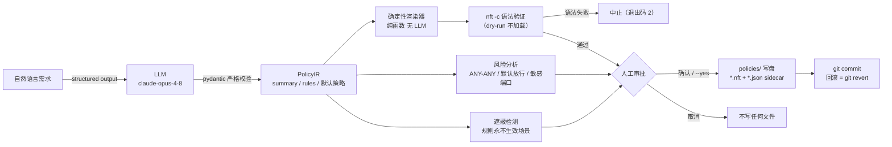

# nft-copilot

AI 防火墙策略助手：用自然语言描述防护需求，生成**经过审查、可审计、可回滚**的 nftables 规则。

核心理念：LLM 只负责把自然语言翻译成结构化策略（PolicyIR），**防火墙文本永远由确定性代码渲染**；每一条策略落盘前都要通过风险分析、规则遮蔽检测与 `nft -c` 语法 dry-run，并经人工审批后才写入 `policies/` 目录并提交 git——规则即代码（Policy as Code），回滚一次 `git revert` 即可。

## 架构



- **PolicyIR**（`src/nft_copilot/ir.py`）：pydantic 模型，字段级校验（CIDR、端口 1–65535、HH:MM 时间窗口等）。LLM 输出必须通过 schema 校验，否则直接报错，绝不降级。
- **渲染器**（`renderer.py`）：PolicyIR → nftables 配置文本，纯函数，可复现。
- **风险分析**（`risks.py`）：确定性静态检查——`DEFAULT_INPUT_ACCEPT`（critical）、`ANY_ANY_ACCEPT`（high）、公网来源放行 / 宽端口 / 敏感端口（medium）等。
- **遮蔽检测**（`conflicts.py`）：nftables 首匹配生效，报告被更早规则完全覆盖、永不生效的规则。
- **验证器**（`validator.py`）：`nft -c -f` dry-run，只查语法不加载规则。
- **存储**（`store.py`）：策略写入 `policies/`，sidecar JSON 保存 IR 与原始描述，自动 git 提交。

## 安装

需要 Python ≥ 3.12 与 [uv](https://docs.astral.sh/uv/)：

```bash
uv sync
```

系统依赖：`nft`（nftables ≥ 0.9，语法验证用，缺失时验证跳过并明确提示）、`git`（策略提交用）。

## 环境变量

| 变量 | 必需 | 说明 |
|---|---|---|
| `ANTHROPIC_API_KEY` | `generate` / `explain` 必需 | Anthropic API 凭证，从环境读取，绝不硬编码。`audit` 不需要 |
| `NFT_COPILOT_MODEL` | 否 | 覆盖模型 ID，默认 `claude-opus-4-8`（也可用 `--model` 参数临时覆盖） |
| `NFT_COPILOT_ROOT` | 否 | `generate` 的策略仓库根目录（含 `policies/` 与 `.git`），默认 `.`。注意：`audit` 不读此变量，审计目录用 `--path` 指定 |

## 用法

### generate：自然语言 → nftables

```bash
export ANTHROPIC_API_KEY=sk-...

# 交互式：生成 → 展示摘要/配置/风险/遮蔽/语法报告 → 确认后才写盘
uv run nft-copilot generate \
  "只允许 10.0.0.0/24 访问 443，其他全拒；SSH 只允许办公网 10.8.0.0/13"

# 指定策略名（小写字母/数字/连字符）
uv run nft-copilot generate "..." --name demo-intranet

# CI 等自动化场景：显式跳过人工审批
uv run nft-copilot generate "..." --name demo-intranet --yes

# 临时换模型
uv run nft-copilot generate "..." --model claude-sonnet-4-5
```

流程与退出码：

1. LLM 生成 PolicyIR（失败退出码 1）；
2. 渲染并打印中文摘要、完整 nftables 配置、风险与遮蔽报告；
3. `nft -c` 语法 dry-run——**语法不过立即中止（退出码 2），不会写盘**；环境无 `nft` 或无 `CAP_NET_ADMIN` 时显示"验证跳过"及原因，不静默通过；
4. 人工确认（`--yes` 显式跳过）后写入 `policies/<name>.nft`（含时间窗口时另有 `.restricted.nft` 与 `.timers`）和 `<name>.json` sidecar，并自动 git 提交。

### audit：审计已有策略（CI 可用）

```bash
# 审计默认目录 policies/
uv run nft-copilot audit

# 审计任意目录
uv run nft-copilot audit --path /etc/nft-copilot/policies
```

对每个策略 sidecar 重新执行风险分析、遮蔽检测和 `nft -c` 语法验证；发现 critical/high 风险或语法错误时**退出码 1**，全绿输出"审计通过"。适合接 CI 定时门禁。

### explain：解释一份 nftables 配置

```bash
uv run nft-copilot explain /etc/nftables/main.nft
```

用中文逐链解释默认策略与每条规则，并指出潜在风险。需要 `ANTHROPIC_API_KEY`。

## 安全模型

1. **LLM 不碰防火墙文本**：LLM 的唯一输出目标是结构化 PolicyIR（structured output + pydantic 校验）。渲染、风险分析、遮蔽检测全部是确定性代码，结论可复现、可审计，无模型幻觉进入规则集的通道。
2. **`nft -c` 先行**：落盘前必须通过语法 dry-run；语法失败即中止且不写任何文件。无 `nft` 二进制或无 `CAP_NET_ADMIN` 权限时明确提示"验证跳过"与原因（本机无 root 权限的容器/开发机上属预期行为，可用 `sudo` 重跑），绝不把跳过伪装成通过。
3. **写盘必经人工审批**：默认交互确认，且存在 critical/high 风险时会额外警示；`--yes` 是唯一跳过途径，供 CI 显式声明。
4. **规则即代码**：所有策略落在 `policies/` 目录并逐次 git 提交，每次变更可 diff、可追责；**回滚 = `git revert`** 对应提交后重新下发（MVP 未内置自动回滚，属手册流程）。
5. **凭证安全**：API key 只从环境变量读取，代码与仓库中不落任何密钥。
6. **全量替换式下发**：渲染产物以 `flush ruleset` 开头，一旦加载会清空整机**所有** nftables 表——与 Docker / libvirt / ufw 等自带 nft/iptables 规则的组件共存时具有破坏性，混部环境请先评估再下发。

## 时间窗口（夜间版 / 日间版）

nftables 本身没有时间条件，nft-copilot 用**两份配置 + systemd timer 切换**实现"22:00 后收紧"这类需求：

- 常规规则渲染进 `<name>.nft`（基础版）；
- 带时间窗口的规则只渲染进 `<name>.restricted.nft`（夜间版）；
- `<name>.timers` 生成 `OnCalendar` 定时单元，到点各加载一版。

⚠️ **本工具不提供开机加载路径**：产物只写入 `policies/`，重启后**不会**自动生效。要让基础版开机常驻，需手工把基础版内容写入 `/etc/nftables.conf`（配合系统的 `nftables.service`），或自建 boot 单元加载。

⚠️ **安装需拆分**：`.timers` 文件按注释分隔包含 **4 个 systemd 单元**（`nft-copilot-restrict.service` / `nft-copilot-base.service` / `nft-copilot-restrict.timer` / `nft-copilot-base.timer`），安装前必须拆成 4 个独立文件放入 `/etc/systemd/system/`，再执行：

```bash
sudo systemctl daemon-reload
sudo systemctl enable --now nft-copilot-restrict.timer nft-copilot-base.timer
```

⚠️ **路径需对齐**：service 单元的 `ExecStart` 引用**固定路径** `/etc/nftables/nft-copilot.restricted.nft` 与 `/etc/nftables/nft-copilot.base.nft`，而产物文件名是 `policies/<name>.nft` / `policies/<name>.restricted.nft`——安装时必须把两份产物复制并改名对齐到上述固定路径。

策略含多个不同时间窗口时，`.timers` 头部会追加警告：只有第一个窗口生效，其余窗口的规则始终随夜间版加载。

## 测试与开发

```bash
uv run pytest                                     # 全套件（无需 API key，LLM 全 mock）
uv run pytest --cov=nft_copilot --cov-report=term # 覆盖率报告
```

代码布局：`src/nft_copilot/` 下每模块（`ir` / `renderer` / `risks` / `conflicts` / `validator` / `llm` / `store` / `cli`）对应 `tests/test_*.py`，互不依赖网络与 root 权限。
