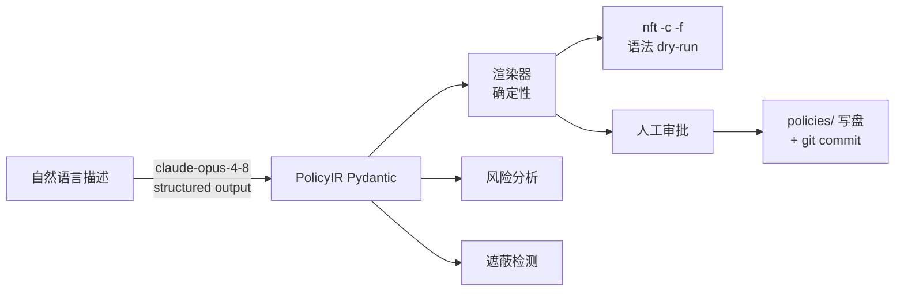

# nft-copilot MVP 实现计划

> **For agentic workers:** REQUIRED SUB-SKILL: Use superpowers:subagent-driven-development (recommended) or superpowers:executing-plans to implement this plan task-by-task. Steps use checkbox (`- [ ]`) syntax for tracking.

**Goal:** 构建 AI 防火墙策略助手 CLI：自然语言 → nftables 规则（含人类可读摘要、风险说明、语法 dry-run、人工审批、Git 规则即代码）。

**Architecture:** LLM 只输出结构化策略（PolicyIR JSON，Pydantic 校验），由确定性渲染器生成 nftables 配置——LLM 永不直接生成防火墙文本。风险检测、遮蔽检测、语法验证全部是纯确定性代码。审批通过后写盘并 git commit。



**Tech Stack:** Python 3.12 + uv · typer（CLI）· pydantic v2（IR/校验）· anthropic SDK（`messages.parse()` structured output）· pytest

**Spec:** 用户 2026-09-20 会话需求描述（即本文件 Goal 与 Global Constraints；无独立 spec 文件）。

## Global Constraints

- Python `>=3.12`，uv 管理依赖；运行时依赖仅 `typer`、`pydantic`、`anthropic`
- 模型默认 `claude-opus-4-8`，可用环境变量 `NFT_COPILOT_MODEL` 覆盖；API 凭证从环境解析（`anthropic.Anthropic()` 零参数构造），**绝不硬编码密钥**
- 所有注释、文档、CLI 输出使用简体中文；commit 用 conventional 格式（`feat:`/`test:` 等），描述可中文
- 文件 < 800 行、函数 < 50 行；LLM 生成的任何内容不得直接作为 shell 命令执行
- nftables 配置必须先过 `nft -c -f` 语法验证；写盘必须经人工审批（`--yes` 显式跳过）
- 测试覆盖率 ≥ 80%；LLM 调用在单元测试中一律 mock（CI 不调 API）
- 环境：`nft v1.0.9` 位于 `/usr/sbin/nft`；git 可用；`balcony314` 不是 git 仓库，需在 `nft-copilot/` 内 `git init`

---

### Task 1: 项目脚手架与 CLI 骨架

**Files:**
- Create: `pyproject.toml`、`.gitignore`、`src/nft_copilot/__init__.py`、`src/nft_copilot/cli.py`、`tests/test_cli.py`

**Interfaces:**
- Produces: `nft_copilot.cli:app`（typer 应用，`nft-copilot` 命令入口）；`nft_copilot.__version__: str`

- [ ] **Step 1: 初始化 uv 项目结构**

```bash
cd /home/ywdxz/code/github/balcony314/nft-copilot
mkdir -p src/nft_copilot tests policies
```

`pyproject.toml`：

```toml
[project]
name = "nft-copilot"
version = "0.1.0"
description = "AI 防火墙策略助手：自然语言 → nftables"
requires-python = ">=3.12"
dependencies = [
    "typer>=0.12",
    "pydantic>=2.7",
    "anthropic>=0.116",
]

[project.scripts]
nft-copilot = "nft_copilot.cli:app"

[build-system]
requires = ["hatchling"]
build-backend = "hatchling.build"

[tool.hatch.build.targets.wheel]
packages = ["src/nft_copilot"]

[dependency-groups]
dev = ["pytest>=8", "pytest-cov>=5"]

[tool.pytest.ini_options]
testpaths = ["tests"]
```

`.gitignore`：

```
__pycache__/
*.egg-info/
.venv/
.pytest_cache/
.coverage
```

`src/nft_copilot/__init__.py`：

```python
"""nft-copilot：AI 防火墙策略助手（自然语言 → nftables）。"""

__version__ = "0.1.0"
```

`src/nft_copilot/cli.py`：

```python
"""typer CLI 入口。"""

import typer

from nft_copilot import __version__

app = typer.Typer(
    help="AI 防火墙策略助手：自然语言 → nftables 规则（生成/审查/解释）",
    no_args_is_help=True,
)


@app.command()
def version() -> None:
    """显示版本号。"""
    typer.echo(f"nft-copilot {__version__}")
```

- [ ] **Step 2: 写失败测试** `tests/test_cli.py`：

```python
"""CLI 冒烟测试。"""

from typer.testing import CliRunner

from nft_copilot.cli import app

runner = CliRunner()


def test_version_command() -> None:
    result = runner.invoke(app, ["version"])
    assert result.exit_code == 0
    assert "nft-copilot" in result.stdout
```

- [ ] **Step 3: 安装依赖并跑测试**

```bash
uv sync && uv run pytest tests/test_cli.py -v
```

Expected: PASS

- [ ] **Step 4: git init 并提交**

```bash
git init && uv add --dev pytest pytest-cov 2>/dev/null; git add -A && git commit -m "feat: 项目脚手架与 CLI 骨架"
```

---

### Task 2: PolicyIR 数据模型

**Files:**
- Create: `src/nft_copilot/ir.py`
- Test: `tests/test_ir.py`

**Interfaces:**
- Produces:
  - `class TimeWindow(BaseModel)`: `start: str`（"HH:MM"）、`end: str`
  - `class Rule(BaseModel)`: `direction: Literal["input","output"]="input"`、`action: Literal["accept","drop","reject"]="accept"`、`protocol: Literal["tcp","udp","icmp","any"]="any"`、`source: str | None=None`（CIDR）、`port: int | list[int] | None=None`、`time_window: TimeWindow | None=None`
  - `class Policy(BaseModel)`: `summary: str`、`default_input: Literal["accept","drop"]="drop"`、`default_output: Literal["accept","drop"]="accept"`、`rules: list[Rule]=[]`
  - `class PolicyGenerationError(Exception)`
- 校验规则：`source` 必须是合法 IPv4/IPv6 CIDR（`ipaddress.ip_network(x, strict=False)`）；`port` 每个值 1–65535；`TimeWindow` 的 start/end 匹配 `HH:MM` 且 00:00–23:59

- [ ] **Step 1: 写失败测试** `tests/test_ir.py`：

```python
"""PolicyIR 模型校验测试。"""

import pytest
from pydantic import ValidationError

from nft_copilot.ir import Policy, Rule, TimeWindow


def test_最小合法策略() -> None:
    policy = Policy(summary="测试", rules=[])
    assert policy.default_input == "drop"


def test_完整规则() -> None:
    rule = Rule(
        direction="input",
        action="accept",
        protocol="tcp",
        source="10.0.0.0/24",
        port=[443, 8443],
    )
    assert rule.port == [443, 8443]


def test_非法_cidr_被拒绝() -> None:
    with pytest.raises(ValidationError):
        Rule(source="999.0.0.0/24")


def test_非规范主机位_cidr_被接受() -> None:
    # strict=False：10.0.0.1/24 归一化为 10.0.0.0/24
    rule = Rule(source="10.0.0.1/24")
    assert rule.source == "10.0.0.0/24"


def test_非法端口_被拒绝() -> None:
    with pytest.raises(ValidationError):
        Rule(port=0)
    with pytest.raises(ValidationError):
        Rule(port=70000)


def test_非法时间格式_被拒绝() -> None:
    with pytest.raises(ValidationError):
        TimeWindow(start="25:00", end="06:00")
    with pytest.raises(ValidationError):
        TimeWindow(start="6点", end="22:00")


def test_跨午夜时间窗口_合法() -> None:
    tw = TimeWindow(start="22:00", end="06:00")
    assert tw.start == "22:00"
```

- [ ] **Step 2: 运行测试确认失败**

Run: `uv run pytest tests/test_ir.py -v`
Expected: FAIL（`No module named 'nft_copilot.ir'`）

- [ ] **Step 3: 实现** `src/nft_copilot/ir.py`：

```python
"""策略中间表示（PolicyIR）。

LLM 的唯一输出目标：结构化策略 JSON 经 pydantic 严格校验后，
才允许进入渲染管线。LLM 永不直接生成 nftables 文本。
"""

import ipaddress
import re

from pydantic import BaseModel, field_validator

_TIME_RE = re.compile(r"^([01]\d|2[0-3]):[0-5]\d$")


class PolicyGenerationError(Exception):
    """策略生成失败（LLM 拒答、输出不合法等）。"""


class TimeWindow(BaseModel):
    """时间窗口，如 22:00–06:00（允许跨午夜）。"""

    start: str
    end: str

    @field_validator("start", "end")
    @classmethod
    def _check_hhmm(cls, v: str) -> str:
        if not _TIME_RE.match(v):
            raise ValueError(f"时间必须为 HH:MM（00:00–23:59），收到: {v!r}")
        return v


class Rule(BaseModel):
    """单条过滤规则。"""

    direction: str = "input"  # "input" | "output"（Literal 见模型配置）
    action: str = "accept"  # "accept" | "drop" | "reject"
    protocol: str = "any"  # "tcp" | "udp" | "icmp" | "any"
    source: str | None = None  # CIDR；None = 任意来源
    port: int | list[int] | None = None  # 目标端口
    time_window: TimeWindow | None = None

    @field_validator("direction")
    @classmethod
    def _check_direction(cls, v: str) -> str:
        if v not in ("input", "output"):
            raise ValueError(f"direction 只能是 input/output，收到: {v!r}")
        return v

    @field_validator("action")
    @classmethod
    def _check_action(cls, v: str) -> str:
        if v not in ("accept", "drop", "reject"):
            raise ValueError(f"action 只能是 accept/drop/reject，收到: {v!r}")
        return v

    @field_validator("protocol")
    @classmethod
    def _check_protocol(cls, v: str) -> str:
        if v not in ("tcp", "udp", "icmp", "any"):
            raise ValueError(f"protocol 只能是 tcp/udp/icmp/any，收到: {v!r}")
        return v

    @field_validator("source")
    @classmethod
    def _check_cidr(cls, v: str | None) -> str | None:
        if v is None:
            return None
        try:
            return str(ipaddress.ip_network(v, strict=False))
        except ValueError as exc:
            raise ValueError(f"source 必须是合法 CIDR: {v!r}") from exc

    @field_validator("port")
    @classmethod
    def _check_port(cls, v: int | list[int] | None) -> int | list[int] | None:
        if v is None:
            return None
        ports = [v] if isinstance(v, int) else v
        for p in ports:
            if not 1 <= p <= 65535:
                raise ValueError(f"端口必须在 1–65535，收到: {p}")
        return v


class Policy(BaseModel):
    """一份完整防火墙策略（LLM 结构化输出的根对象）。"""

    summary: str  # 人类可读中文摘要
    default_input: str = "drop"  # input 链默认策略
    default_output: str = "accept"  # output 链默认策略
    rules: list[Rule] = []

    @field_validator("summary")
    @classmethod
    def _check_summary(cls, v: str) -> str:
        if not v.strip():
            raise ValueError("summary 不能为空")
        return v

    @field_validator("default_input", "default_output")
    @classmethod
    def _check_default(cls, v: str) -> str:
        if v not in ("accept", "drop"):
            raise ValueError(f"默认策略只能是 accept/drop，收到: {v!r}")
        return v
```

- [ ] **Step 4: 跑测试通过**

Run: `uv run pytest tests/test_ir.py -v`
Expected: PASS

- [ ] **Step 5: Commit**

```bash
git add src/nft_copilot/ir.py tests/test_ir.py && git commit -m "feat: PolicyIR 数据模型与校验"
```

---

### Task 3: nftables 渲染器

**Files:**
- Create: `src/nft_copilot/renderer.py`
- Test: `tests/test_renderer.py`

**Interfaces:**
- Consumes: Task 2 的 `Policy`/`Rule`
- Produces:
  - `class PolicyBundle`（dataclass）: `base_nft: str`（日间/常规版完整配置）、`restricted_nft: str | None`（含 time_window 规则的夜间版，仅当存在时间规则）、`timers: str | None`（systemd timer+service 单元文本，仅当存在时间规则）
  - `def render_policy(policy: Policy) -> PolicyBundle`
- 渲染约定：
  - 头部 `#!/usr/sbin/nft -f` + `flush ruleset`
  - `table inet filter`；input/output 两条 base chain，`priority filter`
  - input chain 固定前导：`iifname "lo" accept`、`ct state established,related accept`；output chain 固定前导：`oifname "lo" accept`、`ct state established,related accept`
  - 规则语句：`[ip saddr <cidr>] [<proto> dport <port(s)>] <action>`；多端口用 `{ 80, 443 }`；protocol 为 `any` 时省略协议与 dport
  - `time_window` 规则只进 `restricted_nft`；timers 在 start 时间加载 restricted、end 时间加载 base（OnCalendar 两个 timer + 两个 oneshot service）

- [ ] **Step 1: 写失败测试** `tests/test_renderer.py`：

```python
"""渲染器测试：IR → nftables 文本。"""

from nft_copilot.ir import Policy, Rule, TimeWindow
from nft_copilot.renderer import render_policy


def test_基础策略渲染() -> None:
    policy = Policy(
        summary="仅允许内网访问 HTTPS",
        default_input="drop",
        default_output="accept",
        rules=[
            Rule(direction="input", action="accept", protocol="tcp",
                 source="10.0.0.0/24", port=443),
        ],
    )
    bundle = render_policy(policy)
    text = bundle.base_nft
    assert text.startswith("#!/usr/sbin/nft -f")
    assert "flush ruleset" in text
    assert 'table inet filter' in text
    assert "policy drop" in text  # input 默认策略
    assert 'ip saddr 10.0.0.0/24 tcp dport 443 accept' in text
    assert 'iifname "lo" accept' in text
    assert "ct state established,related accept" in text
    # 无时间规则 → 无夜间版与 timer
    assert bundle.restricted_nft is None
    assert bundle.timers is None


def test_多端口渲染为集合() -> None:
    policy = Policy(
        summary="多端口",
        rules=[Rule(action="accept", protocol="tcp", port=[80, 443])],
    )
    assert "tcp dport { 80, 443 } accept" in render_policy(policy).base_nft


def test_output_方向与_drop() -> None:
    policy = Policy(
        summary="禁出网",
        rules=[Rule(direction="output", action="drop", protocol="any")],
    )
    assert "drop" in render_policy(policy).base_nft


def test_时间窗口生成_夜间版与_timer() -> None:
    policy = Policy(
        summary="夜间禁出网",
        default_output="accept",
        rules=[
            Rule(direction="output", action="drop", protocol="any",
                 time_window=TimeWindow(start="22:00", end="06:00")),
        ],
    )
    bundle = render_policy(policy)
    assert bundle.restricted_nft is not None
    assert bundle.timers is not None
    assert "drop" in bundle.restricted_nft
    # 常规版不含该时间规则（出网默认 accept、无 drop 规则）
    assert "OnCalendar=*-*-* 22:00:00" in bundle.timers
    assert "OnCalendar=*-*-* 06:00:00" in bundle.timers
    assert "nft -f" in bundle.timers
```

- [ ] **Step 2: 运行确认失败**

Run: `uv run pytest tests/test_renderer.py -v`
Expected: FAIL（模块不存在）

- [ ] **Step 3: 实现** `src/nft_copilot/renderer.py`：

```python
"""确定性渲染器：PolicyIR → nftables 配置。

纯函数，无 LLM 参与。时间窗口规则通过 systemd timer
在「夜间版 / 常规版」两份配置间定时切换实现。
"""

from dataclasses import dataclass

from nft_copilot.ir import Policy, Rule


@dataclass
class PolicyBundle:
    """一份策略渲染出的全部产物。"""

    base_nft: str  # 常规版（不含时间窗口规则）
    restricted_nft: str | None = None  # 夜间版（含时间窗口规则）
    timers: str | None = None  # systemd 单元（成对 timer+service）


_HEADER = "#!/usr/sbin/nft -f\nflush ruleset\n\n"

_FIXED_INPUT = ['iifname "lo" accept', "ct state established,related accept"]
_FIXED_OUTPUT = ['oifname "lo" accept', "ct state established,related accept"]


def _render_rule(rule: Rule) -> str:
    """单条 Rule → nft 规则语句（无换行）。"""
    parts: list[str] = []
    if rule.source:
        parts.append(f"ip saddr {rule.source}")
    if rule.protocol != "any" and rule.port is not None:
        proto = rule.protocol
        ports = rule.port if isinstance(rule.port, list) else [rule.port]
        port_str = f"{{ {', '.join(str(p) for p in ports)} }}" if len(ports) > 1 else str(ports[0])
        parts.append(f"{proto} dport {port_str}")
    parts.append(rule.action)
    return " ".join(parts)


def _render_nft(policy: Policy, rules: list[Rule]) -> str:
    """渲染完整 nftables 配置文本。"""
    input_rules = [r for r in rules if r.direction == "input"]
    output_rules = [r for r in rules if r.direction == "output"]
    lines = [_HEADER.rstrip(), "", "table inet filter {"]
    lines.append("    chain input {")
    lines.append("        type filter hook input priority filter; "
                 f"policy {policy.default_input};")
    for fixed in _FIXED_INPUT:
        lines.append(f"        {fixed}")
    for r in input_rules:
        lines.append(f"        {_render_rule(r)}")
    lines.append("    }")
    lines.append("    chain output {")
    lines.append("        type filter hook output priority filter; "
                 f"policy {policy.default_output};")
    for fixed in _FIXED_OUTPUT:
        lines.append(f"        {fixed}")
    for r in output_rules:
        lines.append(f"        {_render_rule(r)}")
    lines.append("    }")
    lines.append("}")
    return "\n".join(lines) + "\n"


_TIMER_TEMPLATE = """\
# systemd 单元：将以下内容安装到 /etc/systemd/system/ 后
# systemctl daemon-reload && systemctl enable --now nft-copilot-restrict.timer nft-copilot-base.timer

[Unit]
Description=nft-copilot 夜间加载（含时间限制规则）

[Service]
Type=oneshot
ExecStart=/usr/sbin/nft -f /etc/nftables/nft-copilot.restricted.nft

[Unit]
Description=nft-copilot 日间恢复（常规规则）

[Service]
Type=oneshot
ExecStart=/usr/sbin/nft -f /etc/nftables/nft-copilot.base.nft

[Unit]
Description=nft-copilot 夜间切换定时器

[Timer]
OnCalendar={start}
Persistent=true

[Install]
WantedBy=timers.target

[Unit]
Description=nft-copilot 日间切换定时器

[Timer]
OnCalendar={end}
Persistent=true

[Install]
WantedBy=timers.target
"""


def render_policy(policy: Policy) -> PolicyBundle:
    """渲染策略：常规规则入 base，时间窗口规则只入夜间版。"""
    timed = [r for r in policy.rules if r.time_window is not None]
    untimed = [r for r in policy.rules if r.time_window is None]
    bundle = PolicyBundle(base_nft=_render_nft(policy, untimed))
    if timed:
        bundle.restricted_nft = _render_nft(policy, untimed + timed)
        window = timed[0].time_window
        bundle.timers = _TIMER_TEMPLATE.format(
            start=f"*-*-* {window.start}:00",
            end=f"*-*-* {window.end}:00",
        )
    return bundle
```

注意：`_TIMER_TEMPLATE` 中多个 `[Unit]/[Service]` 段按约定分隔导出（实际安装时应拆成 4 个文件），MVP 以带注释的单文件文本交付，注释中说明拆分方式。

- [ ] **Step 4: 跑测试通过**

Run: `uv run pytest tests/test_renderer.py -v`
Expected: PASS

- [ ] **Step 5: Commit**

```bash
git add src/nft_copilot/renderer.py tests/test_renderer.py && git commit -m "feat: nftables 确定性渲染器（含时间窗口 timer 方案）"
```

---

### Task 4: 风险分析器

**Files:**
- Create: `src/nft_copilot/risks.py`
- Test: `tests/test_risks.py`

**Interfaces:**
- Consumes: Task 2 的 `Policy`
- Produces:
  - `class Risk`（dataclass）: `level: str`（"critical"|"high"|"medium"|"low"）、`code: str`、`message: str`
  - `def analyze_risks(policy: Policy) -> list[Risk]`
- 检测器（全部确定性）：
  1. `DEFAULT_INPUT_ACCEPT` critical — `default_input == "accept"`
  2. `ANY_ANY_ACCEPT` high — 规则 `source is None and port is None and action == "accept"`
  3. `PUBLIC_SOURCE_ACCEPT` medium — `action=="accept"` 且 source 是公网地址（非 loopback/私网 RFC1918/链路本地）
  4. `WIDE_PORTS` medium — `port` 为列表且长度 > 10
  5. `SENSITIVE_PORT` medium — port 命中敏感集 `{21, 23, 135, 139, 445, 3389, 5900, 6379, 9200, 27017}`
  6. `NO_RULES` low — `rules` 为空
  7. `OUTPUT_POLICY_ACCEPT` low — `default_output == "accept"`（信息提示）

- [ ] **Step 1: 写失败测试** `tests/test_risks.py`：

```python
"""风险分析器测试。"""

from nft_copilot.ir import Policy, Rule
from nft_copilot.risks import analyze_risks


def _codes(risks):
    return [r.code for r in risks]


def test_默认放行_input_是_critical() -> None:
    risks = analyze_risks(Policy(summary="x", default_input="accept"))
    assert "DEFAULT_INPUT_ACCEPT" in _codes(risks)
    level = {r.code: r.level for r in risks}["DEFAULT_INPUT_ACCEPT"]
    assert level == "critical"


def test_任意来源任意端口放行_是_high() -> None:
    risks = analyze_risks(
        Policy(summary="x", rules=[Rule(action="accept", protocol="any")])
    )
    assert "ANY_ANY_ACCEPT" in _codes(risks)


def test_私网来源放行_无公网风险() -> None:
    risks = analyze_risks(
        Policy(summary="x",
               rules=[Rule(action="accept", source="10.0.0.0/8", port=443)])
    )
    assert "PUBLIC_SOURCE_ACCEPT" not in _codes(risks)


def test_公网来源放行_是_medium() -> None:
    risks = analyze_risks(
        Policy(summary="x",
               rules=[Rule(action="accept", source="203.0.113.0/24", port=443)])
    )
    assert "PUBLIC_SOURCE_ACCEPT" in _codes(risks)


def test_宽端口_是_medium() -> None:
    risks = analyze_risks(
        Policy(summary="x", rules=[Rule(action="accept", port=list(range(1, 13)))])
    )
    assert "WIDE_PORTS" in _codes(risks)


def test_敏感端口_是_medium() -> None:
    risks = analyze_risks(
        Policy(summary="x", rules=[Rule(action="accept", port=3389)])
    )
    assert "SENSITIVE_PORT" in _codes(risks)


def test_空规则集_是_low() -> None:
    risks = analyze_risks(Policy(summary="x"))
    assert "NO_RULES" in _codes(risks)


def test_出站默认放行_是_low() -> None:
    risks = analyze_risks(Policy(summary="x", default_output="accept"))
    assert "OUTPUT_POLICY_ACCEPT" in _codes(risks)
```

- [ ] **Step 2: 运行确认失败**

Run: `uv run pytest tests/test_risks.py -v`
Expected: FAIL

- [ ] **Step 3: 实现** `src/nft_copilot/risks.py`：

```python
"""确定性风险分析：对 PolicyIR 做静态检查。

不依赖 LLM——风险结论必须可复现、可审计。
"""

import ipaddress
from dataclasses import dataclass

from nft_copilot.ir import Policy, Rule

SENSITIVE_PORTS = {21, 23, 135, 139, 445, 3389, 5900, 6379, 9200, 27017}


@dataclass
class Risk:
    """一条风险发现。"""

    level: str  # critical | high | medium | low
    code: str
    message: str


def _is_public(cidr: str) -> bool:
    """是否公网地址（非回环/私网/链路本地/组播）。"""
    net = ipaddress.ip_network(cidr)
    return not (
        net.is_private or net.is_loopback or net.is_link_local or net.is_multicast
    )


def _rule_ports(rule: Rule) -> list[int]:
    if rule.port is None:
        return []
    return rule.port if isinstance(rule.port, list) else [rule.port]


def analyze_risks(policy: Policy) -> list[Risk]:
    """对策略做全量风险扫描。"""
    risks: list[Risk] = []

    if policy.default_input == "accept":
        risks.append(Risk(
            "critical", "DEFAULT_INPUT_ACCEPT",
            "input 链默认策略为 accept：未匹配任何规则的入站流量全部放行",
        ))
    if not policy.rules:
        risks.append(Risk(
            "low", "NO_RULES", "策略不含任何规则，仅剩默认策略生效",
        ))
    if policy.default_output == "accept":
        risks.append(Risk(
            "low", "OUTPUT_POLICY_ACCEPT",
            "output 链默认策略为 accept：出站流量默认全部放行",
        ))

    for idx, rule in enumerate(policy.rules):
        if rule.source is None and rule.port is None and rule.action == "accept":
            risks.append(Risk(
                "high", "ANY_ANY_ACCEPT",
                f"规则 #{idx + 1}：任意来源、任意端口放行（ANY-ANY）",
            ))
        if rule.action == "accept" and rule.source and _is_public(rule.source):
            risks.append(Risk(
                "medium", "PUBLIC_SOURCE_ACCEPT",
                f"规则 #{idx + 1}：放行公网来源 {rule.source}",
            ))
        ports = _rule_ports(rule)
        if len(ports) > 10:
            risks.append(Risk(
                "medium", "WIDE_PORTS",
                f"规则 #{idx + 1}：单条规则放行 {len(ports)} 个端口，范围过宽",
            ))
        hit = sorted(set(ports) & SENSITIVE_PORTS)
        if hit:
            risks.append(Risk(
                "medium", "SENSITIVE_PORT",
                f"规则 #{idx + 1}：涉及敏感端口 {hit}（远程管理/数据库/文件共享）",
            ))
    return risks
```

- [ ] **Step 4: 跑测试通过**

Run: `uv run pytest tests/test_risks.py -v`
Expected: PASS

- [ ] **Step 5: Commit**

```bash
git add src/nft_copilot/risks.py tests/test_risks.py && git commit -m "feat: 确定性风险分析器"
```

---

### Task 5: nft 语法验证器（dry-run）

**Files:**
- Create: `src/nft_copilot/validator.py`
- Test: `tests/test_validator.py`

**Interfaces:**
- Produces:
  - `class ValidationResult`（dataclass）: `ok: bool`、`skipped: bool`（nft 不存在或无权限时 True）、`error: str | None`
  - `def validate_syntax(nft_text: str, nft_bin: str = "nft") -> ValidationResult` — 写临时文件执行 `nft -c -f <tmp>`，永不实际加载规则
- 行为约定：`nft` 不在 PATH → `skipped=True`；退出码非 0 且 stderr 含 `Operation not permitted` → `skipped=True`（无 CAP_NET_ADMIN，非语法错误）；退出码非 0 → `ok=False, error=stderr 摘要`；退出码 0 → `ok=True`

- [ ] **Step 1: 写失败测试** `tests/test_validator.py`：

```python
"""语法验证器测试（mock subprocess，不依赖真实 nft 权限）。"""

import subprocess
from types import SimpleNamespace
from unittest.mock import patch

from nft_copilot.validator import validate_syntax


def _fake_run(returncode=0, stderr="", stdout=""):
    completed = subprocess.CompletedProcess(
        args=["nft", "-c", "-f", "x"], returncode=returncode,
        stdout=stdout, stderr=stderr,
    )
    def _run(*args, **kwargs):
        return completed
    return _run


def test_语法正确() -> None:
    with patch("nft_copilot.validator.subprocess.run", _fake_run(0)):
        result = validate_syntax("...")
    assert result.ok and not result.skipped


def test_语法错误() -> None:
    with patch(
        "nft_copilot.validator.subprocess.run",
        _fake_run(1, stderr="syntax error near unexpected token"),
    ):
        result = validate_syntax("...")
    assert not result.ok and not result.skipped
    assert "syntax error" in result.error


def test_无权限时标记_skipped() -> None:
    with patch(
        "nft_copilot.validator.subprocess.run",
        _fake_run(1, stderr="netlink: Error: cache initialization failed: Operation not permitted"),
    ):
        result = validate_syntax("...")
    assert result.skipped


def test_nft_不存在时_skipped() -> None:
    def _raise(*args, **kwargs):
        raise FileNotFoundError("nft")
    with patch("nft_copilot.validator.subprocess.run", _raise):
        result = validate_syntax("...")
    assert result.skipped
```

- [ ] **Step 2: 运行确认失败**

Run: `uv run pytest tests/test_validator.py -v`
Expected: FAIL

- [ ] **Step 3: 实现** `src/nft_copilot/validator.py`：

```python
"""nft -c 语法验证（dry-run）。

只做语法/语义检查，绝不加载规则（-c 模式不应用 ruleset）。
"""

import shutil
import subprocess
import tempfile
from dataclasses import dataclass
from pathlib import Path


@dataclass
class ValidationResult:
    """语法验证结果。skipped=True 表示环境不允许验证（非语法问题）。"""

    ok: bool
    skipped: bool = False
    error: str | None = None


def validate_syntax(nft_text: str, nft_bin: str = "nft") -> ValidationResult:
    """对配置文本执行 nft -c -f dry-run。"""
    if shutil.which(nft_bin) is None:
        return ValidationResult(
            ok=False, skipped=True,
            error=f"未找到 {nft_bin}，跳过语法验证",
        )
    with tempfile.NamedTemporaryFile(
        mode="w", suffix=".nft", delete=False
    ) as tmp:
        tmp.write(nft_text)
        tmp_path = Path(tmp.name)
    try:
        proc = subprocess.run(
            [nft_bin, "-c", "-f", str(tmp_path)],
            capture_output=True, text=True, timeout=30,
        )
    except (subprocess.TimeoutExpired, OSError) as exc:
        return ValidationResult(ok=False, skipped=True, error=str(exc))
    finally:
        tmp_path.unlink(missing_ok=True)

    if proc.returncode == 0:
        return ValidationResult(ok=True)
    stderr = (proc.stderr or proc.stdout).strip()
    if "Operation not permitted" in stderr:
        return ValidationResult(
            ok=False, skipped=True,
            error="无 CAP_NET_ADMIN 权限，无法执行 nft -c（可用 sudo 重试）",
        )
    return ValidationResult(ok=False, error=stderr or "未知语法错误")
```

- [ ] **Step 4: 跑测试通过**

Run: `uv run pytest tests/test_validator.py -v`
Expected: PASS

- [ ] **Step 5: 真实环境冒烟（可选，需权限）**

Run: `uv run python -c "from nft_copilot.renderer import render_policy; from nft_copilot.ir import *; from nft_copilot.validator import validate_syntax; p=Policy(summary='x', rules=[Rule(source='10.0.0.0/24', port=443, protocol='tcp')]); print(validate_syntax(render_policy(p).base_nft))"`
Expected: `ok=True`（或无权限时 `skipped=True`）

- [ ] **Step 6: Commit**

```bash
git add src/nft_copilot/validator.py tests/test_validator.py && git commit -m "feat: nft -c 语法 dry-run 验证器"
```

---

### Task 6: LLM 策略生成器（Anthropic structured output）

**Files:**
- Create: `src/nft_copilot/llm.py`
- Test: `tests/test_llm.py`

**Interfaces:**
- Consumes: Task 2 的 `Policy`、`PolicyGenerationError`
- Produces:
  - `SYSTEM_PROMPT: str`
  - `def generate_policy(description: str, client: anthropic.Anthropic | None = None, model: str | None = None) -> Policy`
  - `def explain_config(nft_text: str, client: anthropic.Anthropic | None = None, model: str | None = None) -> str`
- 实现要点（来自 claude-api 技能，不得偏离）：
  - 客户端：`anthropic.Anthropic()` 零参数（环境凭证），不传 api_key
  - 模型：`model or os.environ.get("NFT_COPILOT_MODEL", "claude-opus-4-8")`
  - `generate_policy` 用 `client.messages.parse(model=..., max_tokens=16000, thinking={"type": "adaptive"}, system=SYSTEM_PROMPT, messages=[...], output_format=Policy)`，读 `response.parsed_output`；`stop_reason == "refusal"` 或 `parsed_output is None` 时抛 `PolicyGenerationError`
  - `explain_config` 用 `client.messages.create(...)` 普通文本输出，拼接所有 `block.type == "text"` 的 `block.text`
  - 异常链：`anthropic.AuthenticationError`/`RateLimitError`/`APIConnectionError` 各自转为带中文说明的 `PolicyGenerationError`（保留 `__cause__`）

- [ ] **Step 1: 写失败测试** `tests/test_llm.py`：

```python
"""LLM 模块测试：全程 mock，不真实调用 API。"""

from types import SimpleNamespace
from unittest.mock import MagicMock

import pytest

import nft_copilot.llm as llm
from nft_copilot.ir import Policy, PolicyGenerationError, Rule


def _fake_client(parsed=None, stop_reason="end_turn", text="解释文本",
                 create_error=None):
    client = MagicMock()
    parse_result = SimpleNamespace(parsed_output=parsed, stop_reason=stop_reason)
    client.messages.parse = MagicMock(return_value=parse_result)
    if create_error is not None:
        client.messages.create = MagicMock(side_effect=create_error)
    else:
        client.messages.create = MagicMock(return_value=SimpleNamespace(
            content=[SimpleNamespace(type="text", text=text)]
        ))
    return client


def test_generate_policy_返回校验后的_policy() -> None:
    policy = Policy(summary="测试", rules=[Rule(source="10.0.0.0/24", port=443,
                                                protocol="tcp")])
    client = _fake_client(parsed=policy)
    result = llm.generate_policy("只允许内网访问 443", client=client)
    assert result.rules[0].port == 443
    client.messages.parse.assert_called_once()
    kwargs = client.messages.parse.call_args.kwargs
    assert kwargs["output_format"] is Policy
    assert kwargs["model"] == "claude-opus-4-8"


def test_generate_policy_模型可被环境变量覆盖(monkeypatch) -> None:
    monkeypatch.setenv("NFT_COPILOT_MODEL", "claude-sonnet-5")
    client = _fake_client(parsed=Policy(summary="x"))
    llm.generate_policy("描述", client=client)
    kwargs = client.messages.parse.call_args.kwargs
    assert kwargs["model"] == "claude-sonnet-5"


def test_generate_policy_拒答抛异常() -> None:
    client = _fake_client(parsed=None, stop_reason="refusal")
    with pytest.raises(PolicyGenerationError, match="拒绝"):
        llm.generate_policy("描述", client=client)


def test_generate_policy_解析失败抛异常() -> None:
    client = _fake_client(parsed=None, stop_reason="end_turn")
    with pytest.raises(PolicyGenerationError):
        llm.generate_policy("描述", client=client)


def test_explain_config_返回文本() -> None:
    client = _fake_client()
    text = llm.explain_config("table inet filter { }", client=client)
    assert text == "解释文本"


def test_explain_config_认证错误转中文异常() -> None:
    import anthropic
    client = _fake_client(
        create_error=anthropic.AuthenticationError(
            message="invalid x-api-key", response=MagicMock(status_code=401),
            body=None,
        )
    )
    with pytest.raises(PolicyGenerationError, match="认证"):
        llm.explain_config("...", client=client)


def test_系统提示词包含保守原则() -> None:
    assert "不得编造" in llm.SYSTEM_PROMPT
    assert "summary" in llm.SYSTEM_PROMPT
```

- [ ] **Step 2: 运行确认失败**

Run: `uv run pytest tests/test_llm.py -v`
Expected: FAIL

- [ ] **Step 3: 实现** `src/nft_copilot/llm.py`：

```python
"""Anthropic LLM 集成：自然语言 ⇄ PolicyIR / nftables 解释。

模型默认 claude-opus-4-8（可用 NFT_COPILOT_MODEL 覆盖）；
凭证从环境解析（ANTHROPIC_API_KEY 等），绝不硬编码。
"""

import os
from typing import Any

import anthropic

from nft_copilot.ir import Policy, PolicyGenerationError

DEFAULT_MODEL = "claude-opus-4-8"

SYSTEM_PROMPT = """\
你是一名严谨的 Linux 防火墙策略翻译器，把用户的自然语言需求转换为 \
Policy JSON（结构见 output_format schema）。

必须遵守：
1. 保守原则：需求含糊时选择更严格（更小放行面）的规则，并把你的假设\
写进 summary，例如「办公网未给网段，假设为 10.0.0.0/8」。
2. IP/网段只能来自用户描述或明确的私网假设（10.0.0.0/8、172.16.0.0/12、\
192.168.0.0/16），不得编造具体地址。
3. summary 用简体中文，1–3 句，说明策略做什么、做了哪些假设。
4. 不支持的能力（应用层过滤、域名过滤、每用户限速等）不要伪造，\
在 summary 中说明未实现。
5. 用户明确要求「其他全拒/默认拒绝」时，default_input 设为 drop；
未提及时优先 drop。
6. 端口只用用户提到的；协议未说明且涉及端口时默认 tcp。
"""


def _resolve(model: str | None) -> str:
    return model or os.environ.get("NFT_COPILOT_MODEL", DEFAULT_MODEL)


def _client_or_default(client: anthropic.Anthropic | None) -> anthropic.Anthropic:
    return client if client is not None else anthropic.Anthropic()


def _wrap_api_error(exc: Exception) -> PolicyGenerationError:
    """把 SDK 异常转成带中文说明的策略生成错误。"""
    if isinstance(exc, anthropic.AuthenticationError):
        return PolicyGenerationError(
            f"Anthropic API 认证失败：请检查 ANTHROPIC_API_KEY（{exc}）"
        ) from exc
    if isinstance(exc, anthropic.RateLimitError):
        return PolicyGenerationError(f"API 限流，请稍后重试（{exc}）") from exc
    if isinstance(exc, anthropic.APIConnectionError):
        return PolicyGenerationError(f"无法连接 Anthropic API（{exc}）") from exc
    return PolicyGenerationError(f"调用 Anthropic API 失败：{exc}") from exc


def generate_policy(
    description: str,
    client: anthropic.Anthropic | None = None,
    model: str | None = None,
) -> Policy:
    """自然语言 → 经 pydantic 校验的 Policy。"""
    try:
        response = _client_or_default(client).messages.parse(
            model=_resolve(model),
            max_tokens=16000,
            thinking={"type": "adaptive"},
            system=SYSTEM_PROMPT,
            messages=[{"role": "user", "content": description}],
            output_format=Policy,
        )
    except anthropic.APIError as exc:
        raise _wrap_api_error(exc) from exc
    if response.stop_reason == "refusal":
        raise PolicyGenerationError("模型拒绝了该请求（安全策略）")
    parsed: Policy | None = response.parsed_output
    if parsed is None:
        raise PolicyGenerationError("模型输出未通过 Policy schema 校验")
    return parsed


def explain_config(
    nft_text: str,
    client: anthropic.Anthropic | None = None,
    model: str | None = None,
) -> str:
    """用中文解释一份 nftables 配置的作用与潜在风险。"""
    prompt = (
        "请用简体中文解释以下 nftables 配置：逐链说明默认策略与每条规则\
的作用，并指出潜在风险（过宽放行、ANY-ANY、敏感端口等）。配置如下：\n"
        f"```\n{nft_text}\n```"
    )
    try:
        response = _client_or_default(client).messages.create(
            model=_resolve(model),
            max_tokens=8000,
            thinking={"type": "adaptive"},
            messages=[{"role": "user", "content": prompt}],
        )
    except anthropic.APIError as exc:
        raise _wrap_api_error(exc) from exc
    parts = [b.text for b in response.content if b.type == "text"]
    return "\n".join(parts)
```

- [ ] **Step 4: 跑测试通过**

Run: `uv run pytest tests/test_llm.py -v`
Expected: PASS（注意 `generate_policy` 调用 `messages.parse` 用的关键字参数名必须是 `output_format=`）

- [ ] **Step 5: Commit**

```bash
git add src/nft_copilot/llm.py tests/test_llm.py && git commit -m "feat: Anthropic structured output 策略生成器"
```

---

### Task 7: 规则遮蔽检测

**Files:**
- Create: `src/nft_copilot/conflicts.py`
- Test: `tests/test_conflicts.py`

**Interfaces:**
- Consumes: Task 2 的 `Policy`/`Rule`
- Produces:
  - `class Conflict`（dataclass）: `earlier: int`、`later: int`（规则序号，1 起）、`message: str`
  - `def detect_conflicts(policy: Policy) -> list[Conflict]`
- 判定：同 `direction` 内，若前面的规则 A 匹配域完全覆盖后面的规则 B（source：A 为 None 或网段包含 B 的网段；port：A 为 None 或端口集合 ⊇ B 的；protocol：A 为 `any` 或相等；time_window：两者均为 None 或相等），且 `action` 不同 → B 永不生效（被遮蔽）
- 用 `ipaddress.ip_network` 的 `subnet_of` 判断网段包含；单端口视为单元素集合

- [ ] **Step 1: 写失败测试** `tests/test_conflicts.py`：

```python
"""遮蔽检测测试。"""

import ipaddress

from nft_copilot.ir import Policy, Rule
from nft_copilot.conflicts import detect_conflicts


def test_宽规则遮蔽窄规则() -> None:
    policy = Policy(summary="x", rules=[
        Rule(action="accept", source="10.0.0.0/8", port=443, protocol="tcp"),
        Rule(action="drop", source="10.1.0.0/16", port=443, protocol="tcp"),
    ])
    conflicts = detect_conflicts(policy)
    assert len(conflicts) == 1
    assert conflicts[0].earlier == 1 and conflicts[0].later == 2


def test_无遮蔽返回空() -> None:
    policy = Policy(summary="x", rules=[
        Rule(action="accept", source="10.0.0.0/8", port=443, protocol="tcp"),
        Rule(action="accept", source="10.1.0.0/16", port=22, protocol="tcp"),
    ])
    assert detect_conflicts(policy) == []


def test_不同方向不比较() -> None:
    policy = Policy(summary="x", rules=[
        Rule(direction="input", action="accept"),
        Rule(direction="output", action="drop"),
    ])
    assert detect_conflicts(policy) == []


def test_同_action_不报() -> None:
    policy = Policy(summary="x", rules=[
        Rule(action="accept", source="10.0.0.0/8"),
        Rule(action="accept", source="10.1.0.0/16"),
    ])
    assert detect_conflicts(policy) == []


def test_任意来源遮蔽具体来源() -> None:
    policy = Policy(summary="x", rules=[
        Rule(action="drop", protocol="any"),
        Rule(action="accept", source="192.168.1.0/24", port=80, protocol="tcp"),
    ])
    assert len(detect_conflicts(policy)) == 1
```

- [ ] **Step 2: 运行确认失败**

Run: `uv run pytest tests/test_conflicts.py -v`
Expected: FAIL

- [ ] **Step 3: 实现** `src/nft_copilot/conflicts.py`：

```python
"""规则遮蔽（shadowing）检测。

nftables 规则自上而下首匹配生效——若前面的规则完全覆盖
后面的规则且动作不同，后者永不生效。
"""

import ipaddress
from dataclasses import dataclass

from nft_copilot.ir import Policy, Rule


@dataclass
class Conflict:
    """一条遮蔽发现。序号为 1 起。"""

    earlier: int
    later: int
    message: str


def _covers_source(early: Rule, late: Rule) -> bool:
    if early.source is None:
        return True
    if late.source is None:
        return False
    return ipaddress.ip_network(late.source).subnet_of(
        ipaddress.ip_network(early.source)
    )


def _port_set(rule: Rule) -> set[int] | None:
    if rule.port is None:
        return None
    ports = rule.port if isinstance(rule.port, list) else [rule.port]
    return set(ports)


def _covers_port(early: Rule, late: Rule) -> bool:
    early_ports, late_ports = _port_set(early), _port_set(late)
    if early_ports is None:
        return True
    if late_ports is None:
        return False
    return late_ports <= early_ports


def _covers(early: Rule, late: Rule) -> bool:
    if early.protocol != "any" and early.protocol != late.protocol:
        return False
    return _covers_source(early, late) and _covers_port(early, late)


def detect_conflicts(policy: Policy) -> list[Conflict]:
    """报告被更早规则遮蔽、永不生效的规则。"""
    conflicts: list[Conflict] = []
    for i, later in enumerate(policy.rules):
        for j in range(i):
            earlier = policy.rules[j]
            if earlier.direction != later.direction:
                continue
            if earlier.action == later.action:
                continue
            if _covers(earlier, later):
                conflicts.append(Conflict(
                    earlier=j + 1, later=i + 1,
                    message=f"规则 #{i + 1} 被更早的规则 #{j + 1} 完全遮蔽，"
                            f"永不生效（动作 {earlier.action} 先于 {later.action}）",
                ))
    return conflicts
```

- [ ] **Step 4: 跑测试通过**

Run: `uv run pytest tests/test_conflicts.py -v`
Expected: PASS

- [ ] **Step 5: Commit**

```bash
git add src/nft_copilot/conflicts.py tests/test_conflicts.py && git commit -m "feat: 规则遮蔽检测"
```

---

### Task 8: 策略存储（审批 + 写盘 + Git 即代码）

**Files:**
- Create: `src/nft_copilot/store.py`
- Test: `tests/test_store.py`

**Interfaces:**
- Consumes: Task 3 的 `PolicyBundle`、Task 2 的 `Policy`
- Produces:
  - `def save_policy(root: Path, name: str, bundle: PolicyBundle, policy: Policy, source_text: str) -> list[Path]` — 写入 `policies/<name>.nft`、（若存在）`policies/<name>.restricted.nft`、`policies/<name>.timers`、`policies/<name>.json`（IR + `source`/`generated_at` 元数据）；返回写入路径列表；`name` 只允许 `[a-z0-9-]`（校验失败抛 `ValueError`）
  - `def git_commit(root: Path, message: str) -> str | None` — root 无 `.git` 时先 `git init`；`git add policies/` + `git commit`；返回 commit 短 hash（无可提交变更返回 None）
  - `def load_policy_ir(path: Path) -> Policy` — 读 sidecar JSON 还原 Policy（audit 用）
- 全部 git 操作走 `subprocess.run`，`cwd=root`

- [ ] **Step 1: 写失败测试** `tests/test_store.py`：

```python
"""存储层测试：tmp_path + 真实 git。"""

import json

import pytest

from nft_copilot.ir import Policy, Rule, TimeWindow
from nft_copilot.renderer import render_policy
from nft_copilot.store import git_commit, load_policy_ir, save_policy


def _bundle():
    policy = Policy(
        summary="示例",
        rules=[
            Rule(source="10.0.0.0/24", port=443, protocol="tcp"),
            Rule(direction="output", action="drop",
                 time_window=TimeWindow(start="22:00", end="06:00")),
        ],
    )
    return policy, render_policy(policy)


def test_保存并加载_roundtrip(tmp_path) -> None:
    policy, bundle = _bundle()
    paths = save_policy(tmp_path, "demo", bundle, policy, "只允许内网访问 443")
    names = {p.name for p in paths}
    assert names == {"demo.nft", "demo.restricted.nft", "demo.timers", "demo.json"}
    restored = load_policy_ir(tmp_path / "policies" / "demo.json")
    assert restored == policy

    meta = json.loads((tmp_path / "policies" / "demo.json").read_text("utf-8"))
    assert meta["source"] == "只允许内网访问 443"
    assert "generated_at" in meta


def test_无时间规则_不写_timer_文件(tmp_path) -> None:
    policy = Policy(summary="x", rules=[Rule(port=443)])
    bundle = render_policy(policy)
    paths = save_policy(tmp_path, "simple", bundle, policy, "描述")
    names = {p.name for p in paths}
    assert "simple.timers" not in names
    assert "simple.restricted.nft" not in names


def test_非法名称被拒绝(tmp_path) -> None:
    policy, bundle = _bundle()
    with pytest.raises(ValueError):
        save_policy(tmp_path, "../evil", bundle, policy, "x")
    with pytest.raises(ValueError):
        save_policy(tmp_path, "My Policy", bundle, policy, "x")


def test_git_提交并返回_hash(tmp_path) -> None:
    policy, bundle = _bundle()
    save_policy(tmp_path, "demo", bundle, policy, "描述")
    sha = git_commit(tmp_path, "feat: 添加 demo 策略")
    assert sha is not None and len(sha) >= 7
    # 再次提交无变更 → None
    assert git_commit(tmp_path, "chore: 空") is None
```

- [ ] **Step 2: 运行确认失败**

Run: `uv run pytest tests/test_store.py -v`
Expected: FAIL

- [ ] **Step 3: 实现** `src/nft_copilot/store.py`：

```python
"""策略存储：写盘 + Git 即代码。

每个策略由一组文件构成（policies/<name>.*），
sidecar JSON 保存 IR 与元数据，供 audit / 回溯使用。
"""

import json
import re
import subprocess
from datetime import datetime, timezone
from pathlib import Path

from nft_copilot.ir import Policy
from nft_copilot.renderer import PolicyBundle

_NAME_RE = re.compile(r"^[a-z0-9][a-z0-9-]*$")


def _git(root: Path, *args: str) -> subprocess.CompletedProcess:
    return subprocess.run(
        ["git", "-C", str(root), *args],
        capture_output=True, text=True, timeout=60,
    )


def save_policy(
    root: Path,
    name: str,
    bundle: PolicyBundle,
    policy: Policy,
    source_text: str,
) -> list[Path]:
    """把策略产物写入 <root>/policies/，返回写入路径。"""
    if not _NAME_RE.match(name):
        raise ValueError(f"策略名只允许小写字母/数字/连字符: {name!r}")
    policies_dir = root / "policies"
    policies_dir.mkdir(parents=True, exist_ok=True)

    written: list[Path] = [(policies_dir / f"{name}.nft")]
    (policies_dir / f"{name}.nft").write_text(bundle.base_nft, "utf-8")
    if bundle.restricted_nft is not None:
        path = policies_dir / f"{name}.restricted.nft"
        path.write_text(bundle.restricted_nft, "utf-8")
        written.append(path)
    if bundle.timers is not None:
        path = policies_dir / f"{name}.timers"
        path.write_text(bundle.timers, "utf-8")
        written.append(path)

    sidecar = {
        "ir": policy.model_dump(),
        "source": source_text,
        "generated_at": datetime.now(timezone.utc).isoformat(timespec="seconds"),
        "version": 1,
    }
    json_path = policies_dir / f"{name}.json"
    json_path.write_text(
        json.dumps(sidecar, ensure_ascii=False, indent=2) + "\n", "utf-8"
    )
    written.append(json_path)
    return written


def load_policy_ir(path: Path) -> Policy:
    """从 sidecar JSON 还原 Policy。"""
    data = json.loads(path.read_text("utf-8"))
    return Policy.model_validate(data["ir"])


def git_commit(root: Path, message: str) -> str | None:
    """提交 policies/ 变更；无 .git 先 init；无变更返回 None。"""
    if not (root / ".git").exists():
        _git(root, "init")
    _git(root, "add", "policies")
    status = _git(root, "status", "--porcelain", "--", "policies")
    if not status.stdout.strip():
        return None
    commit = _git(root, "commit", "-m", message)
    if commit.returncode != 0:
        raise RuntimeError(f"git commit 失败: {commit.stderr.strip()}")
    sha = _git(root, "rev-parse", "--short", "HEAD")
    return sha.stdout.strip() or None
```

- [ ] **Step 4: 跑测试通过**

Run: `uv run pytest tests/test_store.py -v`
Expected: PASS

- [ ] **Step 5: Commit**

```bash
git add src/nft_copilot/store.py tests/test_store.py && git commit -m "feat: 策略存储与 Git 即代码"
```

---

### Task 9: CLI 命令串联（generate / audit / explain）

**Files:**
- Modify: `src/nft_copilot/cli.py`
- Test: `tests/test_cli.py`（追加）

**Interfaces:**
- Consumes: Task 3–8 全部接口
- Produces（typer 命令，均可用 `CliRunner` 测试）：
  - `nft-copilot generate <description> [--name NAME] [--yes] [--model MODEL]` — LLM → IR → 渲染 → 风险/遮蔽/语法报告 → 审批（`typer.confirm`，`--yes` 跳过）→ save + git commit；CRITICAL/HIGH 风险存在时审批提示必须额外输入确认文案不变（仍一次 y/N，但报告显著标出）；语法 `ok=False 且 skipped=False` 时**中止**不写盘
  - `nft-copilot audit [--path policies/]` — 遍历 `*.json` sidecar：风险 + 遮蔽 + 对 `.nft` 跑 `nft -c`；存在 critical/high 风险或验证失败（非 skipped）时 `raise typer.Exit(1)`（CI 友好）
  - `nft-copilot explain <file>` — 读 `.nft` 文本 → `llm.explain_config` → 打印
- `version` 命令保持不变

- [ ] **Step 1: 追加失败测试**（加入 `tests/test_cli.py`）：

```python
"""generate/audit/explain 命令测试（mock LLM 与审批输入）。"""

from pathlib import Path
from unittest.mock import patch

from nft_copilot.ir import Policy, Rule

runner = CliRunner()


def _policy() -> Policy:
    return Policy(
        summary="仅允许内网 HTTPS",
        default_input="drop",
        rules=[Rule(source="10.0.0.0/24", port=443, protocol="tcp")],
    )


def test_generate_审批后写盘并提交(tmp_path: -> None: None:
    policy = _policy()
    with (
        patch("nft_copilot.llm.generate_policy", return_value=policy),
        patch("nft_copilot.cli.generate_policy", return_value=policy),
    ):
        result = runner.invoke(app, [
            "generate", "只允许 10.0.0.0/24 访问 443",
            "--name", "intranet-https", "--yes",
        ], env={"NFT_COPILOT_ROOT": str(tmp_path)})
    assert result.exit_code == 0, result.stdout
    assert (tmp_path / "policies" / "intranet-https.nft").exists()
    assert (tmp_path / "policies" / "intranet-https.json").exists()
    assert (tmp_path / ".git").exists()
    assert "仅允许内网 HTTPS" in result.stdout
    assert "风险" in result.stdout


def test_generate_拒绝审批_不写盘(tmp_path) -> None:
    policy = _policy()
    with (
        patch("nft_copilot.llm.generate_policy", return_value=policy),
        patch("nft_copilot.cli.generate_policy", return_value=policy),
    ):
        result = runner.invoke(app, ["generate", "描述", "--name", "x1"],
                               input="n\n",
                               env={"NFT_COPILOT_ROOT": str(tmp_path)})
    assert result.exit_code == 0
    assert not (tmp_path / "policies" / "x1.nft").exists()


def test_generate_语法失败_中止(tmp_path) -> None:
    from nft_copilot.validator import ValidationResult
    policy = _policy()
    with (
        patch("nft_copilot.cli.generate_policy", return_value=policy),
        patch("nft_copilot.validator.validate_syntax",
              return_value=ValidationResult(ok=False, error="语法错误")),
    ):
        result = runner.invoke(app, [
            "generate", "描述", "--name", "bad", "--yes",
        ], env={"NFT_COPILOT_ROOT": str(tmp_path)})
    assert result.exit_code != 0
    assert not (tmp_path / "policies" / "bad.nft").exists()


def test_audit_报告并按严重度退出(tmp_path) -> None:
    from nft_copilot.renderer import render_policy
    from nft_copilot.store import save_policy, git_commit

    risky = Policy(summary="全放行", default_input="accept",
                   rules=[Rule(action="accept")])
    save_policy(tmp_path, "risky", render_policy(risky), risky, "全放行")
    git_commit(tmp_path, "feat: 添加 risky 策略")

    with patch("nft_copilot.validator.validate_syntax") as mock_v:
        mock_v.return_value = __import__("nft_copilot.validator",
                                         fromlist=["ValidationResult"]) \
            .ValidationResult(ok=True)
        result = runner.invoke(app, ["audit", "--path", str(tmp_path / "policies")])
    assert result.exit_code == 1
    assert "critical" in result.stdout.lower() or "DEFAULT_INPUT_ACCEPT" in result.stdout


def test_explain_输出解释(tmp_path) -> None:
    nft_file = tmp_path / "demo.nft"
    nft_file.write_text("table inet filter { }", "utf-8")
    with patch("nft_copilot.cli.explain_config", return_value="这是解释") as m:
        result = runner.invoke(app, ["explain", str(nft_file)])
    assert result.exit_code == 0
    assert "这是解释" in result.stdout
    m.assert_called_once()
```

（注意：上面第一段的 `def test_generate_审批后写盘并提交(tmp_path: -> None: None:` 是笔误示范——实际书写时签名与其它测试一致：`def test_generate_审批后写盘并提交(tmp_path) -> None:`。CLI 需支持环境变量 `NFT_COPILOT_ROOT` 指定仓库根目录，默认当前工作目录。）

- [ ] **Step 2: 运行确认失败**

Run: `uv run pytest tests/test_cli.py -v`
Expected: 新增用例 FAIL

- [ ] **Step 3: 实现命令** — 重写 `src/nft_copilot/cli.py`（保持 `version`，新增三个命令）。结构：

```python
"""typer CLI 入口。"""

import os
from pathlib import Path

import typer

from nft_copilot import __version__, llm
from nft_copilot.conflicts import detect_conflicts
from nft_copilot.ir import Policy, PolicyGenerationError
from nft_copilot.renderer import render_policy
from nft_copilot.risks import Risk, analyze_risks
from nft_copilot.store import git_commit, load_policy_ir, save_policy
from nft_copilot.validator import validate_syntax

app = typer.Typer(
    help="AI 防火墙策略助手：自然语言 → nftables 规则（生成/审查/解释）",
    no_args_is_help=True,
)

_LEVEL_ICON = {"critical": "⛔", "high": "🔴", "medium": "🟡", "low": "🔵"}


def _root() -> Path:
    return Path(os.environ.get("NFT_COPILOT_ROOT", "."))


def _report(policy: Policy, nft_text: str) -> int:
    """打印摘要/配置/风险/遮蔽/语法报告；返回 critical+high 数量。"""
    typer.echo(f"\n📋 摘要：{policy.summary}")
    typer.echo("\n📄 nftables 配置：\n" + nft_text)
    risks = analyze_risks(policy)
    for r in risks:
        typer.echo(f"{_LEVEL_ICON[r.level]} [{r.level}] {r.code}: {r.message}")
    for c in detect_conflicts(policy):
        typer.echo(f"⚠️  [conflict] {c.message}")
    validation = validate_syntax(nft_text)
    if validation.skipped:
        typer.echo(f"⏭️  语法验证跳过：{validation.error}")
    elif validation.ok:
        typer.echo("✅ nft -c 语法验证通过")
    else:
        typer.echo(f"❌ 语法验证失败：{validation.error}")
        raise typer.Exit(code=2)
    return sum(1 for r in risks if r.level in ("critical", "high"))


@app.command()
def generate(
    description: str = typer.Argument(..., help="自然语言策略描述"),
    name: str = typer.Option(None, "--name", help="策略名（小写/数字/连字符）"),
    yes: bool = typer.Option(False, "--yes", help="跳过人工审批（CI 用）"),
    model: str = typer.Option(None, "--model", help="覆盖模型 ID"),
) -> None:
    """自然语言 → nftables：生成、审查、审批、入库。"""
    try:
        policy = llm.generate_policy(description, model=model)
    except PolicyGenerationError as exc:
        typer.echo(f"生成失败：{exc}", err=True)
        raise typer.Exit(code=1) from exc

    bundle = render_policy(policy)
    severe = _report(policy, bundle.base_nft)

    if not yes:
        hint = "（存在 critical/high 风险，请谨慎确认）" if severe else ""
        if not typer.confirm(f"写入该策略到 policies/{name or '<name>'}.nft？{hint}",
                             default=False):
            typer.echo("已取消，未写入任何文件。")
            return

    name = name or "policy-" + __version__.replace(".", "-")
    written = save_policy(_root(), name, bundle, policy, description)
    sha = git_commit(_root(), f"feat: 添加策略 {name}（{policy.summary}）")
    for path in written:
        typer.echo(f"✍️  已写入 {path}")
    if sha:
        typer.echo(f"📦 git 提交 {sha}")


@app.command()
def audit(
    path: str = typer.Option("policies", "--path", help="策略目录"),
) -> None:
    """审计已有策略：风险 + 遮蔽 + nft -c 语法（CI 可用退出码）。"""
    root = Path(path)
    sidecars = sorted(root.glob("*.json"))
    if not sidecars:
        typer.echo(f"{root} 下没有策略（*.json）。")
        return
    failed = False
    for sidecar in sidecars:
        policy = load_policy_ir(sidecar)
        typer.echo(f"\n=== {sidecar.stem} ===")
        nft_file = sidecar.with_suffix(".nft")
        nft_text = nft_file.read_text("utf-8") if nft_file.exists() else ""
        risks = analyze_risks(policy)
        for r in risks:
            typer.echo(f"{_LEVEL_ICON[r.level]} [{r.level}] {r.code}: {r.message}")
            if r.level in ("critical", "high"):
                failed = True
        for c in detect_conflicts(policy):
            typer.echo(f"⚠️  [conflict] {c.message}")
        if nft_text:
            validation = validate_syntax(nft_text)
            if validation.skipped:
                typer.echo(f"⏭️  语法验证跳过：{validation.error}")
            elif not validation.ok:
                typer.echo(f"❌ 语法验证失败：{validation.error}")
                failed = True
            else:
                typer.echo("✅ nft -c 语法验证通过")
    if failed:
        raise typer.Exit(code=1)
    typer.echo("\n🎉 审计通过")


@app.command()
def explain(file: str = typer.Argument(..., help="nftables 配置文件路径")) -> None:
    """用中文解释一份 nftables 配置。"""
    nft_text = Path(file).read_text("utf-8")
    try:
        typer.echo(llm.explain_config(nft_text))
    except PolicyGenerationError as exc:
        typer.echo(f"解释失败：{exc}", err=True)
        raise typer.Exit(code=1) from exc


@app.command()
def version() -> None:
    """显示版本号。"""
    typer.echo(f"nft-copilot {__version__}")
```

实现注意：
- `from nft_copilot import llm` 后调用 `llm.generate_policy(...)`，测试同时 patch `nft_copilot.cli.generate_policy` 与 `nft_copilot.llm.generate_policy` 二者之一即可命中（以 `nft_copilot.cli.generate_policy` 为准写 patch）
- `name` 默认值不要含时间戳（测试确定性）：用 `f"policy-{len(list((_root() / 'policies').glob('*.json'))) + 1}"` 这类确定性派生，或固定前缀加序号

- [ ] **Step 4: 跑全部测试通过**

Run: `uv run pytest -v`
Expected: PASS

- [ ] **Step 5: Commit**

```bash
git add src/nft_copilot/cli.py tests/test_cli.py && git commit -m "feat: generate/audit/explain CLI 命令"
```

---

### Task 10: README 与端到端验证

**Files:**
- Create: `README.md`

**Interfaces:**
- Consumes: 全部

- [ ] **Step 1: 写 README**（中文，含 mermaid 架构图、安装、三条命令用法、`NFT_COPILOT_MODEL`/`NFT_COPILOT_ROOT`/`ANTHROPIC_API_KEY` 环境变量表、安全模型说明：LLM 只产 IR、确定性渲染、审批强制、nft -c 先行）

- [ ] **Step 2: 真实端到端冒烟（需要 ANTHROPIC_API_KEY）**

```bash
uv run nft-copilot generate "只允许 10.0.0.0/24 访问 443，其他全拒；SSH 只允许办公网 10.8.0.0/13" --name demo-intranet --yes
uv run nft-copilot audit
```

Expected: 生成策略文件、git 提交、audit 报告无 critical/high（demo 场景）
若无 API key，改用离线冒烟验证渲染-验证-入库链路：

```bash
uv run python - <<'EOF'
from pathlib import Path
from tempfile import TemporaryDirectory
from nft_copilot.ir import Policy, Rule
from nft_copilot.renderer import render_policy
from nft_copilot.risks import analyze_risks
from nft_copilot.validator import validate_syntax
from nft_copilot.store import save_policy, git_commit

p = Policy(summary="冒烟", rules=[Rule(source="10.0.0.0/24", port=443, protocol="tcp")])
b = render_policy(p)
print(validate_syntax(b.base_nft))
print([r.code for r in analyze_risks(p)])
with TemporaryDirectory() as d:
    save_policy(Path(d), "smoke", b, p, "冒烟")
    print(git_commit(Path(d), "feat: 冒烟"))
EOF
```

Expected: 验证 ok=True（或 skipped）、风险列表合理、commit hash 输出

- [ ] **Step 3: 覆盖率检查**

Run: `uv run pytest --cov=nft_copilot --cov-report=term`
Expected: 总覆盖率 ≥ 80%

- [ ] **Step 4: Commit**

```bash
git add README.md && git commit -m "docs: README 与端到端验证"
```

---

## 自检记录（Self-Review）

- **Spec 覆盖**：自然语言→规则（Task 6/9）、人类可读摘要（IR.summary）、风险说明 policy accept/ANY-ANY/宽端口（Task 4）、dry-run（Task 5）、人工审批（Task 9）、Git 规则即代码（Task 8/9）、CI 检查（audit 退出码 + `--yes`）✅；时间窗口需求（Task 3 timer 方案）✅；「自动回滚」= git revert 手册流程写入 README，不在 MVP 代码内（明确范围）
- **类型一致性**：`PolicyBundle(base_nft, restricted_nft, timers)`、`analyze_risks(Policy)->list[Risk]`、`detect_conflicts(Policy)->list[Conflict]`、`validate_syntax(str)->ValidationResult(ok, skipped, error)`、`generate_policy(str, client, model)->Policy`、`save_policy(root, name, bundle, policy, source_text)->list[Path]`、`git_commit(root, message)->str|None` 各任务间签名一致 ✅
- **占位符扫描**：Task 9 Step 1 代码块中的一处签名笔误已就地标注更正方式；无 TBD/TODO ✅
