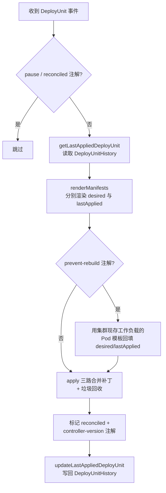
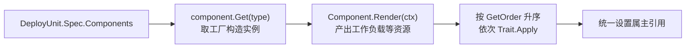

# OAM Controller

基于 [OAM（Open Application Model）](https://oam.dev/) 思想的 Kubernetes 应用部署控制器：
把用户声明的 `DeployUnit`（Component + Trait 模型）渲染成一组 Kubernetes 原生资源，
并以类 `kubectl apply` 的三路合并方式持续同步。

## 核心特性

- **声明式模型**：`DeployUnit` 由若干 Component（工作负载）与 Trait（增强能力）组成；
- **渲染管线**：Component / Trait 均为插件式注册（`init()` 自注册 + 全局工厂表），
  新增类型无需改动控制器主体；
- **三路合并 Apply**：以（lastApplied, desired, existing）计算补丁——
  内置资源走 StrategicMergePatch，自定义资源走 JSONMergePatch；
  受管字段漂移自动拉回，未受管字段（他人改动）保留；
- **垃圾回收**：声明中移除的资源自动删除；
- **快照与回滚基础**：上次成功应用的声明写入 `DeployUnitHistory`，作为下次合并基准。

## 架构



渲染管线（`internal/render`）：



## 项目结构

遵循 [kubebuilder v4](https://book.kubebuilder.io/) 推荐布局：

```
├── cmd/main.go                    # 控制器入口
├── api/v1/                        # CRD 类型定义（DeployUnit / DeployUnitHistory）
├── internal/
│   ├── controller/                # reconcile 主循环、三路合并 Apply、补丁计算
│   └── render/                    # 渲染管线
│       ├── render.go              # 渲染上下文（RenderContext 注入）
│       ├── component/             # Component 抽象 + 工厂注册表
│       │   └── components/        # 内置实现：stateless / stateful
│       └── trait/                 # Trait 抽象 + 工厂注册表 + 执行档位
│           └── traits/            # 内置实现：scaler / sidecar / mount
├── config/                        # kustomize 部署清单（CRD / RBAC / Manager）
├── hack/                          # 代码生成用的版权头模板
├── Taskfile.yml                   # 任务入口
└── Dockerfile                     # 多阶段构建（distroless）
```

## 快速开始

### 前置要求

- Go 1.24+
- [Task](https://taskfile.dev/) v3
- 访问 Kubernetes 集群的 kubeconfig（运行 / 部署时）

### 常用任务

```bash
task              # 查看所有任务
task build        # 编译到 bin/manager
task test         # 单元测试（跳过 envtest 集成用例）
task test-envtest # 全部测试，含 envtest 集成用例（自动下载测试控制面）
task manifests    # 重新生成 CRD / RBAC 清单
task generate     # 重新生成 DeepCopy（修改 api/ 后必须执行）
task run          # 本地运行
task deploy       # 部署到集群（先 task docker-build IMG=<镜像>）
```

### 试用

```bash
# 安装 CRD 并部署控制器
task install
task docker-build IMG=oam-controller:dev
task deploy IMG=oam-controller:dev

# 提交一个 DeployUnit
kubectl apply -f config/samples/oam_v1_deployunit.yaml

# 观察渲染产物
kubectl get deployments,svc,configmaps -l oam.example.com/deploy-unit=demo-app
```

声明示例（完整字段见 `config/samples/`）：

```yaml
apiVersion: oam.example.com/v1
kind: DeployUnit
metadata:
  name: demo-app
spec:
  components:
    - name: web
      type: stateless            # stateless -> Deployment, stateful -> StatefulSet
      properties:
        image: nginx:1.27
        ports: [{port: 8080}]
      traits:
        - type: scaler           # 副本数与滚动更新策略
          properties: {replicas: 3}
        - type: mount            # 配置文件 -> ConfigMap + 挂载
          properties:
            mountPath: /etc/app
            files: [{name: app.conf, content: "key=value"}]
        - type: sidecar          # 注入边车容器
          properties: {name: log-shipper, image: fluent/fluent-bit:3.0}
```

## 控制行为注解（`oam.example.com/`）

| 注解 | 作用 |
| --- | --- |
| `pause=true` | 跳过整个 reconcile |
| `reconciled=true` | 当前声明已成功应用，跳过处理（控制器在成功后置位；提交方更新声明时应清除以触发重新同步） |
| `prevent-rebuild=true` | 重建工作负载时保留集群中现存的 Pod 模板，仅同步其余字段 |
| `controller-version` | 处理该对象的控制器版本（来自环境变量 `CONTROLLER_VERSION`，默认 `dev`） |

## 扩展开发

**新增 Component**（参考 `internal/render/component/components/stateless.go`）：

1. 新建文件，`init()` 中调用 `component.Register("my-type", NewMyType)`；
2. 构造函数从 `runtime.RawExtension` 反序列化自己的 spec；
3. 实现 `Render(ctx, name) ([]client.Object, error)`，产出工作负载等资源。

**新增 Trait**（参考 `internal/render/trait/traits/scaler.go`）：

1. 新建文件，`init()` 中调用 `trait.Register("my-trait", NewMyTrait)`；
2. 实现 `GetOrder()`（档位：`PreOrder=10 < InOrder=100 < PostOrder=1000 < LastOrder=10000`，
   越大越靠后执行，后执行的可覆盖先执行设置的字段）
   与 `Apply(ctx, manifests, client)`（按类型匹配并改写对象，也可追加新对象）。

修改 `api/v1/` 下类型后务必执行 `task generate manifests`，
否则集群中的 CRD 与代码字段会不一致。

## 环境与依赖

- Go 1.24+，controller-runtime v0.22（Kubernetes 1.34 API）
- 仅依赖 Kubernetes 官方库与 controller-runtime / controller-tools，
  无任何私有仓库依赖
- 工具（controller-gen、setup-envtest）由 Taskfile 通过 `go run pkg@version`
  按需拉取固定版本，无需全局安装

## License

Apache License 2.0，见 [LICENSE](LICENSE)。
