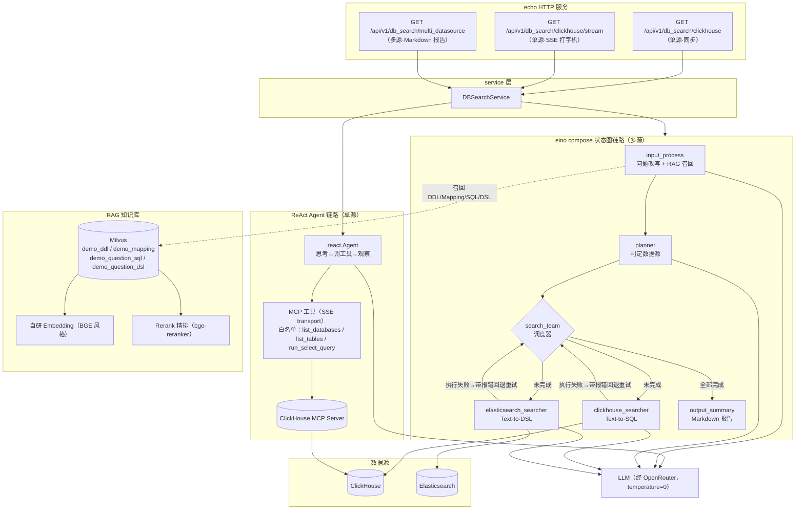

# 基于大模型的多数据源智能查询 Agent 平台

以自然语言问答方式查询 ClickHouse 与 Elasticsearch 两种异构数据源的智能查询平台。基于 [eino](https://github.com/cloudwego/eino)（cloudwego LLM 编排框架）构建，提供两条查询链路：

- **多 Agent 状态图编排链路**：`输入改写 → 数据源规划 → 任务调度 → 查询执行（失败自愈重试）→ 结果汇总` 有向状态图，子图通过共享 State + 动态分支（Goto 路由）循环流转；
- **ReAct Agent 链路**：ClickHouse 单源查询，LLM 经 MCP 协议自主调用 `list_databases / list_tables / run_select_query` 工具，循环"思考 → 调工具 → 观察"。

## 架构



### 关键机制

| 机制 | 说明 |
|------|------|
| 子图共享 State | 所有子图经 `compose.ProcessState` 读写同一份 `*graph.State`（`Goto` / `DataSources` / `Query` 尝试历史 / `RespMap`），State 每请求惰性生成，编译后的图可复用 |
| 动态分支路由 | `search_team` 后挂 `compose.NewGraphBranch`，`agentHandOff` 读 `state.Goto` 决定下一跳，实现"调度 → 执行 → 回调度"的循环流转 |
| RAG 双路召回 | 表结构（DDL / ES Mapping）与"问题→查询语句"两条召回通路；查询生成前注入 Schema 与相似历史查询作 few-shot |
| 自愈重试闭环 | 查询执行失败不中断图：语句与报错记入 `Attempt` 历史 → 回退调度节点重新派发 → load 节点把失败上下文注入 Prompt 定向修复；每源默认最多 2 次尝试，超限写失败占位保证终止 |
| 只读安全双保险 | Prompt 层强制只读 + `internal/pkg/sqlguard` 代码层校验（首关键字白名单 + 剥离字面量/注释后的危险词黑名单）；ES 侧走 Search API 天然只读 |
| MCP 最小权限 | MCP server 暴露的工具面先按工具名白名单过滤，再交给 LLM |
| 全链路日志 | `callback.LoggerCallback` 记录每次模型/工具调用的输入输出（含流式），挂载于状态图 Invoke 与 ReAct Agent |

## 快速开始

> 已安装 [Taskfile](https://taskfile.dev) 时可用 `task deps:up && task init && task ragload && task server` 一路到底；以下为等价的手动步骤。详见[部署文档](docs/deployment.md)。

### 1. 启动依赖环境

```bash
cp .env.example .env          # 按需修改凭证
docker compose -f deploy/compose.yml up -d
```

包含：Milvus（etcd + minio + standalone）、ClickHouse、ClickHouse MCP Server（SSE `:4200`）、Elasticsearch 8。

### 2. 初始化演示数据（可选）

`task init` 一键完成；等价于执行 `deploy/init/clickhouse.sql`（建 `demo` 库与 `orders` / `user_visits` 表）与 `deploy/init/elasticsearch.sh`（建 `product_reviews` / `app_logs` 索引），均幂等可重复执行。

### 3. 灌 RAG 知识库

```bash
export OPEN_AI_API_KEY=sk-...            # 必填（服务用）
export EMBEDDING_BASE_URL=http://...     # 必填（BGE 风格 /embedding/{model} 接口）
go run ./cmd/ragload
```

主键为内容 hash，重复执行幂等。

### 4. 启动服务

```bash
source .env 2>/dev/null; export $(grep -v '^#' .env | xargs) 2>/dev/null
go run ./cmd/server
# 或显式指定：go run ./cmd/server -api-key sk-... -embedding-base-url http://...
```

### 5. 调用

```bash
# 单源：react agent 经 MCP 工具直查 ClickHouse（同步）
curl "http://127.0.0.1:5002/api/v1/db_search/clickhouse?content=demo库里订单表有多少条数据"

# 单源流式：SSE 打字机输出
curl -N "http://127.0.0.1:5002/api/v1/db_search/clickhouse/stream?content=统计各支付状态的订单数"

# 多源：状态图编排，返回 Markdown 查询报告
curl "http://127.0.0.1:5002/api/v1/db_search/multi_datasource?content=上个月销售额最高的类目是哪些"
```

## 配置项

全部支持 `-flag` 与同名大写环境变量两种来源（flag 优先），完整列表见 `.env.example`：

| 配置 | 默认值 | 说明 |
|------|--------|------|
| `OPEN_AI_API_KEY` | —— | OpenRouter API Key（必填） |
| `MODEL_NAME` | `google/gemini-2.5-pro` | OpenRouter 模型名 |
| `EMBEDDING_BASE_URL` | —— | 自研 embedding 服务地址（必填） |
| `EMBEDDING_MODEL` | `BAAI/bge-m3` | embedding 模型名 |
| `RERANK_BASE_URL` | `https://api.siliconflow.cn/v1` | rerank 服务地址 |
| `RERANK_MODEL` | `BAAI/bge-reranker-v2-m3` | rerank 模型名 |
| `MILVUS_ADDR` | `127.0.0.1:19530` | Milvus 地址 |
| `ES_ADDR` | `http://127.0.0.1:9200` | Elasticsearch 地址 |
| `CLICKHOUSE_ADDR` | `127.0.0.1:9000` | ClickHouse native 协议地址 |
| `MCP_CLICKHOUSE_SSE_BASE_URL` | `http://127.0.0.1:4200/sse` | ClickHouse MCP server SSE 端点 |
| `MCP_CLICKHOUSE_TOOL_NAMES` | `list_databases,list_tables,run_select_query` | MCP 工具白名单（逗号分隔） |
| `MAX_RETRY_PER_SOURCE` | `2` | 多源链路每源自愈重试上限（含首次） |
| `HTTP_LISTEN` | `127.0.0.1:5002` | HTTP 监听地址 |

## 目录结构

遵从业内通行布局（golang-standards/project-layout）：业务代码全部收进 `internal/`（防止被外部项目误 import），`cmd/` 只留进程入口。

```
agent-workflow/
├── cmd/
│   ├── server/                # 服务入口（flag/env 配置 + 依赖组装）
│   └── ragload/               # RAG 语料灌库工具（rag/ 内嵌 DDL/Mapping/SQL/DSL 语料）
├── internal/
│   ├── agent/clickhouse/      # ReAct Agent：经 MCP 工具自主查询 ClickHouse
│   ├── api/v1/                # HTTP 路由（同步 / SSE 流式 / 多源报告）
│   ├── callback/              # eino 全链路调用日志 callback
│   ├── chatmodel/             # 对话模型配置（经 OpenRouter 兼容网关）
│   ├── client/db/             # ClickHouse / ES / Milvus 客户端
│   ├── embedding/             # 自研 embedding 服务客户端（实现 eino 接口）+ 维度探测
│   ├── orch/datasearch/       # 多源状态图编排
│   │   ├── graph/             #   图构建：builder / 各节点 / 报告生成 / 自愈重试
│   │   ├── prompt/            #   各节点 Prompt 模板（Markdown 维护，go:embed 加载）
│   │   └── agent.go           #   对外 Agent 门面（注入 RAG 召回闭包）
│   ├── pkg/                   # 内部通用工具（不对外）
│   │   ├── convert/           #   数值类型转换
│   │   ├── hash/              #   内容 SHA-256（灌库幂等主键）
│   │   └── sqlguard/          #   只读 SQL 校验（白名单 + 黑名单双保险）
│   ├── service/               # 业务域 service（组装单源/多源两类 agent）
│   ├── store/                 # Milvus 向量知识库 + Rerank 客户端
│   └── tool/                  # MCP 工具加载（SSE/StreamableHttp/Stdio + 白名单）
├── deploy/
│   ├── compose.yml            # 依赖环境一键编排（全公共镜像）
│   └── init/                  # 演示数据初始化（ClickHouse / ES，幂等）
├── docs/                      # 架构 / 设计 / 前置知识点 / 部署 / 使用说明
├── .golangci.yml              # lint 配置（revive/gocritic/staticcheck 等）
├── .editorconfig              # 编辑器基础格式统一
└── Taskfile.yml               # 常用任务（deps/init/ragload/server/check/smoke/e2e）
```

## 开发工作流

```bash
task check    # go build + go vet + go test + golangci-lint
task e2e      # 一键端到端验证（依赖环境 → 数据 → 灌库 → 服务 → 三接口冒烟）
task --list   # 查看全部任务
```

测试覆盖：`sqlguard` 只读 SQL 校验（含字面量误伤 / CTE 伪装写操作等 20 例）、`graph` 的 JSON 围栏剥离 / DSL 展开 / 数据源规划解析 / Markdown 报告生成、`prompt` 模板加载。
