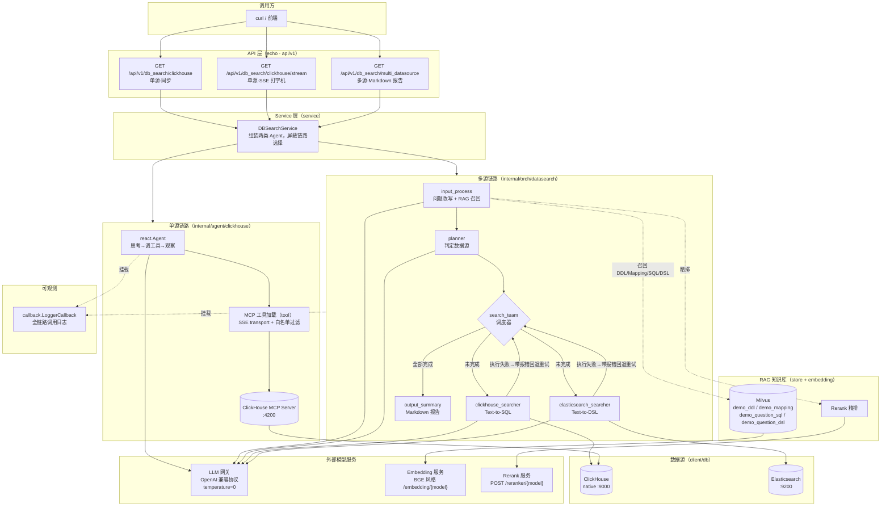
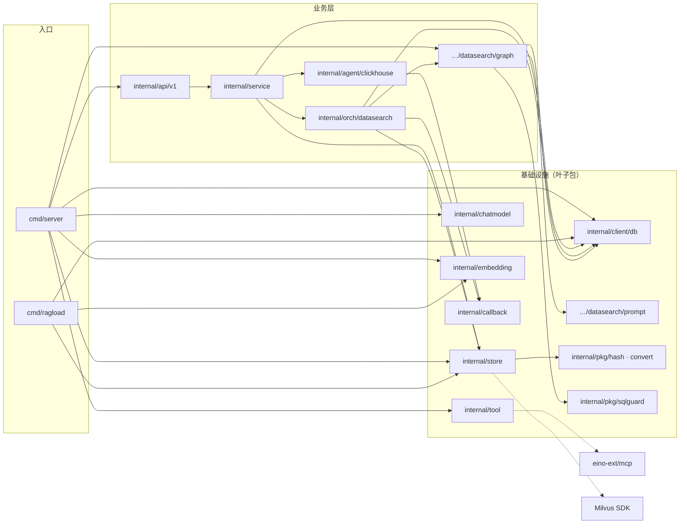

# 架构文档

> 基于大模型的多数据源智能查询 Agent 平台 —— 系统架构说明

## 1. 系统定位

以自然语言问答方式查询 ClickHouse 与 Elasticsearch 两种异构数据源。基于 [eino](https://github.com/cloudwego/eino)（cloudwego LLM 编排框架）构建，提供两条查询链路与三种 API 形态（同步 / SSE 流式 / 多源 Markdown 报告）。

## 2. 总体架构

## 3. 分层与模块职责

业务代码全部位于 `internal/`（防外部 import），`cmd/` 只含进程入口：

| 层 | 模块 | 职责 |
|----|------|------|
| API | `internal/api/v1` | echo 路由、参数绑定、SSE 帧封装（`data: ...\n\n` + `[DONE]` 终止帧） |
| Service | `internal/service` | 业务域门面，组装单源 ReAct Agent 与多源状态图 Agent，对上屏蔽链路差异 |
| Agent | `internal/agent/clickhouse` | 单源 ReAct Agent：LLM 经 MCP 工具自主查询 ClickHouse（同步 + 流式） |
| 编排 | `internal/orch/datasearch` | 多源状态图：图构建（`graph/`）+ Prompt 模板（`prompt/`，go:embed）+ Agent 门面（`agent.go`） |
| 工具 | `internal/tool` | MCP 工具加载（SSE / StreamableHttp / Stdio 三种 transport）+ 工具名白名单过滤 |
| 存储 | `internal/store` | Milvus 向量知识库（四类 collection，启动时幂等加载防运行时释放）+ Rerank 客户端 |
| 向量化 | `internal/embedding` | 自研 embedding 服务客户端（实现 eino `embedding.Embedder` 接口）+ 维度探测 |
| 客户端 | `internal/client/db` | ClickHouse（native 协议）/ ES（TypedClient）/ Milvus 客户端 |
| 模型 | `internal/chatmodel` | 对话模型配置集中管理（OpenAI 兼容网关，经 OpenRouter 或任意兼容端点） |
| 可观测 | `internal/callback` | eino 全链路回调：模型/工具每次调用的输入输出日志（含流式帧） |
| 工具库 | `internal/pkg` | `sqlguard` 只读 SQL 校验 / 内容 hash / 类型转换（内部通用工具） |
| 入口 | `cmd/server` `cmd/ragload` | 服务入口（flag/env 配置 + 依赖组装）；RAG 语料灌库工具 |
| 部署 | `deploy/` | compose 依赖编排（全公共镜像）+ 演示数据初始化脚本 |

## 4. 两条查询链路的架构取舍

| 维度 | ReAct 单源链路 | 多源状态图链路 |
|------|---------------|---------------|
| 决策者 | LLM 自主（运行时） | 状态图结构（构建时确定拓扑，运行时动态路由） |
| Schema 获取 | MCP 工具实时探测（`list_databases` / `list_tables`） | RAG 知识库召回（DDL / Mapping 注入 Prompt） |
| 查询生成 | LLM 边探索边生成 SQL | 专用 searcher 节点一次性生成（Text-to-SQL / DSL） |
| 失败处理 | LLM 观察报错自行调整（ReAct 循环） | 结构化自愈重试（`Attempt` 历史 + 调度回退，上限 `MAX_RETRY_PER_SOURCE`） |
| 执行通道 | MCP server（HTTP :4200） | 服务进程内直连（native :9000 / :9200） |
| 输出 | 自然语言答案（可流式） | 结构化 Markdown 查询报告 |

## 5. 依赖拓扑

（实线 = 编译期 import，虚线 = 外部库依赖；由 `go list` 核实的真实包依赖，非示意）

关键解耦点：

- **叶子包 + 依赖注入**：`chatmodel` / `tool` / `embedding` / `client/db` 都是叶子包（不依赖任何业务包），由 `cmd/server` 统一组装后注入下游——中间层（`service` / `orch` / `agent`）不 import `chatmodel` / `tool`，替换实现只改入口；
- `internal/orch/datasearch/graph` 不直接依赖 `store`——RAG 召回以闭包集合 `UserInputGenFunc` 注入 State（[builder.go](../internal/orch/datasearch/graph/builder.go)），向量库实现可替换；
- `store` 不依赖 `embedding`——Embedder 以 eino 接口注入，向量化实现可替换；
- 所有 LLM 节点共用一个 `model.ToolCallingChatModel` 实例，模型配置只在 `chatmodel` 包维护；
- 汇总结果写入随请求生成的 State（`GenLocalState` 惰性创建），编译后的图可被并发请求复用而互不干扰。

## 6. 外部依赖

| 组件 | 版本 | 用途 | 通道 |
|------|------|------|------|
| Milvus | v2.6（standalone + etcd + minio） | RAG 向量知识库 | gRPC :19530 |
| ClickHouse | 25.3 | 结构化数据源 | native :9000 / HTTP :8123 |
| ClickHouse MCP Server | mcp/clickhouse | ReAct 链路工具提供方 | SSE :4200 |
| Elasticsearch | 8.19 | 全文/日志数据源 | HTTP :9200（Search API） |
| LLM 网关 | 任意 OpenAI 兼容端点 | 对话模型（temperature=0） | HTTPS |
| Embedding 服务 | BGE 风格 | 向量化（维度运行时探测） | `POST /embedding/{model}` |
| Rerank 服务 | SiliconFlow 风格 | 召回精排（top1） | `POST /reranker/{model}` |

## 7. 技术选型理由

- **eino**：cloudwego 出品的 Go LLM 编排框架，原生提供 compose 状态图（共享 State + 动态分支）、react Agent、callbacks 链路——多源链路的"调度 → 执行 → 回调度"循环完全由其图原语承载；
- **MCP 协议**：ClickHouse 查询工具以标准 MCP server 独立部署，工具面按白名单收窄（`MCP_CLICKHOUSE_TOOL_NAMES`），Agent 与数据库解耦；
- **Prompt 即代码**：所有节点 Prompt 以 Markdown 维护、`go:embed` 编译进二进制（改 Prompt 无需改 Go 代码，但需重新编译）；
- **OpenAI 兼容协议**：模型网关可替换（OpenRouter / GLM / 任意兼容端点），只改配置不改代码。

相关文档：[使用说明书](usage.md) · [设计文档](design.md) · [前置知识点](prerequisites.md) · [部署文档](deployment.md)
