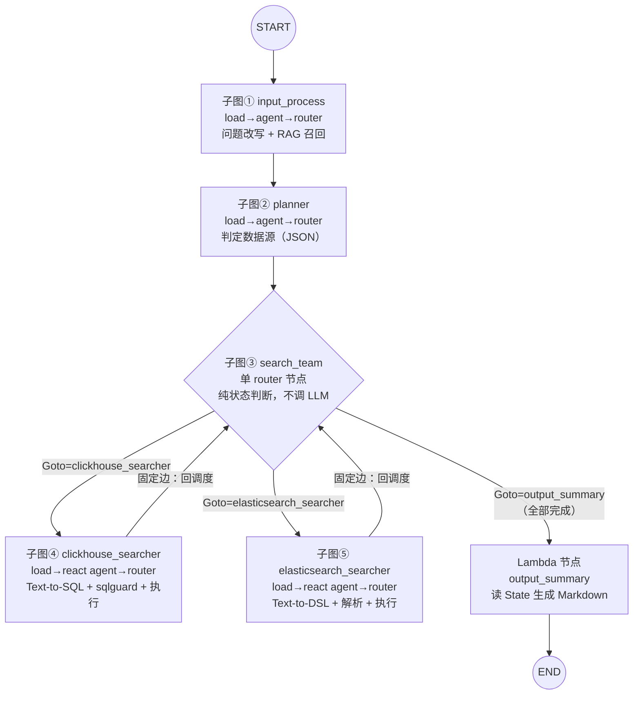
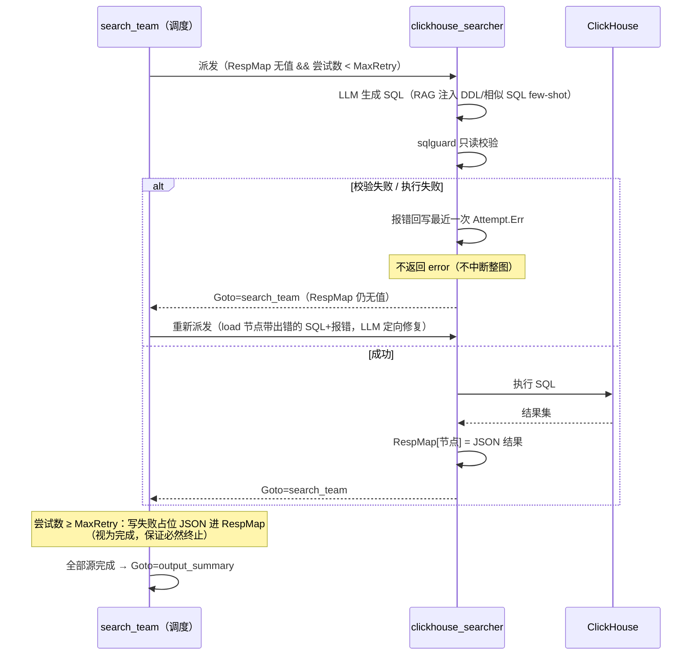
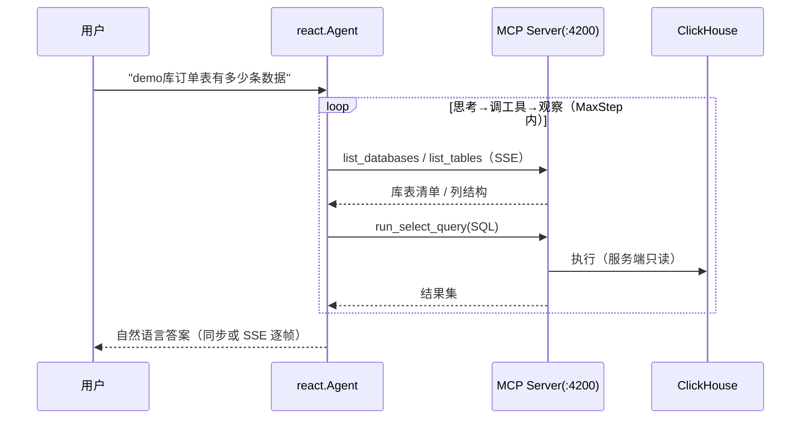

# 设计文档

> 多数据源智能查询 Agent 平台 —— 核心机制与详细设计

## 1. 设计目标

1. 自然语言 → 异构数据源（ClickHouse / Elasticsearch）查询，屏蔽 SQL / DSL 差异；
2. 查询生成失败可自愈（带报错定向重试），不因单源失败中断整条链路；
3. 只读安全双保险（Prompt 约束 + 代码层校验），LLM 无法执行写操作；
4. 请求隔离：编译后的图/Agent 可复用，并发请求互不干扰。

## 2. 多源状态图设计（internal/orch/datasearch/graph）

### 2.1 图拓扑与共享 State



每个子图内部固定为 **load（组装 Prompt）→ agent（调 LLM）→ router（写 State 并决定流转）** 三段式。子图以"图节点"方式挂载到主图（`AddGraphNode`）。

searcher 的生成约束（Prompt 层，见 [prompt 模板](../internal/orch/datasearch/prompt/)）：

- **跨源职责隔离**：CH searcher 只查询召回 DDL 中真实存在的库表，用户问题里属于其他源的部分（如 ES 评论检索）不得掺入 SQL；
- **单条语句输出**：禁分号拼接多条语句（会被执行层拒绝，也可能绕过首关键字只读校验），需要多组结果用 `UNION ALL` 合并为一条。

核心数据结构（[builder.go](../internal/orch/datasearch/graph/builder.go)）：

```go
type State struct {
    UserInput                      // 原始/改写问题 + RAG 召回的 DDL/Mapping/SQL/DSL
    UserInputGenFunc               // RAG 召回闭包集合（外层注入，graph 包不依赖 store）
    Goto        string             // 下一跳节点名：子图 router 写入，branch 函数读取
    DataSources []string           // planner 判定的数据源
    Query       map[string][]Attempt // 每源"生成→执行"尝试历史（自愈重试载体）
    RespMap     map[string]string  // 每源最终结果；有值即视为该源完成
    MaxRetry    int                // 每源最大尝试次数（含首次），默认 2
    CH, ESCli                      // 数据源客户端（随请求 State 注入）
}

type Attempt struct {             // 一次尝试 = 生成的语句 + 报错（失败时回写）
    Statement string
    Err       string
}
```

### 2.2 动态分支路由（Goto 机制）

`search_team` 之后挂 `compose.NewGraphBranch(agentHandOff, outMap)`：上一个子图把目标节点名写入 `state.Goto`，`agentHandOff` 读出返回给 eino 框架路由（出口白名单 = 两个 searcher + output_summary）。这实现了"调度 → 执行 → 回调度"的**循环流转**——静态 DAG 做不到的事。

### 2.3 自愈重试闭环（核心设计）



设计要点：

- **失败不抛 error**：searcher router 失败时把报错记入 `Attempt` 后正常返回（`return nil`），流程回到调度节点重新派发——抛 error 会中断整图；
- **修复有上下文**：重试时 load 节点把"上次 SQL + 报错"注入 Prompt，LLM 是定向修复而非盲目重试；
- **必然终止**：超限源写入失败占位（`{"error":"... exhausted N attempts, last error: ..."}`），上层报告无需区分成功/失败结构；
- **每轮只派发一个源**，剩余源在后续循环中继续。

### 2.4 RAG 双路召回设计

| 通路 | Milvus Collection | 内容 | 作用 |
|------|-------------------|------|------|
| 表结构 | `demo_ddl` / `demo_mapping` | ClickHouse 建表语句 / ES Index Mapping | 注入 searcher Prompt 作 Schema 参考 |
| 查询范式 | `demo_question_sql` / `demo_question_dsl` | "问题 → SQL/DSL" 对 | 作 few-shot 参考，对齐查询风格 |

检索管线：**向量粗排（topK=10）→ rerank 精排（top1）**。查询侧拼接 bge 指令前缀（`为这个句子生成表示以用于检索相关文章：`）以区分 query/document 编码。主键 = 内容 SHA-256，重复灌库天然幂等（upsert 语义）。

召回闭包（`UserInputGenFunc`）由 [internal/orch/datasearch/agent.go](../internal/orch/datasearch/agent.go) 注入，`graph` 包不 import `store`——向量库实现可替换。

## 3. ReAct 单源链路设计（internal/agent/clickhouse）



- 工具面收窄：MCP server 暴露的工具先按 `MCP_CLICKHOUSE_TOOL_NAMES` 白名单过滤再交给 LLM（最小权限）；
- 流式兼容：配置 `StreamToolCallChecker` 为消费完整流再判定（`fullStreamToolCallChecker`）——推理型模型（glm / claude 等）先输出思考/叙述、`tool_calls` 位于流末尾，eino 默认的"首个含内容 chunk 即判定"会误判导致断流；
- 全链路日志：`callback.LoggerCallback` 挂载于 Generate / Stream，记录每次模型/工具调用输入输出（含流式帧）。

## 4. 安全设计（只读双保险 + 权限收窄）

| 层 | 机制 | 实现 |
|----|------|------|
| Prompt 层 | 强制只读表述、单条语句（禁分号拼接）、别名须 ASCII 标识符、必须带 LIMIT | [prompt 模板](../internal/orch/datasearch/prompt/)（可被 LLM 绕过） |
| 代码层 | `sqlguard.ValidateReadOnly`（[internal/pkg/sqlguard](../internal/pkg/sqlguard/readonly.go)） | ① 语句首关键字白名单（SELECT/WITH/SHOW/DESCRIBE/DESC/EXPLAIN/EXISTS）② 剥离字符串字面量/引号标识符/注释后做危险词黑名单匹配（INSERT/UPDATE/DELETE/DROP/...，防 `WITH ... INSERT` 与 CTE 伪装写操作） |
| 工具层 | MCP 工具名白名单过滤 | [tool.FilterToolsByNames](../internal/tool/tool.go) |
| 执行层 | ES 侧走 Search API（天然只读）；MCP server 侧账号权限 | 部署层 |

## 5. 请求隔离与复用

- 编译后的图（`compose.Runnable`）结构不可变、可重复运行；请求级数据全部放在 `GenLocalState` 惰性生成的 State 中；
- 汇总作为图节点输出返回（而非写入 Agent 实例共享 map），天然无跨请求覆盖风险。

## 6. 配置设计

所有配置同时支持 `-flag` 与同名大写环境变量（flag 优先），完整列表见 [.env.example](../.env.example)。要点：

- 模型网关可替换：`OPEN_ROUTER_BASE_URL` 指向任意 OpenAI 兼容端点（OpenRouter / GLM Coding Plan 等）；
- Embedding 维度运行时探测（`internal/embedding.GetModelDim`），Milvus collection 维度随之创建，不写死；
- `MAX_RETRY_PER_SOURCE` 控制自愈重试上限（含首次，默认 2）。

## 7. 已知设计权衡

| 权衡 | 说明 |
|------|------|
| rerank 硬依赖 | rerank 失败会中断多源链路（`getSchemaWithRerank` 无降级）——假定部署环境必有 rerank 服务 |
| ES 分词器假设 | RAG 语料中的 Mapping 使用 `ik_max_word`，需部署侧 ES 装 ik 插件，否则实际建索引时须替换 |
| Prompt 编译期嵌入 | `go:embed` 意味着改 Prompt 必须重新编译二进制 |
| 每轮单源串行调度 | 多源查询按源串行执行，未做并行派发（demo 场景可接受） |

相关文档：[使用说明书](usage.md) · [架构文档](architecture.md) · [前置知识点](prerequisites.md) · [部署文档](deployment.md)
