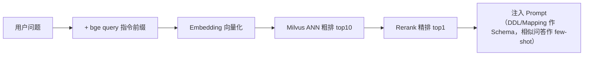

# 前置知识点

> 阅读本项目的代码与文档前，建议先了解以下概念。每节给出"是什么 → 在本项目中的角色"。

## 1. LLM 编排：eino 框架

[eino](https://github.com/cloudwego/eino) 是 cloudwego 开源的 Go LLM 应用编排框架（对标 LangChain）。本项目用到的核心原语：

| 原语 | 说明 | 本项目用法 |
|------|------|-----------|
| `compose.Graph` | 有向图编排：节点 + 边 + 分支 | 多源查询主图（5 个子图节点 + 动态分支） |
| 共享 State（`GenLocalState`） | 全图共享的可变状态，每请求惰性生成 | 子图间传递问题的唯一通道（`graph.State`） |
| `AddBranch` / GraphBranch | 动态分支：函数运行时决定下一跳 | `agentHandOff` 读 `state.Goto` 路由 |
| `react.Agent` | ReAct 循环 Agent（模型 + 工具） | 单源链路主体；searcher 子图内的生成器 |
| `schema.StreamReader` | 流式读取器 | SSE 打字机输出 |
| callbacks | 全链路钩子（OnStart/OnEnd/OnError） | `LoggerCallback` 调用审计 |

## 2. Agent 模式：ReAct

**ReAct** = **Rea**soning + **Act**ing：LLM 循环"思考 → 调用工具 → 观察结果"直到能给出答案。

- 本项目单源链路即此模式：LLM 自主决定调用 `list_databases` / `list_tables` / `run_select_query` 的顺序与次数，无需外部编排；
- 与"状态图编排"的区别：ReAct 的流程控制权在 LLM 手里（灵活但难约束步数），状态图的拓扑在构建时确定（可控、可插入结构化机制如自愈重试）。

## 3. MCP（Model Context Protocol）

Anthropic 提出的模型-工具连接标准协议。本项目把 ClickHouse 查询能力封装为独立 MCP server（`mcp/clickhouse` 镜像）：

- **传输层**：SSE（`GET /sse` 建立事件流得到会话端点 → `POST /messages/?session_id=...` 发送 JSON-RPC 请求）；
- **握手**：`initialize` → `notifications/initialized` → `ListTools` / `CallTool`；
- **白名单收窄**：MCP server 暴露的工具面先按 `MCP_CLICKHOUSE_TOOL_NAMES` 过滤再交给 LLM（最小权限）。

## 4. RAG（检索增强生成）

在生成查询语句前，先从知识库检索参考信息注入 Prompt，缓解 LLM 不知库表结构的问题。本项目检索管线：

关键概念：

- **Embedding**：文本 → 定长浮点向量，语义相近则向量相近。本项目自研协议 `POST /embedding/{model}`，body `{"isQuestion":bool,"contents":[]string}`，维度运行时探测；
- **ANN 检索**：Milvus 的近似最近邻搜索（`IP` 内积 + AutoIndex，`nprobe=128`）；
- **Rerank 精排**：cross-encoder 对"问题-候选"对打分重排，比纯向量召回更准。协议 `POST /reranker/{model}`，SiliconFlow 风格；
- **双路召回**：表结构（DDL / Mapping）与"问题→查询语句"两个语料库分别服务 Schema 注入与 few-shot 对齐；
- **幂等灌库**：主键 = 内容 SHA-256，重复执行 `ragload` 不产生重复数据。

## 5. Text-to-SQL / Text-to-DSL

- **Text-to-SQL**：自然语言 → SQL（ClickHouse 方言）。难点：方言差异（`uniqExact`、`countIf` 等）、幻觉列名（靠 DDL 注入抑制）、别名合法性（非 ASCII 裸标识符会语法错误，Prompt 已约束）；
- **Text-to-DSL**：自然语言 → ES Query DSL（JSON）。本项目约定输出 `{"index": "...", "dsl": {...}}`，执行走 ES Search API（天然只读）。

## 6. 数据源基础

| 系统 | 需了解的最小集合 |
|------|----------------|
| **ClickHouse** | 列式 OLAP；native 协议（:9000）与 HTTP（:8123）；`MergeTree` 引擎；`Enum8` / `LowCardinality` / `Decimal` 类型；`system.columns` 可查元数据 |
| **Elasticsearch** | 倒排索引全文检索；Index / Mapping / 分词器（analyzer）；Query DSL（`bool`/`match`/`range`/`term`）；Search API 只读 |
| **Milvus** | 向量数据库；Collection / Field / 主键 / FloatVector 维度（创建后不可改）；AutoIndex |

### 6.1 Elasticsearch：字段类型与索引机制

**keyword vs text**——ES 字符串的两大类型，区别在"值切成几个词条（term）进倒排索引"：

| | `keyword` | `text` |
|---|---|---|
| 分词 | ❌ 整串原样一个 term | ✅ 经 analyzer 切成多个 term |
| 典型查询 | `term` / `terms` 精确等值 | `match` 全文检索 + 相关性打分 |
| 聚合/排序 | ✅（doc_values 列存） | ❌ 需走 `.keyword` 子字段 |
| 适用字段 | ID、枚举、标签、维度 | 标题、正文、日志消息 |

本项目初始化脚本（`deploy/init/elasticsearch.sh`）即按此划分：`service` / `level` / `sentiment` 等枚举维度用 keyword（供 term 过滤 + 聚合），`title` / `content` / `message` 用 text（供分词全文检索）。

**ID 选 keyword 还是数值类型？**——看有无数值语义。`user_id` 用 `integer`：范围查询走数值序（keyword 是字典序，`"999" > "1001"` 会出错），且支持 `avg` / `stats` 数值聚合；`product_id` 用 keyword：只是标签，仅做等值匹配与分组。口诀：**只用来"等值 + 分组"是 keyword，还承载大小/顺序/运算语义是数值类型**。

**每个字段背后有两套结构**：

| 结构 | 方向 | 用途 |
|------|------|------|
| 倒排索引（term → doc list） | term 找文档 | 等值 / 全文查询 |
| doc_values（doc → 值，列存） | 文档取值 | 聚合、排序 |

数值/日期类不建倒排，走 BKD 树（point 索引），支持等值与范围。

**索引结构是类型声明的"副作用"，自动创建**——与 PostgreSQL 需显式 `CREATE INDEX` 不同：ES 里倒排索引就是存储本身（没有"无索引的堆表"，一切查询都走索引结构），mapping 声明类型后写入即建索引，无需 DDL；PG 的索引是堆表之上的可选加速结构，加不加是性能取舍。ES 连 mapping 也可省略（动态映射按值猜类型），但会猜错——如 `"501"` 猜成 `text` + `.keyword` 子字段而非纯 keyword、`1001` 猜成 `long` 而非 `integer`——且类型一经写入不可改（只能 reindex 迁移），所以本脚本显式声明全部 mapping。

## 7. 协议与接口

- **OpenAI 兼容协议**：`POST {base}/chat/completions`（messages / tools / stream）。本项目模型网关可指向任意兼容端点（OpenRouter、GLM 等）；带 `tools` 的请求中，模型以 `tool_calls` 字段返回调用意图；流式响应按 chunk 增量返回 `delta.content` / `delta.reasoning_content` / `delta.tool_calls`；
- **推理型（reasoning）模型**：先输出思考（`reasoning_content`）再输出正文。与流式工具调用检查的交互需注意——见设计文档 §3 的 `StreamToolCallChecker` 说明；
- **SSE（Server-Sent Events）**：HTTP 长连接单向推送，帧格式 `data: ...\n\n`。本项目流式 API 以 `data: [DONE]` 作终止帧；
- **JSON-RPC**：MCP 的报文格式（`{"jsonrpc":"2.0","method":...,"id":...}`）。

## 8. 部署侧概念

- **Docker Compose**：多容器编排（本项目 6 个服务：etcd / minio / milvus / clickhouse / mcp-clickhouse / elasticsearch）；
- **healthcheck 与 depends_on**：容器健康探测与启动顺序约束（`condition: service_healthy`）；
- **env 与 flag 双通道**：本项目配置优先级 flag > 环境变量 > 默认值。

## 9. 建议阅读顺序

1. 本文 → [架构文档](architecture.md)（宏观）
2. [部署文档](deployment.md) + 亲手把环境跑起来
3. [设计文档](design.md) + 对照源码：
   - 多源链路：`internal/orch/datasearch/graph/builder.go`（图构建）→ `search_team.go`（调度）→ `clickhouse_searcher.go`（生成+执行+重试）
   - 单源链路：`internal/agent/clickhouse/agent.go` → `internal/tool/tool.go`
   - 安全：`internal/pkg/sqlguard/readonly.go`（配测试用例阅读）

相关文档：[使用说明书](usage.md) · [架构文档](architecture.md) · [设计文档](design.md) · [部署文档](deployment.md)
