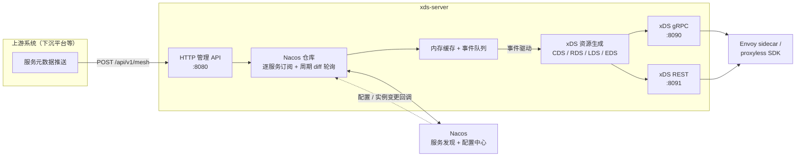

# xds

基于 [go-control-plane](https://github.com/envoyproxy/go-control-plane) 的轻量服务网格控制面：以 **Nacos** 作为注册中心与配置存储，通过 **xDS 协议（CDS/RDS/LDS/EDS）** 向 Envoy sidecar / proxyless SDK 下发配置，并对外提供服务元数据与实例管理的 HTTP API。

## 架构



**数据流**：上游系统通过 HTTP API 把服务元数据（协议、端口、路由、分组、可见性等）写入 Nacos 配置中心；Nacos 的配置/实例变更回调与周期 diff 轮询感知变化后进入事件队列（dirty/processing 去重）；worker 消费事件更新内存缓存；缓存变化触发 xDS Snapshot 重新生成，推送到已连接的 Envoy / proxyless SDK。

## 快速开始

### 前置：启动本地 Nacos

```bash
docker run -e MODE=standalone -p 8848:8848 -d nacos/nacos-server
```

### 构建与运行

```bash
task build              # 编译到 bin/xds-server，注入版本信息（默认 Version=dev）
./bin/xds-server        # 默认读取 conf/dev.yaml（CONF_ENV=dev）
```

版本信息验证（`task build` 未传 VERSION 时默认为 `dev`）：

```bash
./bin/xds-server --version
```

### Docker 运行

```bash
task docker             # 等价于 docker build -t xds-server .
# 或手动构建并注入版本（默认 Version=dev）：
# docker build --build-arg VERSION=v1.0.0 --build-arg REVISION=$(git rev-parse --short HEAD) -t xds-server .
docker run -p 8080:8080 -p 8090:8090 -p 8091:8091 \
  -e xds_nacos_address=宿主机IP \
  xds-server
```

镜像为多阶段构建：`golang:1.23-alpine` 编译 → `alpine:3.20` 运行（非 root 用户，仅含二进制与 conf）。

## 配置说明

进程启动时按环境变量 `CONF_ENV`（默认 `dev`）在 `./conf`、`../conf` 中查找 `<env>.yaml`；也可用 `--config <路径>` 显式指定。仓库提供 `conf/dev.yaml`、`conf/prod.yaml` 两份样例。

| 键 | 类型 | dev 默认值 | 说明 |
|---|---|---|---|
| `debug` | bool | `true` | 调试开关（gin debug 模式） |
| `log.level` | string | `debug` | 日志级别 |
| `log.format` | string | `console` | `console` / `json` |
| `log.dir` | string | `./log` | 日志目录 |
| `log.maxSize` | int | `100` | 单文件大小上限（MB），超过即轮转 |
| `log.maxBackups` | int | `5` | 保留的轮转备份数 |
| `log.maxAge` | int | `7` | 备份保留天数 |
| `web.address` | string | `0.0.0.0:8080` | 管理 API 监听地址（host:port） |
| `web.adminPort` | int | `8081` | admin 端口（**仅绑定 127.0.0.1**） |
| `xds.grpcPort` | int | `8090` | xDS gRPC discovery 端口（Envoy 直连） |
| `xds.restPort` | int | `8091` | xDS REST gateway 端口（调试用） |
| `tracing.domain` | string | 空 | OpenTelemetry Collector 地址（链路追踪上报）；**为空时不下发 tracing cluster** |
| `tracing.port` | int | `0` | OpenTelemetry Collector 端口 |
| `nacos.address` | string | `127.0.0.1` | Nacos 服务端地址 |
| `nacos.port` | int | `8848` | Nacos 端口 |
| `nacos.namespace` | string | `xds` | 命名空间 |
| `nacos.group` | string | `default_group` | 分组（注册、订阅、配置监听均限定此分组） |
| `nacos.username` | string | 空 | 认证用户名（空 = 无认证） |
| `nacos.password` | string | 空 | 认证密码（空 = 无认证） |
| `nacos.logDir` | string | `/tmp/nacos` | Nacos SDK 日志目录 |
| `nacos.cacheDir` | string | `/tmp/nacos` | Nacos SDK 缓存目录 |
| `nacos.logLevel` | string | `warn` | Nacos SDK 日志级别 |
| `nacos.syncInterval` | duration | `30s` | 订阅集合 diff 轮询周期（新服务补订阅、消失服务退订） |

端口缺失或为 0 时进程启动即报错退出，不会静默监听随机端口。

### 环境变量覆盖

配置项可被环境变量覆盖，约定为：**`xds_` 前缀 + 键路径全小写 + `.` 换 `_`**：

```bash
xds_nacos_port=8849 xds_xds_grpcport=8092 ./bin/xds-server
```

注意：

- 只支持全小写形式（`xds_nacos_port`），**不支持大写（`XDS_NACOS_PORT`）或驼峰**，大写形式不会生效；
- 布尔与数值同样适用（如 `xds_debug=false`）；
- `CONF_ENV` 本身不带前缀，用于选择配置文件。

## 端口一览

| 端口 | 协议 | 监听范围 | 用途 |
|---|---|---|---|
| 8080 | HTTP | `web.address`（默认全网卡） | 管理 API（`/api/v1/*`）+ Prometheus `/metrics` |
| 8081 | HTTP | **仅 127.0.0.1** | admin：就绪/存活探针、缓存 dump |
| 8090 | gRPC | 全网卡 | xDS discovery（CDS/RDS/LDS/EDS，Envoy 直连） |
| 8091 | HTTP | 全网卡 | xDS REST gateway（调试用） |

## HTTP API

管理 API 无鉴权（假设内网部署），统一前缀 `/api/v1`，响应格式为 `{code, message, data}`。

### 业务接口（:8080）

| 方法 | 路径 | 说明 |
|---|---|---|
| POST | `/api/v1/instances/list` | 查询服务实例列表；`fromSdk=true` 读本地缓存（容灾视图），默认走 Nacos 服务端（准确视图） |
| POST | `/api/v1/instances` | 注册实例（`source` 缺省为 custom；供 proxyless 模式直连注册） |
| PUT | `/api/v1/instances` | 更新实例（重新注册覆盖；仅 custom 实例） |
| DELETE | `/api/v1/instances` | 注销单个实例（按 IP + Port 定位） |
| DELETE | `/api/v1/instances/clean` | 批量清理实例（`includeHealthy` 控制是否连带健康实例） |
| POST | `/api/v1/mesh` | 保存服务元数据（整体写入 Nacos，变更经订阅链路下发） |
| DELETE | `/api/v1/mesh/:name` | 删除指定 mesh 服务 |
| GET | `/api/v1/service/:service/settings/healthy-check` | 查询服务健康检查 TTL（未配置默认 10 秒） |
| GET | `/metrics` | Prometheus 指标 |

### admin 接口（127.0.0.1:8081）

| 方法 | 路径 | 说明 |
|---|---|---|
| GET | `/-/ready` | 就绪探针（xDS 存储初始化完成后置位） |
| GET | `/-/healthy` | 存活探针 |
| GET | `/-/dump?service=<name>` | dump 内存缓存中指定服务的详情与实例列表（排查用） |

## 服务可见性模型

服务元数据中的 `serviceVisibility` 字段是**服务名白名单**：声明"本服务允许哪些调用方服务看见我"。

- `null` / 空列表 = **对全部服务可见**（开源场景默认全开）；
- 非空列表 = 仅列表内的服务名在生成 xDS 配置时能解析到本服务（cluster/endpoint 不下发）。

这与基于服务树 TreeId 的可见性模型不同：本项目的可见性以**服务名**为最小单元，不依赖任何外部服务树。

## 开发

常用命令（[Taskfile.yml](Taskfile.yml)，需要 [go-task](https://taskfile.dev)）：

```bash
task build    # 编译并注入版本信息（默认 Version=dev）
task test     # 全量测试（-race -cover）
task lint     # golangci-lint
task fmt      # gofmt + goimports
task tidy     # go mod tidy
task run      # 编译并运行
task docker   # 构建镜像
task clean    # 清理 bin/ log/
```

### 目录结构

```
xds/
├── api/
│   ├── http/             # 管理 API server（gin）：handler、middleware、admin
│   └── xds/              # xDS server：gRPC discovery + REST gateway + 下发回调
├── cmd/
│   └── xds-server/       # 进程入口：装配与启动
├── conf/                 # 配置样例（dev.yaml / prod.yaml）
├── internal/
│   ├── entity/           # 领域模型（服务元数据、实例、网格设置）
│   ├── errs/             # 业务错误码
│   ├── metric/           # Prometheus 指标
│   ├── queue/            # 自研轻量事件队列（workqueue 语义）
│   ├── repo/storage/     # Nacos 仓库（服务发现 + 配置中心）
│   ├── service/          # 服务层（内存缓存、事件消费、元数据管理）
│   └── xds/              # Envoy 资源生成（cluster/listener/router/endpoint + 协议 matcher）
├── pkg/                  # 通用库（buildinfo/config/logging/probe/proc/web）
├── Dockerfile            # 多阶段构建（golang:1.23-alpine → alpine:3.20）
└── Taskfile.yml
```
